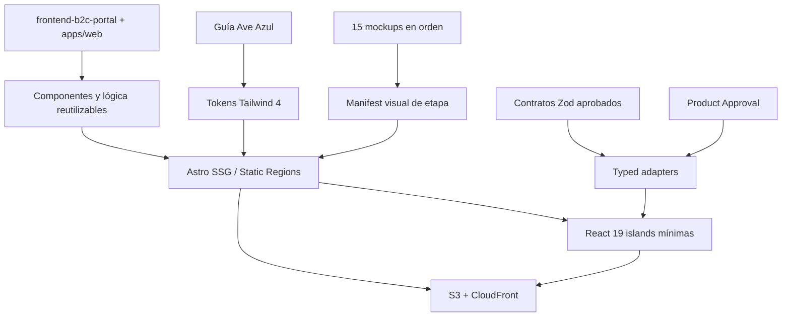
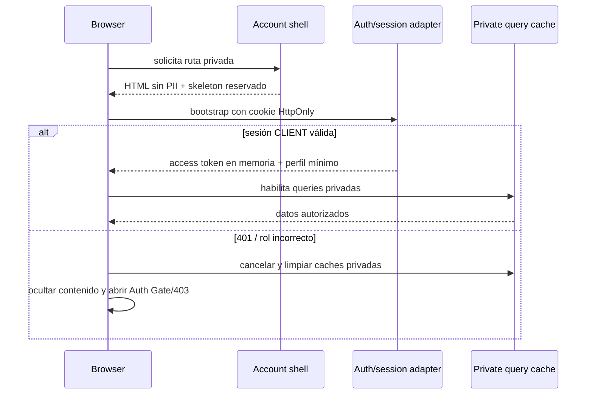
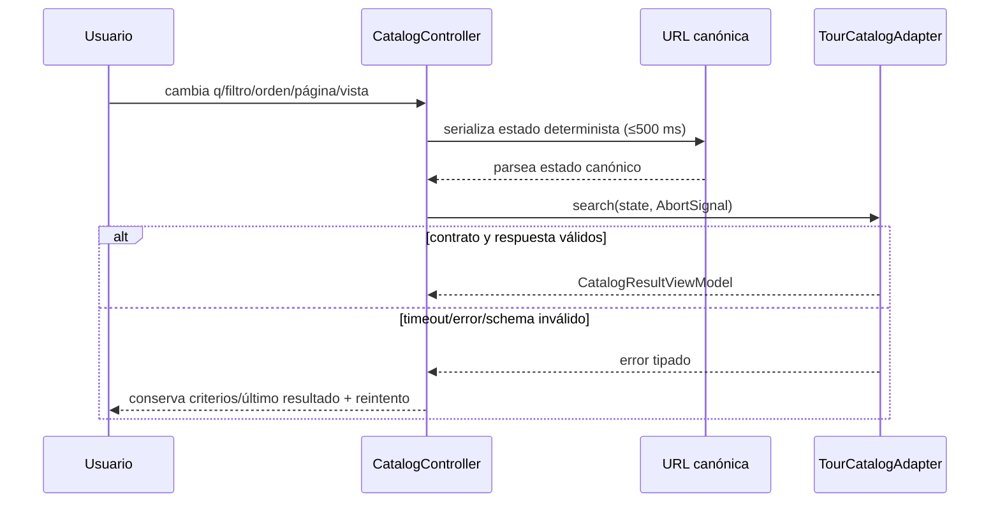
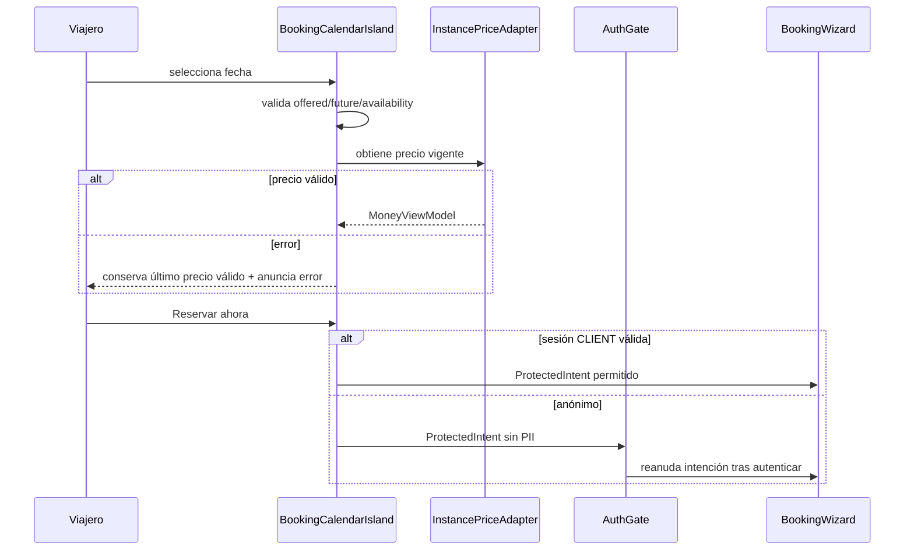
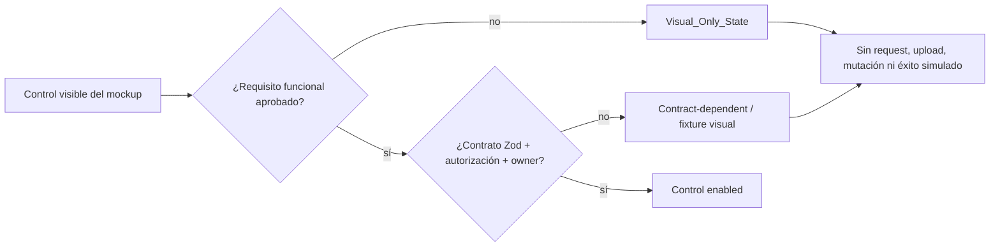

# Design Document — B2C Pixel-Perfect Redesign

## Overview

Este documento define el diseño técnico de `b2c-pixel-perfect-redesign` para implementar secuencialmente las 15 láminas de `otros/design/b2c` en `apps/web`. El resultado conserva Astro SSG, React 19 islands, Tailwind CSS 4, TanStack Query y Nanostores; no introduce SSR, esquemas de base de datos, endpoints, cálculos financieros, roles ni transiciones de estado.

La decisión rectora es separar **fidelidad visual** de **compromiso funcional**. Las capacidades respaldadas por Specs A–F y contratos compartidos conservan su comportamiento. Las capacidades visibles sin contrato aprobado se renderizan como `Visual_Only_State`: pueden alcanzar fidelidad, accesibilidad y responsive completos, pero no ejecutan escrituras, pagos, carga de PII ni efectos irreversibles.

### Fuentes y precedencia

La resolución de conflictos sigue Requirement 1.5 y la introducción de `requirements.md`:

1. `requirements.md`, Specs A–F y reglas de negocio vigentes gobiernan comportamiento, privacidad y seguridad.
2. La guía Ave Azul y `.kiro/steering/12-brand-identity.md` gobiernan identidad.
3. Cada PNG gobierna composición, geometría, densidad y jerarquía visual de su etapa.
4. La implementación existente es fuente de reutilización, no de precedencia.

Specs A–F contienen referencias históricas a SPA, NestJS, Redis y BullMQ. Para este diseño solo se conservan sus reglas de producto; la implementación sigue `.kiro/steering/02-tech-stack.md`: Astro estático, Hono/Lambda, API Gateway, EventBridge/SQS/Step Functions y contratos Zod compartidos.

### Hallazgos que informan el diseño

- Evidencia reutilizable comprobada en `apps/web`: rutas `/`, `/discovery` y `/tours/[slug]`; `Base.astro`; componentes UI, landing, catálogo y detalle; utilidades puras de disponibilidad, calendario, formato, geografía, query params, sanitización e i18n; `session.ts`; y suites Vitest/fast-check/Playwright. Las rutas 3–6 y 20–25 todavía no existen.
- La reutilización es mayor en las láminas 1, 2 y 2-1. En 3–6 se reutilizan foundations/layout/UI, pero las composiciones son nuevas. En 20–25 se reutilizan primitives, `TourCard`, sesión mínima y contratos puntuales; el account shell y las vistas privadas son diseño nuevo.
- El hero, destacados, información de tour y add-ons existentes están sobre-hidratados; las regiones separables se migran a Astro y solo los controles conservan islands. `MapView` hoy está incluido dentro de `CatalogController client:load`; aislarlo como `client:visible` es una modificación propuesta, no estado actual.
- `packages/contracts` cubre inputs de auth, checkout/cancelación y búsqueda de tours, pero la llamada actual de catálogo no coincide extremo a extremo con `TourSearchSchema` y los response/view models siguen locales y sin validación Zod compartida. Por ello catálogo y tour son **baseline reutilizable contract-dependent**, no integración contractual completa.
- `session.ts` mantiene correctamente el access token en memoria, pero faltan bootstrap por refresh HttpOnly, perfil/rol, coordinación de 401, limpieza de caches privadas e intención protegida.
- Home usa fixtures para destacados, las rutas de tour pueden quedar vacías si falla la fuente de build y `Base.astro` aún no implementa el descriptor SEO completo. Estos gaps son trabajo de frontend/contrato, no autorización para inventar datos o backend.
- Las láminas no demuestran 3D ni una secuencia temporal aprobada; GSAP y Three.js quedan fuera del artefacto inicial.
- La publicación en inglés no está lista: solo se expone un locale cuando su catálogo, SEO y contenido accesible están completos.

### Evidencia y fuentes de reutilización

- [`frontend-b2c-portal/design.md`](../frontend-b2c-portal/design.md) define foundations y comportamiento público reutilizable; su implementación real se valida contra `apps/web`, no se asume por documentación.
- [`apps/web/src/pages/index.astro`](../../../apps/web/src/pages/index.astro), [`discovery.astro`](../../../apps/web/src/pages/discovery.astro) y [`tours/[slug].astro`](../../../apps/web/src/pages/tours/[slug].astro) son las únicas rutas B2C existentes comprobadas.
- [`packages/contracts/src/schemas/tours.ts`](../../../packages/contracts/src/schemas/tours.ts) demuestra el input compartido de búsqueda y también la divergencia con el request actual que debe resolverse antes de declarar integración completa.
- [Spec A — Discovery](../../../docs/01-Specs/Spec-A-Discovery.md) y [Spec B — Tour Detail](../../../docs/01-Specs/Spec-B-Tour-Detail.md) gobiernan búsqueda, filtros, mapa, detalle, calendario y cross-selling; sus referencias históricas de infraestructura no sustituyen el stack serverless vigente.
- La guía [Ave Azul](../../../otros/design/marca/Brand_Guidelines_Borondo_Tours_Completo-v2.md) gobierna paleta, tipografía, logotipo, fotografía, iconografía, glass y tono.

### Objetivos

- Hacer implementables las 15 láminas en el orden 1, 2, 2-1, 3, 4, 5, 6, 20, 21, 21-1, 21-2, 22, 23, 24 y 25.
- Alcanzar un máximo de 0.5% de píxeles diferentes y ±2px en anclas aprobadas a 1440×900 y 375×812.
- Consolidar tokens medidos, `Canonical_TourCard`, shells, estados y patrones responsive sin variantes ad hoc.
- Preservar Specs A–F, WCAG 2.1 AA, SEO público, privacidad, i18n, Core Web Vitals y el despliegue S3/CloudFront.

### No objetivos

- Implementar código o crear `tasks.md` en esta fase.
- Aprobar APIs, persistencia, proveedores, migraciones o reglas a partir de un mockup.
- Hacer funcionales CMS, planner, personalización, chat, MFA, colecciones, Split Fare u otras capacidades sin contrato y `Product_Approval`.
- Rediseñar ERP, B2B, App móvil o backend.
## Architecture

### Technical Design — High-Level Design (HLD)

El HLD define cinco límites desplegables y de confianza:

1. **Build estático**: Astro genera HTML, metadata y manifests únicamente con contenido público aprobado o snapshots de build versionados.
2. **Entrega CDN**: S3 + CloudFront sirven HTML y assets con hash; no hay SSR ni estado privado en el artefacto.
3. **Presentación estática**: layouts y componentes Astro poseen semántica, contenido y composición que no requieren estado de navegador.
4. **Interacción cliente**: islands React 19 de alcance mínimo poseen estado local; TanStack Query maneja server state y Nanostores solo coordinación transversal demostrada.
5. **Integración aprobada**: adapters validados con Zod consumen contratos existentes. Un hueco contractual cambia la capacidad a `Visual_Only_State` o contract-dependent, nunca crea un endpoint implícito.

El límite de seguridad principal está entre el shell estático y los datos privados: ninguna ruta autenticada serializa PII en HTML de build. El límite de producto está entre composición visual y efecto: las 15 láminas pueden construirse con fixtures deterministas, pero solo los controles con requisito, contrato y aprobación ejecutan efectos.



**Decisiones HLD y rationale**:

- Astro conserva SEO, entrega estática y mínimo JavaScript; React no se usa como page shell público.
- El diseño adapta primero componentes existentes; una variante nueva solo se permite si semántica o composición no puede expresarse con props/slots.
- Specs A/B se reutilizan como baseline funcional de Discovery y Tour Detail, pero los request/response reales deben converger con `packages/contracts` antes de considerarse contract-backed end-to-end.
- Las vistas privadas son shells estáticos con gate cliente; esto permite construir las láminas sin cambiar hosting ni persistencia.
- No se añade modelo de datos, tabla, migración ni almacenamiento frontend persistente. Los modelos de este documento son proyecciones de vista efímeras.

### Contexto de ejecución

```mermaid
graph LR
  subgraph Build[Build time]
    Content[Fixtures/CMS aprobado/API de build]
    Astro[Astro SSG pages]
    Meta[SEO + JSON-LD + sitemap]
    Assets[Responsive images + local fonts]
    Content --> Astro
    Astro --> Meta
    Astro --> Assets
  end
  subgraph CDN[S3 + CloudFront]
    HTML[HTML shells y páginas públicas]
    Static[Assets con hash]
  end
  subgraph Browser[Browser]
    Public[Static regions]
    Islands[React 19 islands]
    Stores[Nanostores]
    Query[TanStack Query]
    Adapter[Typed API adapters]
    Public --- Islands
    Islands --> Stores
    Islands --> Query
    Query --> Adapter
  end
  subgraph API[API aprobada]
    Envelope[Hono/Lambda\n{data,error,meta}]
  end
  Astro --> HTML
  Assets --> Static
  HTML --> Public
  Static --> Islands
  Adapter --> Envelope
```

Las rutas públicas se generan como HTML completo. Las rutas privadas generan **shells sin datos de usuario**; `Account_Shell_Island` valida o restaura sesión y solo entonces monta el contenido privado. CloudFront entrega shells estáticos también en acceso directo; no existe render privado en servidor ni datos privados embebidos en HTML.

### Capas

| Capa | Responsabilidad | Restricción |
|---|---|---|
| `pages/*.astro` | Rutas, datos de build, metadata, composición | Sin estado privado ni lógica de negocio |
| `layouts` | `PublicLayout`, `AccountLayout`, head, skip link, header/footer | Private layout emite `noindex,nofollow` |
| `components/static` | Copy, cards no mutables, breadcrumbs, artículos, equipo, valores | Cero hidratación |
| `components/islands` | Estado local/interacción delimitada | Una island posee un flujo coherente |
| `lib/view-models` | Adaptación snake_case→camelCase y validación Zod | No recalcula reglas financieras |
| `lib/domain-ui` | Funciones puras de URL, clasificación y presentación | Sin I/O ni dependencia de React |
| `stores` | Sesión, intención protegida, UI transversal | Access token solo memoria; sin PII persistida |
| `lib/api` | Envelope, timeout, auth, refresh coordinado, errores tipados | Solo endpoints y schemas aprobados |

### Principios de descomposición

1. Astro posee hero, copy, navegación semántica, breadcrumbs, información de tour, grids estáticos, destinos, experiencias, artículos, valores, equipo y footer.
2. React se usa solo cuando hay estado de navegador, mutación, consulta privada, widget complejo o feedback inmediato.
3. Una island no envuelve una página completa salvo `Account_Shell_Island`, cuyo límite se justifica por la prohibición de revelar datos antes de validar sesión.
4. Contenido estático visual dentro de una pantalla privada puede ser slot Astro, pero cualquier dato de usuario se renderiza después del gate.
5. Mapbox, calendario, galería, checkout y mensajería se importan dinámicamente y nunca entran en rutas que no los consumen.
6. TanStack Query gestiona exclusivamente server state. Nanostores coordina sesión, intención protegida y eventos entre islands. Zustand no se añade salvo que una única island futura demuestre complejidad que Nanostores/estado React no cubran.

### Navegación y rutas

Las rutas actuales se preservan. Las nuevas rutas privadas tienen un archivo shell estático por familia; los identificadores opacos solo se incorporan cuando exista contrato que confirme que no contienen PII. Hasta entonces las capturas usan claves de fixture exclusivas del entorno visual.

| Tipo | Ruta canónica | Lámina | Render/data | Indexación |
|---|---|---:|---|---|
| Pública | `/` | 1 | SSG + `HomeSearchIsland` | index |
| Pública | `/discovery` | 2 | SSG shell + `CatalogController` | index; filtros no canónicos excluidos |
| Pública dinámica | `/tours/[slug]` | 2-1 | SSG por tour publicado | index |
| Pública | `/destinations` | 3 | SSG, enlaces nativos | index |
| Pública | `/experiences` | 4 | SSG, enlaces nativos | index |
| Pública | `/blog` | 5 | SSG + controles URL si hay fuente aprobada | index |
| Pública dinámica | `/blog/[slug]` | 5 | SSG por artículo publicado | index |
| Pública | `/about` | 6 | SSG | index |
| Pública | `/contact` | 6 | SSG + mapa/formulario gated | index |
| Privada | `/mi-cuenta` | 20 | shell + dashboard privado | noindex |
| Privada | `/mis-reservas` | 21 | shell + lifecycle | noindex |
| Privada dinámica | `/mis-reservas/[reference]` | 21-1 | shell estático reescrito + adapter privado | noindex |
| Protegida | `/checkout` | 21-2 | shell + wizard | noindex |
| Privada | `/perfil` | 22 | shell + controles de perfil | noindex |
| Privada | `/coins` | 23 | shell + wallet/historial | noindex |
| Privada | `/favoritos` | 24 | shell + favoritos | noindex |
| Privada | `/mensajes` | 25 | shell + inbox/chat | noindex |
| Auxiliar | `/auth/callback` | — | shell de retorno OAuth | noindex |
| Auxiliar | `/no-autorizado`, `/404` | — | estático | noindex |

`/mis-reservas` sigue siendo el destino post-login de `CLIENT` definido por Spec F. `/mi-cuenta` es el dashboard y no sustituye dicho retorno. Si el contrato de detalle no autoriza una referencia URL-safe, la etapa 21-1 queda visualmente completa pero sin deep link de producción hasta `Product_Approval`.

### Dependencia de datos en build

`getStaticPaths()` de tours y artículos recibe un manifiesto versionado de contenido publicado. Si la fuente no está disponible, CI no aprueba silenciosamente un build vacío: falla el gate de completitud o usa únicamente un snapshot aprobado y marcado con fecha. Ninguna página inventa tours, ofertas, ratings o artículos. Las rutas privadas no dependen de datos de build.

### Sesión y shell privado



- Bootstrap: una sola solicitud coordinada intenta refresh; las queries privadas usan `enabled: session.status === "authenticated"`.
- 401: pausa nuevas requests, ejecuta como máximo un refresh compartido, reintenta una vez y, si falla, limpia token, intención expirada, caches y datos derivados.
- 403: no reintenta; muestra estado no autorizado y ruta correcta para el rol.
- Logout: llama al endpoint aprobado, limpia cookie vía backend, token, QueryClient privado, stores de checkout/mensajes/favoritos y navega a una ruta pública.
- Intención protegida: conserva solo IDs opacos y valores no sensibles necesarios (`tour`, `instance`, fecha, pax, ruta); tiene versión y expiración. No guarda documento, datos médicos ni pago. El redirect OAuth solo usa el mecanismo aprobado por Spec F; cualquier excepción temporal a memoria requiere revisión de seguridad.

### Flujos técnicos de referencia

#### Catálogo: URL como fuente de verdad



La implementación actual del request de catálogo debe alinearse con `TourSearchSchema` o con un contrato aprobado que lo sustituya; hasta entonces el adapter se considera contract-dependent.

#### Tour, fecha e intención protegida



#### Capability gate para las 15 pantallas



Los flujos de checkout, cancelación, perfil, wallet, favoritos y mensajes reutilizan este gate. Sus vistas son construibles con fixtures sintéticos; sus efectos quedan bloqueados hasta completar contrato y aprobación.

### Estrategia secuencial y blast radius

Cada etapa genera un registro de implementación con ruta, componentes usados/modificados, tokens nuevos con procedencia, islands, diferencias aprobadas, tamaño JS y baselines. La etapa siguiente permanece bloqueada hasta pasar visual, funcional, axe, teclado, build y regresión de todas las rutas consumidoras de componentes compartidos.

| Etapa | Lámina | Entregable principal | Regresión obligatoria adicional |
|---:|---|---|---|
| 1 | 1 | Foundations, Home, Header, Footer, Canonical_TourCard | Home desktop/mobile |
| 2 | 2 | Catálogo y mapa | Home + TourCard |
| 3 | 2-1 | Detalle y calendario | Home + catálogo + TourCard |
| 4 | 3 | Destinos | Header/Footer/Home |
| 5 | 4 | Experiencias | Header/Footer/Home |
| 6 | 5 | Blog y artículo | Header/Footer/cards tipográficas |
| 7 | 6 | About/contact/map/form | todas las públicas |
| 8 | 20 | Account shell/dashboard | header/account navigation |
| 9 | 21 | Lifecycle View | dashboard/account shell |
| 10 | 21-1 | Booking detail | private shell + lifecycle |
| 11 | 21-2 | Checkout wizard | auth, calendar intent, private shell |
| 12 | 22 | Profile/security | all private + auth/OTP |
| 13 | 23 | Coins | dashboard + checkout totals |
| 14 | 24 | Favorites | all Canonical_TourCard consumers |
| 15 | 25 | Messaging | all private + shell responsive |
## Components and Interfaces

### Technical Design — Low-Level Design (LLD)

El LLD organiza cada pantalla como una composición Astro con islands explícitas, view models inmutables y adapters tipados. Los nombres bajo **existente** son evidencia de `apps/web`; los nombres bajo **objetivo** son contratos de diseño que se crean o adaptan durante implementación, no afirmaciones sobre el código actual.

| Concern | Existente reutilizable | Objetivo implementable |
|---|---|---|
| Documento/layout | `Base.astro`, `Navbar.tsx`, `Footer.tsx` | `PublicLayout`, `AccountLayout`, metadata tipada y header sin solapamiento |
| UI | `Button`, `Card`, `GlassSurface`, `Image`, `SafeHtml.tsx`, `Skeleton`, `TourCard.tsx` | tokens medidos, `CanonicalTourCard` y wrappers mínimos de mutación |
| Home | `Hero`, `SearchWidget`, `DestinationsSection` con fixtures | regiones estáticas Astro + `HomeSearchIsland`; fuente de destacados aprobada |
| Catálogo | `CatalogController`, filtros, grid, mapa, query params | request alineado a `TourSearchSchema`; `CatalogMapIsland client:visible` separado |
| Tour | galería, info, add-ons, calendario, nearby | contenido estático Astro; response schemas Zod; calendario de alcance mínimo |
| Privado | `session.ts` en memoria | `AccountShellIsland`, adapters y vistas 20–25 tras gate de sesión |
| Tests | Vitest, fast-check, Playwright/axe de rutas existentes | manifests visuales, screenshots, anchors y journeys de las 15 etapas |

#### Firmas de lógica pura y boundaries

```ts
export function parseCatalogState(params: URLSearchParams): CatalogState;
export function serializeCatalogState(state: CatalogState): URLSearchParams;
export function validateHomeSearch(input: HomeSearchDraft): ValidationResult<HomeSearchCriteria>;
export function selectCalendarDate(
  previous: string | null,
  candidate: TourInstanceViewModel,
): CalendarSelectionResult;
export function classifyLifecycle(
  booking: BookingListItemViewModel,
  now: Date,
  policy: LifecyclePolicy,
): LifecycleCategory | "contract_error";
export function resolveCapability(
  entry: EvaluationEntry,
  contracts: ContractReadiness,
): "enabled" | "visual_only" | "contract_dependent";
export function buildSeoDescriptor(input: PublicPageSeoInput): SeoDescriptor;
export function redactForbiddenSinks<T>(event: TelemetryEvent<T>): RedactedTelemetryEvent;
```

```ts
interface ViewAdapter<TRemote, TView> {
  readonly schema: ZodType<TRemote>;
  toView(remote: TRemote): TView;
}

interface CapabilityController<TInput, TResult> {
  readonly mode: "enabled" | "visual_only" | "contract_dependent";
  execute(input: TInput, signal: AbortSignal): Promise<TResult>;
}
```

- `parse`/`serialize` poseen la canonicalización de URL; ningún componente reimplementa query params.
- `selectCalendarDate` no consulta red ni calcula precio: selecciona; el adapter obtiene el precio vigente y conserva el último válido ante error.
- `classifyLifecycle` requiere política/estado aprobados; un estado desconocido no se adivina.
- `resolveCapability` centraliza el gate de Product Approval y garantiza que `visual_only` no tenga handler de efecto.
- `ViewAdapter` valida antes de mapear `snake_case` a view models; TypeScript interfaces locales solas no cuentan como contrato remoto.
- Ninguna firma autoriza rutas API nuevas. La matriz de readiness sigue siendo el gate de integración.

### Design system y procedencia de tokens

`tokens.css` sigue siendo la fuente única de verdad y se expone mediante `@theme` de Tailwind 4. Los ocho colores Ave Azul, Sora/Inter y los dos degradados son canónicos. Ningún valor medido del PNG se promueve directamente a token global: primero se registra en el manifiesto visual de etapa y se clasifica.

| Familia | Ejemplos | Regla de procedencia |
|---|---|---|
| Primitivos | color, spacing unit, font family/weight | guía Ave Azul o medición repetida ≥2 contextos |
| Semánticos | `surface-page`, `text-muted`, `action-primary` | alias con propósito; nunca hex en componente |
| Geométricos | containers, gutters, section gaps, radii | medición a 1440 y 375, interpolación documentada |
| Elevación | border, shadow, opacity, blur | muestreo del PNG + contraste/fallback |
| Componente | header height, card media ratio, sidebar width | solo si no es reutilizable fuera del patrón |

Cada token derivado registra `{name, value, sourceSheet, sourceViewport, anchors, allowedUse, wcagEvidence}`. Si el panel visual de la lámina 1 contradice la marca, el valor se conserva solo como diferencia rechazada; no entra al tema.

Escala propuesta (los valores finales se fijan durante medición de etapa, no en este diseño):

- `--space-*`: escala base consistente con incrementos medidos y ajuste fluido con `clamp()` solo entre anclas verificadas.
- `--container-public`, `--container-reading`, `--container-account`; gutters mobile/tablet/desktop.
- `--radius-control`, `--radius-card`, `--radius-panel`, `--radius-pill`.
- `--shadow-card`, `--shadow-floating`, `--glass-bg`, `--glass-border`, `--glass-blur`, `--glass-highlight`.
- `--header-height-mobile/desktop` y `--safe-sticky-offset` para impedir solapamientos.

`LiquidGlassSurface` usa tokens de fondo, blur, borde y brillo. `@supports not (backdrop-filter: blur(1px))` cambia a una superficie opaca que conserva contraste. El logo horizontal mantiene proporción, ancho recomendado ≥160px y área de respeto 1x; el isotipo solo se usa en espacios aprobados de 32px o avatar.

### Layouts y componentes compartidos

| Componente | Tecnología | Responsabilidad |
|---|---|---|
| `Base.astro` / target `PublicLayout.astro` | Astro | documento, `lang`, skip link, metadata, JSON-LD, slots |
| target `AccountLayout.astro` | Astro + slot gated | shell visual sin PII, `noindex,nofollow` |
| existing `Navbar.tsx` → target `HeaderIsland` | React | drawer, foco, estado sobre hero, auth trigger |
| existing `Footer.tsx` | React server-rendered sin directiva | trust badges y navegación; candidato a Astro si no requiere React |
| existing `TourCard.tsx` → target `CanonicalTourCard` | React server-rendered/Astro target | jerarquía canónica y enlace semántico |
| `FavoriteTourCardIsland` | React wrapper mínimo | mutación favorita sin duplicar card |
| existing `SafeHtml.tsx` | React | único punto actual de HTML backend sanitizado; se evita hidratar cuando sea separable |
| `ResponsiveImage` | Astro/Unpic | srcset 400/800/1200, sizes, ratio y fallback |
| `Skeleton` | Astro/React | geometría final reservada, sin spinner |
| `StatusMessage` | Astro/React | error/empty/success + live region cuando aplica |

`CanonicalTourCard` muestra imagen, ubicación, nombre, duración, precio, rating, disponibilidad y acción solo si existe el dato. Los opcionales no reservan hueco. Las extensiones usan slots (`badge`, `secondaryAction`, `availability`) y no forks de markup. El enlace de detalle es la acción primaria; cualquier botón interno tiene nombre y área táctil independientes y evita controles interactivos anidados.

### Contratos principales de componentes

```ts
interface CanonicalTourCardViewModel {
  slug: string;
  name: string;
  locationLabel?: string;
  durationLabel?: string;
  price: MoneyViewModel;
  rating?: { value: number; count?: number };
  availability?: AvailabilityViewModel;
  image: ImageViewModel;
}

interface ProtectedIntent {
  version: 1;
  originPath: string;
  tourSlug?: string;
  tourInstanceId?: string;
  travelDate?: string;
  passengers?: ReadonlyArray<{ category: string; quantity: number }>;
  expiresAt: string;
}

interface AccountShellState {
  status: "bootstrapping" | "authenticated" | "anonymous" | "forbidden" | "expired";
  user: AccountIdentityViewModel | null;
}
```

No se serializan en `ProtectedIntent` nombres, emails, teléfonos, documentos, condiciones médicas, URLs prefirmadas, datos de pago ni contenido de mensajes.

### Island Registry

| Island | Rutas/láminas | Estado poseído | Directiva | Justificación |
|---|---|---|---|---|
| `HeaderIsland` | todas | drawer, trigger auth, modo hero | `client:idle` | navegación global no crítica para LCP |
| `HomeSearchIsland` | `/`, 1 | destino, fecha, viajeros, errores | `client:idle` | validación y URL |
| `AuthGateIsland` | protegidas | tab, formulario, foco, intención | `client:idle` | modal bajo demanda; se puede montar ocioso |
| `CatalogController` | `/discovery`, 2 | URL, filtros, sort, page, view, query | `client:load` | interacción primaria de la ruta |
| `CatalogMapIsland` | `/discovery`, 2 | mapa, markers, popup, fallback | `client:visible` | Mapbox diferido |
| `GalleryIsland` | tour, 2-1 | índice, lightbox, controles | `client:visible` | controles below fold/visibilidad |
| `BookingCalendarIsland` | tour, 2-1 | mes, fecha, disponibilidad, precio | `client:visible` | widget complejo aislado |
| `PublicContentFilterIsland` | blog, 5 | q, category, sort, URL | `client:visible` | solo si existe fuente/contrato aprobado |
| `ContactFormIsland` | contact, 6 | fields, validation, submit state | `client:visible` | solo endpoint aprobado; si no, visual-only sin submit |
| `OfficeMapIsland` | contact, 6 | mapa/fallback | `client:visible` | Mapbox diferido |
| `AccountShellIsland` | privadas | bootstrap, identity, logout, private cache gate | `client:load` | bloquea toda exposición privada |
| `DashboardIsland` | 20 | próxima reserva y módulos aprobados | dentro del shell/load | datos privados; visual-only separado |
| `LifecycleView` | 21 | category, year, destination, pagination | `client:load` | navegación primaria y datos privados |
| `BookingDetailActionsIsland` | 21-1 | voucher, cancel modal, OTP, support state | `client:load` | acciones protegidas; contenido gated |
| `MeetingMapIsland` | 21-1 | ubicación aprobada/fallback | `client:visible` | mapa pesado y privado |
| `BookingWizardIsland` | 21-2 | step, pax, add-ons, Coins, payment state | `client:load` | flujo transaccional coherente |
| `ProfileControlsIsland` | 22 | forms, consent, upload, OTP, sessions | `client:load` | PII y acciones sensibles |
| `CoinsHistoryIsland` | 23 | filters, cursor, error | `client:load` | tabla privada filtrable |
| `FavoritesIsland` | 24 | optimistic favorites, filters, collections gate | `client:load` | mutación reversible |
| `MessagingIsland` | 25 | inbox, selection, composer, connection | `client:load` | tiempo real/teclado; visual-only si no aprobado |

Carruseles con controles adicionales usan `client:visible`; listas navegables mediante enlaces y scroll CSS permanecen Astro. No se incluye GSAP ni Three.js. Toda island nueva debe actualizar esta tabla y declarar su incremento gzip por ruta.

### Matriz de trazabilidad de las 15 láminas

| Orden / lámina | Ruta y Requirement | Spec/baseline | Reutilización comprobada | Diseño nuevo o adaptación | Estado de capacidad |
|---:|---|---|---|---|---|
| 1 / 1 | `/` — R8 | frontend portal + A-RF01/A-RF03 | `Base`, `Hero`, `SearchWidget`, `DestinationsSection`, `TourCard` | extraer regiones estáticas, identidad Ave Azul, baseline visual | búsqueda validable; planner visual-only; destacados contract-dependent |
| 2 / 2 | `/discovery` — R9 | A-RF04–A-RF09 | `CatalogController`, filtros, grid, mapa, `queryParams` | alinear request con contrato, separar mapa `client:visible`, card canónica | contract-dependent hasta convergencia Zod end-to-end |
| 3 / 2-1 | `/tours/[slug]` — R10 | B-RF01–B-RF09 | galería, info, `SafeHtml`, add-ons, calendario, nearby | static extraction, schema page-data/price, intención protegida | baseline reutilizable; respuestas/efectos contract-dependent |
| 4 / 3 | `/destinations` — R11 | navegación Spec A | layout/UI/cards | mosaico regional Astro y CTA | enlaces nativos; recomendador visual-only |
| 5 / 4 | `/experiences` — R12 | filtros/categorías Spec A | layout/UI/trust | familias Astro y URL mapping | enlaces nativos; vacío en catálogo |
| 6 / 5 | `/blog`, `/blog/[slug]` — R13 | contenido público | layout/UI/`SafeHtml` | índice, artículo, filtros y SEO editorial | SSG con fuente aprobada; CMS/search/newsletter gated |
| 7 / 6 | `/about`, `/contact` — R14 | configuración pública | layout/UI/focus/map pattern | historia/equipo/contacto; map/form islands | links/config; submit y mapa final contract-dependent |
| 8 / 20 | `/mi-cuenta` — R16 | Specs D/E/F | primitives, card, sesión mínima | `AccountLayout`, shell, dashboard | datos agregados/recomendaciones gated |
| 9 / 21 | `/mis-reservas` — R17 | Specs D/F | primitives + enums puntuales | `LifecycleView` y adapter de lista | list/voucher contract-dependent; live actions visual-only |
| 10 / 21-1 | `/mis-reservas/[reference]` — R18 | Specs C/D/F | cancel input y UI base | detalle privado, capabilities, mapas/actions | voucher/cancel solo con contratos; resto gated |
| 11 / 21-2 | `/checkout` — R19 | Spec C + B intent | `CheckoutSchema`, domain pricing, UI | wizard, quote/payment adapters, idempotencia | inputs parciales existentes; respuestas/pago incompletos; Split Fare visual-only |
| 12 / 22 | `/perfil` — R20 | Spec F + compliance | auth básico, focus/UI | perfil, consentimiento, docs/security adapters | PII/documentos/sesiones/MFA gated |
| 13 / 23 | `/coins` — R21 | Specs D/E | UI base | wallet, nivel e historial | reglas aprobadas; response schemas ausentes; futuro visual-only |
| 14 / 24 | `/favoritos` — R22 | TourCard baseline | `TourCard`/UI | favorites controller y rollback | mutación contract-dependent; collections/share visual-only |
| 15 / 25 | `/mensajes` — R23 | chat de fase aprobada | UI/focus/session mínima | inbox/composer/WS boundary | inicialmente visual-only hasta contrato de auth/eventos/TTL/adjuntos |

Esta matriz es la respuesta operativa a si pueden crearse todas las pantallas: **sí, las 15 pueden implementarse visualmente y validarse pixel-perfect en este orden**. “Pantalla creada” no equivale a “capacidad productiva”: una fila contract-dependent o visual-only usa fixtures sintéticos y no habilita efectos.

### Evaluation Inventory

| Mockup/control | Classification | Required contract/approval | PII/sensitive data | Owner |
|---|---|---|---|---|
| 1/3 planner and personalized recommendations | `Visual_Only_State` | flow, ranking, endpoint, ownership | preference/profile possible | Product |
| 5 CMS/article search | contract-dependent | editorial source, publication schema, slugs | none expected | Product/Content |
| 5 newsletter | `Visual_Only_State` | consent, provider, retention, anti-abuse | email | Product/Legal |
| 6 persistent contact form | `Visual_Only_State` | endpoint, retention, anti-spam | name/email/phone/message | Product/Legal |
| 6 office map | contract-dependent | final public coordinates/config | location public | Product |
| 20 countdown | contract-dependent | authoritative tour time/timezone | booking timing | Product/API |
| 20 activity feed/metrics/personalization | `Visual_Only_State` | dashboard response and event semantics | private activity | Product/API |
| 21 live itinerary/group location/emergency/early guide contact | `Visual_Only_State` | operating window, GPS permission, protocol | location/contact | Operations/Legal |
| 21-1 traveler/document editing | `Visual_Only_State` | booking detail/update, presigned upload, audit | identity/docs/medical | Product/Legal/API |
| 21-1 partial balances/payment states | contract-dependent | authoritative payment view/action | financial | Payments |
| 21-2 Split Fare/alternative payment | `Visual_Only_State` until phase approval | idempotency, provider, financial rules | financial/passenger | Product/Payments |
| 22 allergies/medical/diet | `Visual_Only_State` absent contract | separate consent, retention, schema | sensitive medical | Legal/Product |
| 22 active sessions/MFA/channels | `Visual_Only_State` absent approval | sessions, MFA, preferences | security/device | Security/Product |
| 22 documents/deletion | contract-dependent | presigned upload, retention, anonymization/blockers | documents/PII | Legal/API |
| 23 future earn methods/benefits/export | `Visual_Only_State` unless active config | loyalty config and export endpoint | financial activity | Product |
| 24 favorite mutation | contract-dependent | list/mutation schema + optimistic versioning | preference | Product/API |
| 24 collections/share | `Visual_Only_State` | privacy model and share links | preference/privacy | Product |
| 25 inbox/messages/presence/groups/files/mute/report | `Visual_Only_State` initially | WS auth, booking scope, TTL, moderation, presigned upload | messages/files/presence | Product/Security/Legal |

A control visual-only is reachable by keyboard and clearly marked as unavailable or preview; it never simula éxito, no envía datos y no usa disabled styling alone as explanation. Approval updates requirements and contracts before changing classification.

### Behavioral Regression Matrix

| Baseline | Route/action | Observable result preserved | Contract | Regression |
|---|---|---|---|---|
| A-RF04–07 | catalog search/filter/sort/page | canonical URL and equivalent restored state | tour search | property + E2E |
| A-RF09 | list/map | same filtered valid-coordinate tours; list fallback | tour summary | component + E2E |
| A-RF10/F-RF08 | protected reserve | auth gate preserves intent and resumes | auth/session | component + E2E |
| B-RF01–04 | tour content/add-ons | approved visible data, SafeHtml, optional omission | tour page-data | snapshot + integration |
| B-RF05–06 | select date | one valid selection, current price, accessible availability | instances | property + component |
| C-RF01–05/08 | checkout steps | validation preserved; totals supplied by approved rules/contracts | checkout | unit + E2E |
| C-RF07 | payment result | pending/failure never shown as confirmed; idempotency key | checkout response | integration + E2E |
| C-RF11/D-RF07 | cancel | tier/penalty/Coins preview before OTP and mutation | cancellation preview/action | integration + E2E |
| D-RF01–03/E-RF01–08 | wallet/Coins | one free, non-transferable, non-expiring balance; XP separate | wallet/loyalty | component + contract |
| D-RF06 | voucher | only eligible reservations expose download | voucher | integration |
| D-RF08 | chat window | only authorized booking participants and approved period | messaging | integration + E2E |
| F-RF02–08 | auth/session/OTP | role, generic errors, HttpOnly refresh, memory access, focus/intent | auth | component + E2E |
| Requirements 26–33 | cross-cutting | i18n, safety, a11y, perf, static build, SEO preserved | config/content | CI gates |

The stage record expands this matrix to every touched acceptance criterion before implementation begins; no visual sign-off can waive a behavioral row.
## Data Models

Los modelos siguientes son **view models frontend**, no tablas ni propuestas de endpoint. Todo payload remoto debe obtener primero un schema Zod aprobado en `packages/contracts`; el adapter valida el envelope y transforma `snake_case` a `camelCase`. Si el schema no existe, la pantalla usa fixtures visuales no productivos y permanece contract-dependent.

```ts
interface ApiEnvelope<T> {
  data: T | null;
  error: { code: string; message: string; field?: string } | null;
  meta: { nextCursor?: string; total?: number } | null;
}

interface MoneyViewModel {
  amountMinor: number;
  currency: "COP";
  formatted: string;
}

interface ImageViewModel {
  src: string;
  alt: string;
  decorative: boolean;
  width: number;
  height: number;
}

interface AvailabilityViewModel {
  status: "available" | "limited" | "sold_out" | "unavailable";
  label: string;
  remaining?: number;
}
```

`amountMinor` o el tipo monetario definitivo debe alinearse con el contrato aprobado; la UI no convierte floats ni infiere IVA. `formatted` se deriva del valor numérico con `Intl.NumberFormat` y el locale activo, nunca altera el valor fuente.

### Public view models

```ts
interface CatalogState {
  q: string;
  regions: readonly string[];
  durations: readonly string[];
  priceMin?: number;
  priceMax?: number;
  difficulties: readonly string[];
  passportOnly: boolean;
  sort: "popular" | "price_asc" | "price_desc" | "recent";
  page: number;
  view: "list" | "map";
}

interface TourPageViewModel {
  summary: CanonicalTourCardViewModel;
  breadcrumbs: readonly BreadcrumbViewModel[];
  gallery: readonly ImageViewModel[];
  descriptionHtml?: string;
  includes: readonly string[];
  excludes: readonly string[];
  recommendations: readonly string[];
  addOns: readonly AddOnViewModel[];
  instances: readonly TourInstanceViewModel[];
  nearby: readonly CanonicalTourCardViewModel[];
}

interface TourInstanceViewModel {
  id: string;
  date: string;
  availability: AvailabilityViewModel;
  currentPrice: MoneyViewModel | null;
}
```

`CatalogState` mantiene los query params requeridos y serialización determinista. La paginación visual de la lámina no cambia la paginación real del contrato: un adapter traduce página/cursor sin falsificar totales.

### Session and private view models

```ts
type SessionStatus = "idle" | "bootstrapping" | "authenticated" | "anonymous" | "expired" | "forbidden";

interface AccountIdentityViewModel {
  id: string;
  displayName: string;
  role: "CLIENT";
  avatar?: ImageViewModel;
}

interface BookingListItemViewModel {
  reference: string;
  tour: CanonicalTourCardViewModel;
  startsAt: string;
  endsAt?: string;
  status: string;
  actions: readonly ("detail" | "voucher" | "review")[];
}

type LifecycleCategory = "upcoming" | "in_progress" | "completed";

interface BookingDetailViewModel {
  reference: string;
  status: string;
  tourName: string;
  itinerary: readonly ItineraryItemViewModel[];
  meetingPoint?: MeetingPointViewModel;
  travelers: readonly TravelerSummaryViewModel[];
  payment: PaymentSummaryViewModel;
  contacts?: readonly AuthorizedContactViewModel[];
  capabilities: BookingCapabilities;
}

interface BookingCapabilities {
  canDownloadVoucher: boolean;
  canCancel: boolean;
  canReview: boolean;
  canContactGuide: boolean;
  canOpenChat: boolean;
}
```

`LifecycleCategory` se deriva de estado y ventana operativa aprobados, nunca solo de copy. Estados desconocidos producen `contract_error` y no se clasifican silenciosamente. Los datos de viajeros se minimizan; por defecto se muestran nombres parciales y tipo/estado documental, no números completos.

### Checkout

```ts
interface CheckoutDraft {
  tourInstanceId: string;
  passengers: readonly PassengerDraft[];
  addOns: readonly AddOnSelection[];
  residency: "colombia" | "foreign" | null;
  passportUploadKey?: string;
  coinsRequested: number;
}

interface CheckoutQuoteViewModel {
  subtotal: MoneyViewModel;
  addOnsDiscount: MoneyViewModel;
  coinsDiscount: MoneyViewModel;
  taxableBase: MoneyViewModel;
  tax: MoneyViewModel;
  total: MoneyViewModel;
  availableCoins: number;
  expiresAt?: string;
}

type PaymentState = "idle" | "submitting" | "pending" | "confirmed" | "failed";
```

El wizard puede calcular feedback puramente presentacional solo mediante funciones de `packages/domain` o un quote aprobado; el backend/webhook sigue siendo fuente de verdad de confirmación. Cada submit incluye una clave idempotente aprobada y evita doble envío. `pending` jamás se mapea a `confirmed`.

### Profile, loyalty, favorites and messaging

```ts
interface ProfileViewModel {
  publicIdentity: { displayName: string; avatar?: ImageViewModel };
  personal: PersonalDataViewModel;
  preferences?: ApprovedPreferencesViewModel;
  documents?: readonly DocumentStatusViewModel[];
  security: SecurityCapabilitiesViewModel;
  consents: readonly ConsentViewModel[];
}

interface LoyaltyViewModel {
  balanceCoins: number;
  equivalent: MoneyViewModel;
  ratioLabel: string;
  level: { id: number; name: string; xp: number; nextXp?: number; progressPct: number };
  benefits: readonly string[];
}

interface WalletTransactionViewModel {
  id: string;
  type: "credit" | "debit";
  amountCoins: number;
  reason: string;
  occurredAt: string;
  referenceLabel?: string;
}

interface FavoriteMutation {
  tourSlug: string;
  desired: boolean;
  previous: boolean;
  mutationId: string;
}

interface ConversationViewModel {
  id: string;
  bookingReferenceLabel: string;
  participants: readonly ParticipantLabelViewModel[];
  unreadCount: number;
  interaction: "enabled" | "read_only" | "visual_only";
  messages: readonly MessageViewModel[];
}
```

XP y Coins son campos separados. Ratio, umbrales, beneficios, reasons y equivalencia vienen del contrato; no se copian como constantes del mockup. Favoritos usa actualización optimista reversible y rollback por `mutationId`. Mensajes, IDs, adjuntos y presigned URLs nunca se incluyen en logs o rutas.

### Adapter interfaces and contract gates

```ts
interface SessionAdapter {
  bootstrap(): Promise<AccountIdentityViewModel | null>;
  login(input: LoginInput): Promise<AccountIdentityViewModel>;
  refresh(): Promise<void>;
  logout(): Promise<void>;
}

interface TourCatalogAdapter {
  search(state: CatalogState, signal: AbortSignal): Promise<CatalogResultViewModel>;
  getInstancePrice(instanceId: string, signal: AbortSignal): Promise<MoneyViewModel>;
}

interface BookingAdapter {
  list(filters: BookingFilters, signal: AbortSignal): Promise<BookingPageViewModel>;
  detail(reference: string, signal: AbortSignal): Promise<BookingDetailViewModel>;
  previewCancellation(reference: string, signal: AbortSignal): Promise<CancellationPreviewViewModel>;
  requestCancellation(input: ApprovedCancellationInput): Promise<CancellationResultViewModel>;
}
```

Estas interfaces desacoplan UI y transporte; **no autorizan endpoints**. Una implementación solo se registra cuando existe path/método, request/response Zod, auth scope, error codes, idempotencia y owner aprobados.

### Contract readiness matrix

| Domain | Existing evidence | Missing before full functionality |
|---|---|---|
| Auth | `RegisterSchema`, `LoginSchema`; memory token store | session/bootstrap/refresh/user response, OTP and OAuth callback schemas |
| Tours | `TourSearchSchema`; existing API client | canonical search/page-data response schemas, instance price schema |
| Checkout | `CheckoutSchema`, `CancelBookingSchema` | quote, submit, payment-state, idempotency and confirmation responses |
| Dashboard | Specs D/E concepts | dashboard aggregate/activity/recommendation response |
| Bookings | approved list/voucher/cancel behavior | list, detail, capability, voucher and cancellation preview schemas |
| Profile | auth/consent/legal rules | profile, preferences, documents, upload, sessions, deletion schemas |
| Wallet/Loyalty | approved business rules | balance, transactions, levels/config schemas in shared contracts |
| Favorites | visual requirement | list/mutation/versioning and collection schemas |
| Messaging | Phase 2 behavior | inbox/history/WS events/auth window/attachment schemas |
| Blog/Contact | SSG possible | CMS/search/newsletter/contact contracts and consent policy |

No database migration is inferred from these gaps. They are dependencies for future requirement/contract work owned outside this visual design.

### Shared screen and capability view models

```ts
type RemoteViewState<T> =
  | { status: "idle" }
  | { status: "loading"; skeleton: SkeletonDescriptor }
  | { status: "success"; data: T }
  | { status: "empty"; criteria?: Readonly<Record<string, string>> }
  | { status: "stale"; data: T; issue: PublicIssueViewModel }
  | { status: "error"; issue: PublicIssueViewModel; retryable: boolean };

interface EvaluationEntry {
  sheet: "1" | "2" | "2-1" | "3" | "4" | "5" | "6" | "20" | "21" | "21-1" | "21-2" | "22" | "23" | "24" | "25";
  control: string;
  requiredContract: string;
  personalData: readonly string[];
  documentaryPhase: string;
  approval: "pending" | "approved" | "rejected";
  owner: string;
}

interface ContractReadiness {
  requirementApproved: boolean;
  requestSchemaApproved: boolean;
  responseSchemaApproved: boolean;
  authorizationDefined: boolean;
  errorCodesDefined: boolean;
  effectOwnerDefined: boolean;
}

interface SeoDescriptor {
  title: string;
  description: string;
  canonical: string;
  indexPolicy: "index" | "noindex";
  socialImage?: ImageViewModel;
  structuredData: readonly Record<string, unknown>[];
}
```

`RemoteViewState` estandariza loading/empty/error/stale sin persistir estado. `EvaluationEntry` es documentación versionada, no una entidad de dominio. `ContractReadiness` se calcula desde artefactos aprobados y no se almacena como fuente de verdad de negocio. `SeoDescriptor` solo proyecta contenido público visible. Ninguno cambia el modelo de datos existente ni requiere tabla, migración o endpoint.
## Correctness Properties

*A property is a characteristic or behavior that should hold true across all valid executions of a system-essentially, a formal statement about what the system should do. Properties serve as the bridge between human-readable specifications and machine-verifiable correctness guarantees.*

PBT aplica a funciones puras de `lib/domain-ui`, adapters y reducers. No se usa para fidelidad de PNG, render CSS, infraestructura o llamadas reales a servicios. La reflexión de prework consolidó reglas equivalentes de URL, calendario, sesión, lifecycle, formularios, privacidad, i18n, aprobación y SEO para que cada propiedad restante aporte validación única.

### Property 1: Stage history is a valid gated prefix

For all stage histories, a history is valid only when its completed/active stages form a prefix of `1, 2, 2-1, 3, 4, 5, 6, 20, 21, 21-1, 21-2, 22, 23, 24, 25`, and no stage after a failed or unapproved stage is started.

**Validates: Requirements 1.1, 1.4**

### Property 2: Optional TourCard data creates no phantom content

For all `CanonicalTourCardViewModel` values and all subsets of optional fields, the rendered model contains every supplied optional field, contains no absent optional field, and does not reserve an empty semantic slot for absent data.

**Validates: Requirements 7.4**

### Property 3: Catalog URL canonical round trip

For all valid canonical `CatalogState` values, serializing and parsing produces an equivalent state, repeated serialization produces the same ordered query string, and parsing arbitrary query parameters always produces a state satisfying all enum, range and default invariants.

**Validates: Requirements 9.2, 9.4, 9.11, 9.12, 9.13, 31.4**

### Property 4: Search validation is non-destructive

For all invalid home or form search criteria, validation prevents navigation, preserves every entered value, and associates each validation issue with its originating field; for all valid criteria, the destination URL parses to equivalent criteria.

**Validates: Requirements 8.3, 8.4, 31.5**

### Property 5: Native discovery links project exactly one intended filter

For all approved destination regions and experience categories, activating the corresponding native link produces a catalog URL whose parsed state contains the selected value without changing unrelated defaults.

**Validates: Requirements 11.2, 12.2**

### Property 6: Map marker model matches valid filtered tours

For all tour collections and catalog predicates, the marker model contains exactly the filtered tours with finite, valid coordinates, contains no other tours, and preserves the tour identity needed by its popup.

**Validates: Requirements 9.6**

### Property 7: Calendar selection transition is single-valued and safe

For all previous selections and candidate dates, selecting an available candidate returns exactly that candidate; selecting an exhausted, past or unoffered candidate preserves the previous selection and returns a non-color-only reason.

**Validates: Requirements 10.5, 10.7**

### Property 8: Protected intent preserves only allowed purchase context

For all valid protected purchase intents, opening auth and completing CLIENT authentication preserves tour, instance, date, passenger counts and origin route exactly, while serialized intent contains no PII, medical, document, payment or message fields.

**Validates: Requirements 10.12, 15.1, 15.5, 31.7**

### Property 9: Configured external links are safe

For all valid public contact configurations, generated WhatsApp or external-map links use an allowlisted HTTPS origin, encode user-visible parameters, and contain no secret or unapproved personal field.

**Validates: Requirements 14.2, 14.7, 26.8, 26.9**

### Property 10: Session transitions preserve confidentiality

For all session transition sequences and arbitrary populated private stores, access tokens remain memory-only; anonymous, forbidden, expired and logged-out states expose no private data; and logout resets token, private caches, transient mutations and private view models to their initial states.

**Validates: Requirements 15.7, 15.8, 15.10**

### Property 11: Coins, XP and filtered history remain independent

For all balances, XP values, levels, transaction lists and history filters, Coins are rendered only as spendable balance/equivalence, XP only as level progress, and changing transaction filters changes neither balance nor XP.

**Validates: Requirements 16.5, 21.2, 21.4**

### Property 12: Lifecycle classification is total and mutually exclusive

For all bookings with approved status and temporal data, `classifyLifecycle` returns exactly one of `upcoming`, `in_progress` or `completed`; future confirmed bookings are upcoming, bookings inside the approved operating interval are in progress, and completed bookings are completed.

**Validates: Requirements 17.1, 17.2, 17.3, 17.4**

### Property 13: Lifecycle filters and actions are capability-derived

For all booking lists, year/destination filters and capability sets, every filtered item matches both active filters, original relative order is preserved, and voucher/review actions appear if and only if their approved capability flags allow them.

**Validates: Requirements 17.5, 17.6, 17.7**

### Property 14: Form transitions validate before mutation

For all checkout/profile drafts and current steps, advancing or submitting occurs if and only if the applicable approved schema succeeds; on failure, the draft is unchanged and every issue remains associated with its field.

**Validates: Requirements 19.3, 19.4, 20.2, 31.5**

### Property 15: Checkout quote projection follows the approved oracle

For all valid passenger, add-on, residency and Coins inputs accepted by the approved domain functions or quote contract, the UI projection equals the approved subtotal, discount, taxable base, IVA and total; applied Coins never exceed balance or permitted subtotal and are applied before IVA.

**Validates: Requirements 19.5, 19.6, 19.7, 31.6**

### Property 16: Non-confirmed payments never become confirmed UI

For all backend payment states other than an explicit approved confirmation carrying a booking reference, the frontend payment state is never `confirmed`; pending stays pending and failed retains safe retry context.

**Validates: Requirements 19.9, 19.10, 19.11**

### Property 17: Sensitive values do not reach forbidden sinks

For all generated PII, document, medical, token, payment, message and sensitive identifier values passed through supported success and error flows, none appears in URLs, logs, telemetry, source serialization or user-facing technical error messages.

**Validates: Requirements 20.6, 23.7, 26.9**

### Property 18: Favorite optimistic updates are reversible

For all favorite states and desired mutations, the optimistic state equals the desired value while retaining the exact previous value; an accepted response commits it and a rejected response restores the previous value and emits an error announcement.

**Validates: Requirements 22.3, 22.4**

### Property 19: Out-of-window messaging is read-only

For all times outside the approved chat interval and all otherwise authorized conversations, the conversation model exposes message history only, disables every send/upload effect, and provides an accessible temporal explanation.

**Validates: Requirements 23.4**

### Property 20: Approval status controls effect capability

For all evaluation-inventory entries, any capability without `Product_Approval`, approved requirements and an approved contract resolves to `Visual_Only_State` with no mutation/effect handler; only entries with all gates may resolve to an enabled contract-backed capability.

**Validates: Requirements 24.11, 24.12, 31.10, 31.11**

### Property 21: i18n fallback is deterministic

For all translation keys, active catalogs and Spanish catalogs, resolution returns the active value when present, otherwise the Spanish value, otherwise the literal key; the missing-key warning contains no personal data.

**Validates: Requirements 26.3, 26.4, 33.7**

### Property 22: HTML sanitization enforces the allowlist

For all generated HTML strings, sanitized output contains no script, iframe, form, style, event-handler attribute or unsafe URL protocol, and sanitizing an already sanitized output is idempotent.

**Validates: Requirements 26.5, 26.6**

### Property 23: Shared-component impact selection is complete

For all acyclic component-to-route dependency graphs and changed component sets, the visual-regression impact selector returns exactly the transitive set of consuming routes, including all previously approved stages and no unrelated routes.

**Validates: Requirements 1.6, 29.5**

### Property 24: Async state machines preserve recoverable context

For all valid request event sequences, loading reserves the target geometry, failure retains the last valid data and user criteria where required, retry reuses the same criteria, and stale responses cannot overwrite a newer successful request.

**Validates: Requirements 9.10, 10.8, 28.6, 31.8**

### Property 25: Canonical publication excludes private and user-filtered routes

For all route-manifest entries, canonical URLs are absolute and normalized; the sitemap contains exactly valid indexable public canonicals and excludes private, auth-state and user-filter URLs.

**Validates: Requirements 32.2, 32.4, 32.6**

### Property 26: Hreflang links are reciprocal

For all public routes available in two or more enabled locales, each localized page references every equivalent locale, every reference is reciprocal, and each set contains exactly one `x-default` target.

**Validates: Requirements 32.3**

### Property 27: Structured data is a truthful projection

For all approved tour and breadcrumb view models, generated `TouristTrip`, `Offer` and `BreadcrumbList` values equal visible approved data in the same order, and missing optional source values are omitted rather than invented.

**Validates: Requirements 32.9, 32.10, 32.12**

### Property 28: Locale publication requires completeness

For all candidate locale catalogs, a locale appears in the enabled selector if and only if every required UI, accessibility and SEO key is non-empty and passes catalog validation.

**Validates: Requirements 33.2, 33.10**

### Property 29: Locale changes preserve compatible navigation state

For all compatible routes, protected intents, search states and selections, changing locale alters localized presentation and locale metadata only; route identity and domain state remain equivalent.

**Validates: Requirements 33.3, 33.4**

### Property 30: Regional formatting preserves source values

For all valid dates, numbers, COP amounts and enabled locales, locale formatting may change the string representation but never changes the source numeric value, instant or calendar date semantics.

**Validates: Requirements 33.5**

### Property 31: Ave Azul token integrity

For all theme gradients and component style references, every gradient endpoint resolves to an approved Ave Azul primitive or documented semantic derivative, every visual component value resolves through a declared Tailwind 4 token, and no component introduces a duplicated hexadecimal brand literal.

**Validates: Requirements 2.2, 2.5, 2.10**

### Property 32: Responsive interaction geometry remains operable

For all generated viewport widths from 375px through 1440px and localized labels up to 130% of the Spanish reference width, the geometry model produces no horizontal overflow or intersection between interactive controls, preserves visible content, and gives every mobile interactive target a bounding box of at least 44×44 CSS px.

**Validates: Requirements 3.4, 3.5, 3.7, 6.3, 6.8, 33.8**

### Property 33: Evaluation entries are complete and safely gated

For all controls classified as contract-dependent or visual-only, the Evaluation Inventory contains sheet, control, required contract, personal-data classification, documentary phase, approval and owner; resolving an incomplete entry never returns an enabled effect handler.

**Validates: Requirements 24.10, 24.11, 24.12**

### Property 34: Responsive image descriptors preserve semantics and geometry

For all informative and decorative image view models, the generated descriptor contains 400w, 800w and 1200w candidates, an accurate `sizes` value and fixed dimensions; informative images retain non-empty localized alternative text, decorative images retain `alt=""`, and failure substitution preserves both dimensions and alt semantics.

**Validates: Requirements 27.5, 28.1, 28.7**

### Property 35: Route hydration dependencies are isolated

For all route-to-island dependency manifests, a route contains only its declared island chunks; routes that do not declare map, gallery, calendar, checkout or messaging functionality contain none of those transitive heavy dependencies, and every separable static region contributes no hydration chunk.

**Validates: Requirements 4.6, 5.9, 28.8, 28.9**
## Cross-Cutting Design

### SEO and publication

`Base.astro` accepts a typed `SeoDescriptor` containing localized title, description, absolute canonical, social image, index policy and optional structured-data blocks. Public pages produce unique metadata; private/auth/error shells emit `noindex,nofollow`. Query-filtered catalog/blog states canonicalize to the unfiltered route unless an approved landing policy says otherwise and never enter the sitemap.

- Home: `Organization` + `WebSite` using approved brand name, URL and logo.
- Tour: `TouristTrip` + `Offer`; rating is omitted unless an approved visible rating exists.
- Hierarchical pages: `BreadcrumbList` mirrors visible breadcrumbs.
- Blog article: only an approved article schema and publication dates; no invented author or dates.
- Sitemap: build manifest of valid Spanish public routes and additional complete locales only.
- `hreflang`: emitted only for reciprocal, actually generated locale variants plus `x-default`.
- Social metadata: localized title/description and an approved 1200×630 derivative with meaningful content.

Structured data is serialized safely as JSON, not concatenated HTML, and validated in CI. Current tour `getStaticPaths()` empty-on-source-failure behavior is not acceptable for release: route-count expectations make source failure explicit.

### i18n and content

Namespaces follow route/domain ownership: `common`, `nav`, `footer`, `home`, `catalog`, `tour`, `destinations`, `experiences`, `blog`, `contact`, `auth`, `account`, `bookings`, `checkout`, `profile`, `loyalty`, `favorites`, `messages`, `seo`, `a11y`. Astro and React consume the same catalog API.

Spanish is the only initial `Enabled_Locale`. A locale publication validator requires 100% of required UI, `alt`, `aria`, status and SEO keys plus content availability. Incomplete English remains hidden; no mixed-language selector is published. A 130% pseudo-locale validates expansion. `Intl.DateTimeFormat`, `Intl.NumberFormat` and `Intl.RelativeTimeFormat` receive the active locale and `America/Bogota` where business time requires it; UTC source values remain unchanged.

Backend content carries a content-language marker. If only Spanish exists under another enabled UI locale, the original content is labeled rather than machine-translated. Missing keys resolve active→Spanish→literal key and emit development-only, PII-free diagnostics.

### Accessibility

- One H1 per route, landmarks, ordered headings, skip link first, and descriptive page title.
- All controls have programmatic labels; icon-only buttons include localized names and 44×44 mobile targets.
- Drawers/dialogs use the existing focus-trap hook or one canonical dialog primitive, Escape closure and trigger return.
- Calendar conveys date, availability, remaining seats and selection without color; invalid dates remain focusable only when an explanation is needed, otherwise disabled semantically.
- Wizard exposes step name/count, error summary linked to fields, focus on first invalid field, and polite/assertive live regions according to urgency.
- Account navigation identifies current page; responsive table/card transformations preserve reading order.
- Inbox uses a documented listbox/list or roving-tabindex pattern, not an improvised mixture; composer remains reachable without pointer.
- Reduced motion removes autoplay/parallax, replaces non-essential transitions with ≤100ms fades, and never delays task completion.
- Contrast is measured for default, hover, focus, disabled, glass fallback, availability and overlay states.

### Security and privacy

- El artefacto SSG solo contiene datos públicos aprobados. Shells privados, fixtures y baselines de producción no serializan identidad, reservas, documentos, mensajes, tokens ni URLs prefirmadas.
- El access token permanece en memoria; refresh usa cookie HttpOnly backend-managed. Ningún redirect, query key, analytics event o mensaje técnico incorpora PII.
- Toda respuesta remota se valida con Zod antes de mapearse; un envelope o enum desconocido produce error contractual seguro, no coerción silenciosa.
- `SafeHtml.tsx`/su boundary canónico es el único punto de HTML remoto, con allowlist, protocolos seguros e idempotencia. El original nunca se inserta después de un fallo.
- Uploads aprobados usan URL prefirmada privada, validación de tipo/tamaño y descarte inmediato de la URL; documentos y datos médicos requieren consentimiento y políticas existentes, sin persistencia nueva propuesta aquí.
- Acciones mutables conservan autorización backend, idempotencia cuando aplique y rollback seguro. La UI nunca usa visibilidad de botón como control de acceso.
- `Visual_Only_State` no monta clientes API, WebSocket, uploads ni handlers de mutación y no muestra éxito simulado.
- CI inspecciona bundles, source maps, URLs, storage y telemetría con marcadores sintéticos para detectar secretos o datos prohibidos.

### Performance and hydration budgets

The release profile is 375×812, simulated 4G, CPU 4×, cold cache, production build. Gates are LCP ≤2.5s, INP ≤200ms and CLS ≤0.1 on key public routes.

| Resource | Design rule |
|---|---|
| Hero/LCP image | Astro image, dimensions reserved, preload/fetchpriority high, art-directed mobile crop |
| Other images | WebP/AVIF where pipeline supports it; 400/800/1200 srcset, accurate sizes, lazy below fold |
| Fonts | Local approved Sora/Inter subsets, only used weights, preload critical files, metric-compatible fallback |
| Mapbox | dynamic import inside visible island; never initial bundle |
| Calendar/gallery | route chunk + visible hydration |
| Private screens | load only account-shell core, then route-specific chunk after session |
| Messaging | separate WebSocket/attachment chunk; absent until approved and route opened |
| Skeletons | fixed aspect/height matching final component |

CI records initial and gzip bytes per island and route. A stage fails if an undocumented island or dependency enters the route. No absolute universal KB budget is invented before the first production bundle report; stage 1 establishes approved per-route baselines, and later stages must explain any increase and preserve Core Web Vitals.

### Deterministic visual fixtures and baselines

Visual tests never depend on live APIs. MSW/adapter fixtures use fixed IDs, fixed image assets, fixed `America/Bogota` clock, deterministic ordering, local fonts, zero random data, disabled caret/animations and stable Mapbox stubs. Private fixtures contain synthetic PII only.

Each baseline has a manifest:

```ts
interface VisualBaselineManifest {
  stage: string;
  route: string;
  viewport: { width: 375 | 1440; height: 812 | 900 };
  fixture: string;
  locale: "es";
  clock: string;
  mockupSource: string;
  approvedImage: string;
  anchors: readonly { name: string; selector: string; x: number; y: number; width?: number; height?: number }[];
  approvedDifferences: readonly string[];
}
```

Workflow: crop/normalize the relevant mockup panel → measure anchors/tokens → implement stage → capture Chromium → enforce ≤0.5% diff and anchor delta ≤2px → review anti-aliasing-only exceptions → record approval checksum. Baselines never auto-update in CI. A shared-component change computes all transitive route consumers and reruns their two viewports.

## Error Handling

### Error taxonomy

| Kind | UI behavior | Retry/security |
|---|---|---|
| Validation | field message + summary; preserve draft | no request until valid |
| 401 anonymous/expired | hide private DOM, cancel queries, auth gate with safe intent | one coordinated refresh maximum |
| 403 | no retry; no partial private data | route to role-safe destination |
| 404 public content | localized not-found with public navigation | no invented replacement |
| 409 stale mutation | rollback optimistic state, refresh authoritative record | explain conflict without internals |
| 422 business rule | show approved business message next to action | never recompute a different rule |
| 429 | retain state, indicate wait, disable duplicate submit temporarily | honor approved retry metadata |
| timeout >10s/network | geometry-stable error with retry | abort stale request; no duplicate mutation |
| map/media failure | textual/link or dimension-preserving fallback | page remains usable |
| sanitizer failure | safe localized fallback, raw HTML absent | dev diagnostic without content/PII |
| payment pending/failure | pending or safe retry; retain booking reference/draft | never claim confirmation |
| visual-only action | explanatory preview/unavailable state | no request, upload or success toast |

`apiFetch` evolves through typed errors without exposing stack traces. Every request has an `AbortSignal`; query keys contain only non-sensitive canonical state. Mutation errors use approved public codes mapped to i18n, not raw backend messages. Logs use request IDs and capability names, never payloads containing PII.

### Private-data failure boundaries

`Account_Shell_Island` owns a top-level error boundary that can discard all private descendants. Route islands own recoverable boundaries so a wallet failure does not erase navigation or identity. On refresh failure, all private QueryClient caches are removed before showing auth. On role mismatch, the shell never briefly mounts CLIENT data. Presigned URLs remain in component memory only and are discarded on completion, failure, route change and logout.

### Loading, empty and success states

Every remote module defines `idle/loading/success-empty/success-data/error/stale` before implementation. Skeletons match final geometry; empty states preserve active filters and offer a safe next action; success announcements are polite except destructive/security confirmations. Visual-only fixture data is visually distinguishable in development/test metadata but never presented as live user data in production.

## Testing Strategy

The design uses the existing Vitest 3, Testing Library, fast-check 3, Playwright 1.49 and axe stack. Tests are layered; no single visual suite substitutes for behavior, accessibility or contracts.

### Property tests

- Library: `fast-check` with Vitest; no custom generator framework.
- One property-based test per numbered design property, minimum 100 runs; security/parser properties use higher run counts when economical.
- Every test includes a comment in the exact form: `Feature: b2c-pixel-perfect-redesign, Property N: <property title>`.
- Generators centralize valid/invalid `CatalogState`, intents, sessions, bookings, checkout drafts, capability records, translations, route manifests, HTML and sensitive markers.
- Pure financial behavior is tested against approved `packages/domain` functions or contract quote outputs, never a second hand-written formula.
- Failures preserve fast-check seed/path and minimized counterexample in CI.

### Unit and component tests

Unit examples cover fixed boundaries and errors: 375/768/1024/1440 breakpoints, empty search, missing price, timeout at 10s, sanitizer exception, malformed envelope, locale miss and image failure. Component tests cover default/hover/focus/disabled/loading/empty/error/success; focus trap/return; calendar keyboard/price; optimistic rollback; wizard validation; OTP gate; live regions; reduced motion.

Avoid duplicate examples already generalized by a property. Required logic/interaction files maintain ≥80% statement/branch coverage, with higher confidence expected for auth, checkout, redaction and state machines.

### Contract and integration tests

- Zod contract fixtures validate every adapter in both snake_case input and camelCase view output.
- MSW covers success, empty, 401→refresh→retry, refresh failure, 403, 409, 422, 429, timeout and malformed envelope.
- Static build tests verify generated public routes, private shells, metadata, sitemap, robots, JSON-LD, hashed assets and absence of backend secrets.
- Bundle tests assert unrelated routes do not contain Mapbox, calendar, checkout or messaging chunks.
- Storage tests assert access token/PII never reaches localStorage, sessionStorage, URL or logs.

### E2E, accessibility and visual matrix

Playwright runs deterministic journeys for Home→Catalog, Catalog→Tour, date→Auth Gate→checkout, login→`/mis-reservas`, lifecycle→detail, profile, Coins, favorites and messaging visual state. Both 375×812 and 1440×900 execute route screenshots and axe; axe serious/critical count must be zero. Keyboard suites cover header/drawers, dialogs, filters, calendar, wizard, account navigation and messaging without pointer.

Visual thresholds are `maxDiffPixelRatio: 0.005` plus explicit anchor assertions. Chromium, local fonts, fixed clock, deterministic fixtures and reduced/disabled animation are mandatory. Tests that exercise maps use deterministic stubs for geometry and separate smoke tests for Mapbox initialization/fallback.

### Stage quality gate

A stage is approved only after: token/provenance validation; lint with zero warnings; typecheck; unit/property/component tests; contract tests; static build; route E2E; keyboard; axe; visual diff; anchor checks; bundle report; Behavioral Regression Matrix update; Evaluation Inventory review; and explicit baseline approval. A failure leaves the next stage blocked.

## Readiness Assessment

The technical design is sufficient to begin **sequential visual implementation of all 15 screens after design approval**. Public sheets 1, 2 and 2-1 have substantial reusable implementation; sheets 3–6 require new public compositions; sheets 20–25 require a new static private shell and route-specific islands.

Not every visible capability is ready to be fully functional. Authenticated response contracts, dashboard aggregates, complete booking detail/checkout responses, profile/documents/sessions, loyalty view responses, favorites and messaging are incomplete or absent from `packages/contracts`. Those gaps do not block pixel-perfect, accessible screens using deterministic fixtures, but they do block production effects. Until approved requirements and Zod contracts exist, each such control remains `Visual_Only_State` or contract-dependent exactly as recorded in the Evaluation Inventory.

No database, endpoint, infrastructure resource, financial rule, role or state transition is proposed by this design. If product wants any visual-only capability to become functional, the workflow returns to requirements clarification and contract approval before implementation. Therefore: **all screens are visually implementable; only contract-backed capabilities are functionally ready.**
