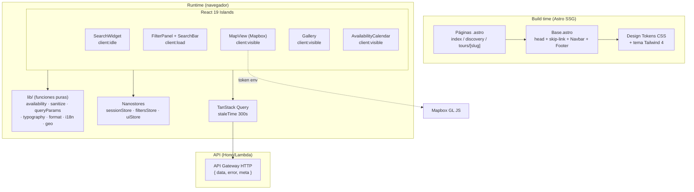

# Design Document — Frontend Portal B2C (Fase 1)

## Overview

Este documento describe el diseño técnico del **Frontend del Portal B2C público de BorondoTours** (`apps/web`) para la Fase 1, a partir de los 22 requisitos aprobados en `requirements.md`. El portal es una web de descubrimiento construida con **Astro 5** en modo `static` (SSG) que hidrata **islands de React 19** solo donde hay interactividad (buscador, filtros, mapa, galería, calendario). La identidad visual canónica es la marca **"Ave azul"** definida en `otros/design/Brand_Guidelines_Borondo_Tours_Completo-v2.md`.

El diseño se organiza en cuatro capas construidas en orden, coherentes con el alcance de Fase 1:

1. **Design System** — design tokens CSS + tema Tailwind CSS 4 + fuentes web (R1, R2).
2. **UI Library** — componentes base: `Button`, `Card`, `GlassSurface`, `TourCard`, `Skeleton`, `Image`, `SafeHtml` (R3, R4).
3. **Layout + Landing** — `Base.astro`, `Navbar`, `Footer`, `Hero`, `SearchWidget`, secciones de destinos y trust badges (R6–R10).
4. **Discovery + Tour Detail** — catálogo con búsqueda/filtros/mapa (Spec-A) y detalle con galería/calendario/add-ons/cross-selling (Spec-B) (R11–R18).

Transversalmente, el diseño cubre i18n (R19), seguridad frontend (R20), performance (R21) y accesibilidad WCAG 2.1 AA (R22).

### Principios de diseño

- **Islands architecture**: el HTML se genera estático en build; React solo hidrata componentes interactivos con la directiva de cliente mínima necesaria (`client:idle`, `client:visible`, `client:load`). Esto satisface el code splitting por ruta (R21.7).
- **Lógica pura separada de UI**: toda regla computable (semáforo de disponibilidad, sanitización HTML, normalización de query params, escalado tipográfico, formateo de precio, resolución i18n, filtrado geográfico) vive en funciones puras testeables por separado de los componentes, en `apps/web/src/lib/`. Esto permite property-based testing (ver Correctness Properties).
- **Cero valores hardcodeados**: colores y tipografía provienen exclusivamente de tokens (R1.9); todo texto proviene de i18next (R19.1).
- **Seguridad por defecto**: HTML del backend solo vía `SafeHtml` (DOMPurify); access token solo en memoria (nanostores) (R20).
- **Contrato de datos del backend**: respuestas con forma `{ data, error, meta }`; endpoints compuestos por vista (`GET /tours/:slug/page-data`); búsquedas complejas vía `QUERY /tours/search`.

### Fuera de alcance (Fase 1)

Checkout, autenticación/Auth Gate, portal privado, lealtad, chat, reseñas con escritura, scrollytelling GSAP, Three.js y contenido en inglés (`en` se prepara en la estructura i18n pero el contenido es `es`).

## Architecture

### Vista de capas



### Stack y decisiones clave

| Preocupación | Decisión | Requisito |
|---|---|---|
| Renderizado | Astro `output: 'static'` (SSG), islands React 19 | R21.7 |
| Estado servidor | TanStack Query, `staleTime: 300s` para catálogo | R21.6 |
| Estado compartido entre islands | Nanostores (`sessionStore`, `filtersStore`, `uiStore`) | R20.1 |
| Estilos | Tailwind CSS 4 con `@theme` mapeando tokens de marca | R1.8 |
| Imágenes | `@unpic/react` con `srcset` 400/800/1200w | R21.4 |
| Mapa | Mapbox GL JS como island `client:visible`, token por env var | R14.2, R14.8 |
| Calendario | react-day-picker island `client:visible` | R17.1 |
| i18n | i18next con fallback `es`, namespaces por dominio | R19 |
| Sanitización | DOMPurify encapsulado en `SafeHtml` | R16.7, R20.5–20.7 |
| Hosting | S3 + CloudFront (estático) | — |

### Estructura de carpetas (apps/web/src)

```
src/
  styles/
    tokens.css            # design tokens (:root custom properties)
    fonts.css             # @font-face Sora/Inter, font-display: swap
  lib/                    # FUNCIONES PURAS (unit + property tested)
    availability.ts       # semáforo (R5)
    sanitize.ts           # allowlist DOMPurify config (R16.7, R20.6)
    queryParams.ts        # serialize/parse filtros<->URL (R12, R13)
    typography.ts         # multiplicador responsivo (R1.6)
    format.ts             # precio COP, duración (R15.2)
    geo.ts                # distancia + filtro radio 50km (R18)
    i18n/
      index.ts            # config i18next + fallback (R19)
      resolve.ts          # resolución de clave con fallback (R19.4/5)
    calendar.ts           # mes inicial + selección (R17.3/4/5)
  components/
    ui/                   # Button, Card, GlassSurface, Skeleton, Image, SafeHtml
    layout/               # Navbar (island), Footer (astro)
    landing/              # Hero, SearchWidget (island), DestinationsSection
    discovery/            # CatalogGrid, SearchBar, FilterPanel, MapView, SortSelect
    detail/               # Gallery, TourInfo, AddOns, AvailabilityCalendar, NearbyTours
  stores/
    session.ts            # access token en memoria (R20.1)
    filters.ts            # estado de filtros del catálogo
    ui.ts                 # modales, drawer, navbar scroll state
  pages/
    index.astro
    discovery.astro
    tours/[slug].astro
  layouts/
    Base.astro
```

### Flujo de datos por vista

- **Landing** (`index.astro`): SSG estático; la sección de destinos hidrata un island que consume `GET /home/page-data` vía TanStack Query, con `Skeleton` durante la carga (R10.5) y estado de error con reintento (R10.6).
- **Discovery** (`discovery.astro`): el estado de búsqueda/filtros/orden es la **URL** (query params) como fuente de verdad. Un island `CatalogController` lee la URL al montar (R13.10), hidrata `filtersStore`, y dispara `QUERY /tours/search` con debounce 300ms (R12.2). Cambios de filtro reescriben la URL en ≤500ms (R13.8).
- **Tour Detail** (`tours/[slug].astro`): consume `GET /tours/:slug/page-data` (endpoint compuesto) que devuelve tour, galería, add-ons, instancias/disponibilidad y semilla de tours cercanos. Islands independientes hidratan galería, calendario y cross-selling.

## Components and Interfaces

### Design System (R1, R2)

Los tokens se declaran como CSS custom properties en `tokens.css` y se exponen a Tailwind 4 vía `@theme`. Una verificación de build (paso de validación en `astro build`) falla si un componente referencia un token no definido (R1.10).

```css
/* tokens.css (extracto) */
:root {
  /* Paleta marca "Ave azul" (R1.1) */
  --color-azul-profundo: #103B66;
  --color-azul-condor:   #2364AA;
  --color-turquesa:      #00B7C7;
  --color-verde:         #79C142;
  --color-arena:         #F3E8D1;
  --color-dorado:        #FDB813;
  --color-blanco-niebla: #F9FBFC;
  --color-negro-volcanico:#101010;

  /* Fondo / texto por defecto (R1.2) */
  --color-bg:   var(--color-blanco-niebla);
  --color-text: var(--color-negro-volcanico);

  /* Semáforo (R5.8) */
  --color-avail-green:  var(--color-verde);
  --color-avail-yellow: var(--color-dorado);
  --color-avail-red:    #D64545;
  --color-avail-gray:   #9AA5AD;

  /* Tipografía (R1.3–R1.5) */
  --font-heading: "Sora", system-ui, sans-serif;
  --font-body:    "Inter", system-ui, sans-serif;
  --fs-h1: 3.5rem;  --lh-h1: 1.12;
  --fs-h2: 2.5rem;  --lh-h2: 1.20;
  --fs-h3: 1.75rem; --lh-h3: 1.28;
  --fs-h4: 1.25rem; --lh-h4: 1.32;
  --fs-body1: 1rem;     --lh-body: 1.60;
  --fs-body2: 0.875rem;
  --fs-button: 1rem;    --lh-button: 1.0;
  --fs-label: 0.75rem;  --lh-label: 1.50;

  /* Degradados (R1.7) */
  --grad-naturaleza: linear-gradient(135deg, #00B7C7, #79C142);
  --grad-profundidad: linear-gradient(135deg, #103B66, #00B7C7);
}
```

**Escalado tipográfico responsivo (R1.6)** — función pura `typographyMultiplier(viewportWidth)`:

```typescript
// lib/typography.ts
export function typographyMultiplier(viewportWidth: number): 0.85 | 0.95 | 1 {
  if (viewportWidth < 768) return 0.85;
  if (viewportWidth <= 1024) return 0.95;
  return 1;
}
```

**Fuentes (R2)**: `@font-face` con `font-display: swap` (R2.2), respaldo `system-ui` declarado explícitamente (R2.1), y solo los pesos Sora 800/700/600 e Inter 400/600 (R2.3). Se precargan con `<link rel="preload">` y se reservan métricas con `size-adjust`/`ascent-override` para mantener CLS < 0.1 (R2.5).

### UI Library (R3, R4)

**`Button`** — variantes `primary` | `cta` | `secondary`, estados default/hover/focus/disabled.

```typescript
interface ButtonProps {
  variant: "primary" | "cta" | "secondary";
  labelKey: string;          // clave i18n; se renderiza con t() (R3.8)
  disabled?: boolean;
  onClick?: () => void;
  type?: "button" | "submit";
}
```

- `primary`: fondo Turquesa, texto blanco (contraste ≥4.5:1, R3.1); hover → Verde con `transition` ≤300ms (R3.2).
- `cta`: fondo Dorado, texto Negro Volcánico (R3.3).
- `secondary`: transparente, borde contraste ≥3:1, texto oscuro ≥4.5:1 (R3.4).
- Foco de teclado visible con contraste ≥3:1 (R3.5).
- `disabled`: `opacity ≤0.5` + `aria-disabled="true"` (R3.6) y `onClick` bloqueado (R3.7).
- Si falta la clave i18n, muestra la clave literal (R3.9 / R19.5).

**`GlassSurface`** — superficie translúcida reutilizable.

```typescript
interface GlassSurfaceProps {
  as?: keyof JSX.IntrinsicElements;  // default "div"
  overImage: true;                    // obliga uso solo sobre imagen (R4.3)
  children: React.ReactNode;
}
```

- `backdrop-filter: blur(...)` + borde 1px opacidad ≤30% (R4.2).
- Overlay que garantiza contraste ≥4.5:1 del texto (R4.4).
- `@supports not (backdrop-filter: blur(0))` → fondo sólido opaco con contraste ≥4.5:1 (R4.5).

**`TourCard`** — foto, nombre, duración, precio base, badge de operador como elementos visibles distintos (R4.6); `alt` no vacío en imagen informativa (R4.7); foco visible ≥3:1 y activación Enter/Espacio cuando es interactiva (R4.8).

```typescript
interface TourCardProps {
  tour: TourSummary;
  glass?: boolean;   // variante glass para landing (R10.1)
  href: string;      // /tours/:slug
}
```

**`SafeHtml`** — único punto de render de HTML del backend (R16.1, R20.5).

```typescript
interface SafeHtmlProps {
  html: string;
  fallbackKey?: string;   // mensaje si no se puede sanitizar (R16.3)
}
```

Usa `sanitizeHtml()` de `lib/sanitize.ts`. Si la sanitización lanza o produce contenido no procesable, renderiza vacío/fallback sin insertar el original (R20.7, R16.3).

**`Image`** — wrapper de `@unpic/react`: `srcset` 400/800/1200w (R21.4), `loading` configurable (eager above-the-fold R8.5; lazy con margen 200px below-the-fold R10.4/R21.1), placeholder con `alt` en fallo de carga (R21.5).

**`Skeleton`** — placeholder animado usado en toda carga asíncrona en lugar de spinner (R21.2).

### Layout y Navegación (R6, R7, R22.1)

**`Base.astro`** provee `<html lang>`, `<head>` (metadatos, preloads, JSON-LD cuando aplica), un **skip-link** como primer elemento tabulable (R22.1), `Navbar` y `Footer`. El `<main id="main">` recibe foco al activar el skip-link.

**`Navbar`** (island `client:idle` para reaccionar al scroll):

- Enlaces: Destinos, Experiencias, Nosotros, Blog, Contacto (R6.2); CTA Dorado "Planifica tu viaje" (R6.3). Textos vía i18n (R6.9).
- Sobre el hero: `GlassSurface` con contraste ≥4.5:1 (R6.4). Al salir del hero (scroll): fondo sólido con contraste ≥4.5:1 (R6.5) — se detecta con `IntersectionObserver` sobre el `Hero`.
- ≥768px: enlaces en línea (R6.6). <768px: menú móvil con `aria-label`, `aria-expanded`, navegable con Tab, activable Enter/Espacio, foco visible, cierre con Escape devolviendo foco al botón (R6.7).
- Logo horizontal "Ave azul" ancho ≥160px con `alt` descriptivo (R6.8).

**`Footer`** (componente `.astro`): las 4 promesas en orden fijo Turismo Responsable → Experiencias Únicas → Seguridad Garantizada → Atención Personalizada (R7.1), cada una con título, texto e icono Lucide (Hoja, Cámara, Escudo, Personas) (R7.2, R7.3). Textos vía i18n con fallback `es` sin mostrar clave cruda (R7.4, R7.5). Aparece en Landing, Discovery y Tour Detail (R7.6).

### Landing (R8, R9, R10)

**`Hero`** — imagen de paisaje 100% ancho con overlay oscuro (R8.1); H1 y subtítulo de marca en Sora (R8.2, R8.3) con contraste ≥4.5:1 sobre el overlay (R8.4); imagen `loading="eager"` (R8.5) y `alt=""` decorativa (R8.6); fallback a fondo oscuro sólido si la imagen no carga (R8.7); sin recorte ni scroll horizontal en <768px (R8.8); textos vía i18n (R8.9).

**`SearchWidget`** (island `client:idle`) — `GlassSurface` sobre el hero (R9.1):

```typescript
interface SearchCriteria {
  destination: string;   // 0..120 chars (R9.2)
  date: string | null;   // ISO; no pasada al enviar (R9.4)
  travelers: number;     // 1..99, inicial 1 (R9.2)
}
```

- Botón Dorado "Buscar aventura" (R9.3).
- Al enviar con datos válidos → navega a `discovery` con criterios como query params (R9.4).
- Si destino vacío / fecha pasada / viajeros fuera de rango → cancela navegación, muestra error asociado al campo y preserva valores (R9.5).
- Cada campo con `label`/`aria-label` alcanzable por teclado (R9.6); labels y placeholders vía i18n (R9.7).

**`DestinationsSection`** — entre 3 y 8 `TourCard` glass sobre foto (R10.1); sección trust badges con las 4 promesas + iconos (R10.2); click en card navega a `/tours/:slug` (R10.3); imágenes below-the-fold con lazy load a 200px (R10.4); `Skeleton` durante carga (R10.5); error con reintento preservando el resto de la página (R10.6).

### Discovery / Catálogo (R11–R14)

La **URL es la fuente de verdad** del estado de exploración. `lib/queryParams.ts` serializa y parsea el estado:

```typescript
interface CatalogState {
  q: string;                       // texto normalizado (trim) (R12.3)
  regions: Region[];               // multi (R13.1)
  durations: DurationBucket[];     // multi (R13.2)
  priceMin: number;                // 0..999_999_999 (R13.3)
  priceMax: number;                // priceMin <= priceMax (R13.3)
  difficulties: Difficulty[];      // multi (R13.4)
  passportOnly: boolean;           // IVA exento (R13.5)
  sort: "popular" | "price_asc" | "price_desc" | "recent";  // default popular (R13.9)
  page: number;                    // 12 por página (R11.8)
  view: "list" | "map";            // default list (R14.1)
}

export function parseCatalogState(search: URLSearchParams): CatalogState;
export function serializeCatalogState(state: CatalogState): URLSearchParams;
```

**`CatalogGrid`** — 3 col ≥1025px, 2 col 768–1024px, 1 col ≤767px (R11.1–11.3); `TourCard` con foto+alt, nombre, duración, precio, badge operador (R11.4); 12 skeletons en primera carga (R11.5); estado vacío con "limpiar filtros" (R11.6); error con reintento conservando filtros (R11.7); paginación de 12 (R11.8).

**`SearchBar`** — 0..100 chars, mínimo 2 para disparar (R12.1); debounce 300ms (R12.2); escribe `q` normalizado (trim) en URL (R12.3); hidrata desde `q` al cargar (R12.4); estado sin resultados conservando texto (R12.5); error conservando último catálogo (R12.6); limpiar elimina `q` (R12.7).

**`FilterPanel`** — filtros Destino (7 regiones), Duración (4), Precio (rango con `min≤max`), Dificultad (4), "Incluye pasaporte" (IVA exento) (R13.1–13.5); combinación AND (R13.6); "Limpiar filtros" visible si hay ≥1 filtro (R13.7); refleja estado en URL ≤500ms (R13.8); orden con 4 opciones, default "Más popular" (R13.9); hidrata desde URL (R13.10); limpiar resetea filtros + orden default + URL (R13.11); vacío conserva filtros y control limpiar (R13.12); <768px en drawer lateral sin colapsar el grid (R13.13).

**`MapView`** (island `client:visible`, Mapbox GL JS) — toggle Lista/Mapa, Lista por defecto con indicación visual (R14.1); render ≤3s con un marcador por tour con coordenadas válidas según filtros (R14.2); centro Colombia `[-74.2973, 4.5709]` zoom 5 (R14.3); un solo popup a la vez con foto/nombre/precio/"Ver detalle" (R14.4); conserva filtros al alternar vista (R14.5); estado vacío si ningún tour filtrado tiene coordenadas (R14.6); fallback a lista si Mapbox no carga en 3s (R14.7); token Mapbox desde env var, nunca en código (R14.8).

### Tour Detail (R15–R18)

Consume `GET /tours/:slug/page-data`:

**`Gallery`** (island `client:visible`) — slider 1..20 fotos con thumbnails y controles (R15.1); `alt` descriptivo por foto informativa / `alt=""` decorativa (R15.8); placeholder si no hay fotos (R15.9); fallback por foto que no carga (R15.10).

**`TourInfo`** — nombre como único H1 (R15.2); destino/región; duración formateada "N días / M noches" o "N horas"; precio "Desde $X COP por persona" con separador de miles (R15.2, `lib/format.ts`); badge operador + badge dificultad con colores de token (R15.3); indicador "IVA exento disponible" si `iva_exempt_available` (R15.4). Elemento pegajoso: card lateral sticky ≥1024px (R15.5) / barra inferior fija <1024px (R15.6), visible durante scroll (R15.7).

**Descripción y Add-ons (R16)** — descripción larga (≤20.000 chars) vía `SafeHtml` (R16.1); si vacía/ausente se omite el bloque (R16.2); si `SafeHtml` no procesa, se omite y muestra mensaje "contenido no disponible" sin exponer HTML crudo (R16.3); secciones "¿Qué incluye? / ¿Qué NO incluye? / ¿Qué llevar?" solo si tienen datos (R16.4); 1..50 add-ons con nombre/descripción/precio en los rangos indicados (R16.5); sin add-ons se omite la sección (R16.6). Allowlist de sanitización (R16.7) definido en `lib/sanitize.ts`.

**`AvailabilityCalendar`** (island `client:visible`, react-day-picker) — colores del semáforo por token (R17.1); exactamente un estado por fecha vía `Availability_Indicator` (R17.2); posiciona en el primer mes con fecha Verde/Amarillo al cargar (R17.3); selección única reemplazando previa para fechas Verde/Amarillo (R17.4); bloquea selección de Rojo/Gris conservando previa e indicándolo (R17.5); dos meses ≥1024px / uno <1024px (R17.6, R17.7); `aria-label` por fecha con fecha + cupos como entero ≥0 (R17.8); al seleccionar fecha con cupos actualiza precio CTA en ≤1s (R17.9); si no obtiene precio, conserva el previo e indica error (R17.10).

**`NearbyTours`** — carrusel con ≤6 tours dentro de 50km ordenados por distancia ascendente (R18.1); excluye el tour actual (R18.2); oculta la sección si falla o no responde en ≤3s (R18.3); skeleton mientras carga (R18.4); oculta si no hay tours en 50km (R18.5). Lógica en `lib/geo.ts`.

### Semáforo de disponibilidad (R5)

Función pura central, reutilizada por catálogo y calendario:

```typescript
// lib/availability.ts
export type AvailabilityStatus = "green" | "yellow" | "red" | "gray";

export interface DateAvailability {
  available: number;      // cupos disponibles
  total: number;          // capacidad total
  isPast: boolean;        // fecha pasada
  isOffered: boolean;     // el tour se ofrece esa fecha
}

export function availabilityStatus(d: DateAvailability): AvailabilityStatus;
```

Reglas (evaluadas en orden de precedencia):
1. `!isOffered || isPast` → `gray` (R5.5)
2. `total <= 0` o `total` inválido (NaN, no finito) → `gray` (R5.6)
3. `available <= 0` → `red` (R5.4)
4. `available/total >= 0.5` → `green` (R5.2)
5. `1% <= available/total <= 49%` → `yellow` (R5.3)

Cada fecha recibe exactamente un estado (R5.7) y se expone texto accesible además del color (R5.9, vía `aria-label`).

### i18n (R19)

i18next inicializado con `lng: 'es'`, `fallbackLng: 'es'` (R19.2, R19.4), namespaces por dominio (`common`, `nav`, `footer`, `home`, `discovery`, `detail`). La resolución con fallback y logging de dev vive en `lib/i18n/resolve.ts` (R19.5). Compartido entre islands vía provider + store para reaccionar a cambio de idioma sin tocar componentes (R19.6).

### Seguridad frontend (R20)

- `sessionStore` (nanostores) mantiene el access token solo en memoria; nunca se escribe en `localStorage`/`sessionStorage` (R20.1, R20.2); logout limpia la memoria (R20.3); recarga/cierre descarta el token (R20.4, comportamiento natural de memoria).
- Refresh token vive en cookie `HttpOnly` gestionada por el backend (fuera del alcance de JS).
- `SafeHtml` + `lib/sanitize.ts`: DOMPurify configurado con allowlist estricta; elimina `script`, `iframe`, `form`, `input`, `style` y todo atributo `on*` antes de insertar al DOM (R20.6); contenido no sanitizable → vacío (R20.7).

## Data Models

Tipos del frontend (TypeScript strict, sin `any`). El contrato con backend usa `snake_case`; el frontend mapea a `camelCase` en la capa de fetch.

```typescript
// Envoltorio estándar de API
interface ApiResponse<T> {
  data: T | null;
  error: { code: string; message: string } | null;
  meta: { page?: number; pageSize?: number; total?: number } | null;
}

type Region =
  | "eje_cafetero" | "llanos" | "amazonia" | "costa_caribe"
  | "costa_pacifico" | "andes" | "bogota_dc";

type DurationBucket = "half_day" | "one_day" | "two_three_days" | "more_than_three";
type Difficulty = "familiar" | "moderado" | "aventurero" | "extremo";

interface TourSummary {          // usado en grids/carruseles/mapa
  slug: string;
  name: string;
  operatorName: string;
  region: Region;
  durationLabel: string;         // ya formateado o crudo para format.ts
  basePriceCop: number;
  photoUrl: string;
  photoAlt: string;
  coordinates: [number, number] | null;   // [lng, lat] (R14.2)
  difficulty: Difficulty;
  ivaExemptAvailable: boolean;
}

interface TourDetail {
  slug: string;
  name: string;
  region: Region;
  destination: string;
  durationDays: number | null;
  durationNights: number | null;
  durationHours: number | null;
  basePriceCop: number;
  operatorName: string;
  difficulty: Difficulty;
  ivaExemptAvailable: boolean;
  gallery: GalleryPhoto[];        // 0..20
  longDescriptionHtml: string;    // hasta 20.000 chars, sin sanitizar
  includes: string[] | null;
  notIncludes: string[] | null;
  whatToBring: string[] | null;
  addOns: AddOn[];                // 0..50
  coordinates: [number, number];
}

interface GalleryPhoto { url: string; alt: string; decorative: boolean; }

interface AddOn {
  id: string;
  name: string;                   // <=100 chars
  shortDescription: string;       // <=300 chars
  additionalPriceCop: number;     // 0.01 .. 999_999_999.99
}

interface TourInstance {          // disponibilidad por fecha
  date: string;                   // ISO yyyy-mm-dd
  available: number;
  total: number;
  currentPriceCop: number;
  isOffered: boolean;
}

interface TourPageData {          // GET /tours/:slug/page-data
  tour: TourDetail;
  instances: TourInstance[];
  nearby: TourSummary[];          // semilla; filtrado 50km en cliente
}
```

**Formateo (R15.2)** — `lib/format.ts`:

```typescript
export function formatPriceCop(value: number): string;      // "Desde $1.250.000 COP por persona"
export function formatDuration(d: {
  days?: number | null; nights?: number | null; hours?: number | null;
}): string;                                                   // "3 días / 2 noches" | "6 horas"
```

## Correctness Properties

*Una propiedad es una característica o comportamiento que debe cumplirse en todas las ejecuciones válidas de un sistema — esencialmente, un enunciado formal de lo que el sistema debe hacer. Las propiedades son el puente entre las especificaciones legibles por humanos y las garantías de corrección verificables por máquina.*

El Portal_B2C concentra toda la lógica computable en funciones puras en `apps/web/src/lib/`, separadas de la UI. Estas funciones son el objetivo natural del **property-based testing** (fast-check + Vitest): tienen entradas/salidas claras, un espacio de entrada amplio y propiedades universales (invariantes, round-trips, idempotencia). Los criterios de aceptación de estilo, layout, render y accesibilidad no se expresan como propiedades universales y se cubren en la Testing Strategy con snapshot/component tests, E2E (Playwright) y axe.

Cada propiedad indica los requisitos que valida.

### Property 1: Multiplicador tipográfico por rango de viewport

*Para todo* ancho de viewport `w > 0`, `typographyMultiplier(w)` devuelve exactamente uno de `{0.85, 0.95, 1}`, siendo `0.85` cuando `w < 768`, `0.95` cuando `768 ≤ w ≤ 1024`, y `1` cuando `w > 1024`. Las fronteras `767`, `768`, `1024` y `1025` se incluyen explícitamente en el generador.

**Validates: Requirements 1.6**

### Property 2: El semáforo asigna exactamente un estado según precedencia y umbrales

*Para toda* `DateAvailability` generada (incluyendo `total = 0`, `total` NaN/no finito, `available` negativo o mayor que `total`, y combinaciones de `isPast`/`isOffered`), `availabilityStatus(d)` devuelve exactamente un valor de `{green, yellow, red, gray}` respetando el orden de precedencia: `!isOffered || isPast → gray`; `total ≤ 0 || total inválido → gray`; `available ≤ 0 → red`; `available/total ≥ 0.5 → green`; `0.01 ≤ available/total ≤ 0.49 → yellow`.

**Validates: Requirements 5.1, 5.2, 5.3, 5.4, 5.5, 5.6, 5.7**

### Property 3: Round-trip de serialización del estado del catálogo

*Para todo* `CatalogState` válido en forma canónica, `parseCatalogState(serializeCatalogState(state))` produce un estado equivalente a `state`, y `serializeCatalogState` es estable bajo re-parseo (`serialize(parse(serialize(s)))` equivale a `serialize(s)`).

**Validates: Requirements 9.4, 12.4, 13.8, 13.10**

### Property 4: Invariantes de normalización del estado del catálogo

*Para toda* `URLSearchParams` de entrada (incluyendo `q` con espacios externos, `priceMin > priceMax`, y valores fuera de rango o ausentes), el `CatalogState` resultante de `parseCatalogState` cumple: `q` no tiene espacios inicial ni final (`q === q.trim()`), `0 ≤ priceMin ≤ priceMax ≤ 999_999_999`, `sort` toma un valor válido con `"popular"` por defecto, y `view` toma `"list"` por defecto cuando falta o es inválido.

**Validates: Requirements 12.3, 13.3, 13.9**

### Property 5: Formateo de precio en COP

*Para todo* entero `v ≥ 0`, `formatPriceCop(v)` produce una cadena que contiene el valor con separador de miles (punto), el prefijo `"Desde $"` y el sufijo `"COP por persona"`, sin decimales y sin depender del locale del entorno.

**Validates: Requirements 15.2**

### Property 6: Formateo de duración según campos presentes

*Para toda* combinación válida de `{days, nights, hours}`, `formatDuration` produce `"N días / M noches"` cuando hay días/noches y `"N horas"` cuando la duración se expresa en horas, seleccionando el formato según qué campos están presentes y sin emitir números negativos ni campos nulos en la salida.

**Validates: Requirements 15.2**

### Property 7: Resultado de tours cercanos (filtro geográfico 50 km)

*Para todo* tour de origen y toda lista de tours con coordenadas válidas, el resultado de la selección de tours cercanos: (a) excluye el tour actual, (b) contiene solo tours cuya distancia al origen es `≤ 50 km`, (c) está ordenado por distancia ascendente, y (d) tiene longitud `≤ 6`.

**Validates: Requirements 18.1, 18.2**

### Property 8: La distancia geográfica es una métrica bien formada

*Para todo* par de coordenadas `a` y `b`, la distancia haversine cumple `d(a, b) ≥ 0`, `d(a, a) = 0` y simetría `d(a, b) = d(b, a)` (dentro de una tolerancia de punto flotante).

**Validates: Requirements 18.1**

### Property 9: Resolución i18n con fallback determinista

*Para toda* clave y conjunto de catálogos generados, `resolve(key, activeLng, catalogs)` devuelve: el valor del idioma activo si la clave existe en él; en su defecto el valor del idioma de respaldo `es` si existe; y en su defecto la clave literal solicitada. Nunca devuelve una cadena vacía.

**Validates: Requirements 19.4, 19.5, 3.9, 7.5**

### Property 10: Selección del calendario mantiene a lo sumo una fecha

*Para toda* selección previa y toda fecha candidata con su estado, `selectDate(current, candidate, status)` reemplaza la selección por `candidate` cuando `status ∈ {green, yellow}` y conserva `current` cuando `status ∈ {red, gray}`; en todos los casos el resultado contiene a lo sumo una fecha seleccionada.

**Validates: Requirements 17.4, 17.5**

### Property 11: Mes inicial del calendario

*Para toda* lista de instancias con disponibilidad, `initialMonth(instances)` devuelve el primer mes (cronológicamente) que contiene al menos una fecha en estado Verde o Amarillo; si no existe ninguna, aplica el comportamiento por defecto definido (mes actual) de forma determinista.

**Validates: Requirements 17.3**

### Property 12: La sanitización de HTML solo deja pasar la allowlist

*Para todo* HTML generado (incluyendo payloads con `script`, `iframe`, `form`, `input`, `style`, atributos `on*` y atributos arbitrarios), `sanitizeHtml(html)` produce una salida que: no contiene ninguna etiqueta fuera de la allowlist `{p, strong, em, ul, ol, li, a, br, h2, h3}`, no contiene los elementos `script`/`iframe`/`form`/`input`/`style`, no contiene ningún atributo cuyo nombre comience por `on`, y en las etiquetas `a` conserva únicamente el atributo `href`.

**Validates: Requirements 16.7, 20.6**

### Property 13: La sanitización de HTML es idempotente

*Para todo* HTML, `sanitizeHtml(sanitizeHtml(html)) === sanitizeHtml(html)`. Aplicar la sanitización una vez o varias veces produce el mismo resultado, garantizando que el contenido ya sanitizado es un punto fijo seguro.

**Validates: Requirements 16.7, 20.6, 20.7**

## Error Handling

El manejo de errores del Portal_B2C es coherente en todas las capas y prioriza la **degradación elegante**: un fallo aislado nunca debe tumbar la página completa, y ningún error debe exponer datos crudos del backend ni PII.

### Contrato de errores del backend

Toda respuesta de la API tiene la forma `{ data, error, meta }`. La capa de fetch aplica una regla única:

- Si `error !== null` o el status HTTP no es 2xx → se trata como fallo y se propaga a TanStack Query como estado `error`.
- Si `data === null` con `error === null` → se trata como "sin contenido" (estado vacío), no como error.
- Los mensajes mostrados al usuario provienen de i18n (`t('common:error.*')`), nunca del campo `error.message` crudo del backend (evita filtrar detalles técnicos o PII, conforme a 07-legal-compliance).

### Reintentos y timeouts (TanStack Query)

| Escenario | Timeout | Estrategia | Requisito |
|---|---|---|---|
| Carga de datos de vista (landing, catálogo, detalle) | 10s | Mostrar error con acción de reintento, evitando layout shift (reservar altura) | R21.3, R10.6, R11.7, R12.6 |
| Reintento manual | — | Botón "Reintentar" que reejecuta la query conservando el estado (filtros, `q`) | R10.6, R11.7, R12.6 |
| Catálogo | — | `staleTime: 300s`; durante ese intervalo no se refetch | R21.6 |

En Discovery, un error de búsqueda/filtros **conserva el último catálogo mostrado** y los filtros aplicados; nunca limpia la vista (R12.6, R11.7).

### Fallos de carga de imágenes

`Image` (wrapper de `@unpic/react`) captura el evento `onError` y sustituye la fuente por un placeholder de marca con `alt` significativo, sin bloquear el render del resto de la vista (R21.5).

- **Hero**: si la imagen de fondo falla → fondo oscuro sólido que preserva el contraste ≥4.5:1 del texto (R8.7).
- **Gallery**: por foto que no carga → imagen de fallback en su lugar (R15.10); si la galería no tiene fotos → placeholder en lugar del slider (R15.9).

### Mapa (Mapbox) — timeout con fallback a lista

`MapView` (`client:visible`) arranca un temporizador de 3s al iniciar la carga de Mapbox GL JS. Si el mapa no carga/inicializa en ese plazo → se muestra un mensaje de respaldo que ofrece volver a la vista Lista, **conservando los filtros aplicados** (R14.7). Si ningún tour filtrado tiene coordenadas válidas → estado vacío específico del mapa (R14.6). El token de Mapbox se lee de variable de entorno; su ausencia se trata como fallo de carga y activa el mismo fallback (R14.8).

### SafeHtml — fallo de sanitización

`SafeHtml` es el único punto de render de HTML del backend. Si `sanitizeHtml` lanza o produce contenido no procesable:

- Renderiza vacío (o el `fallbackKey` de i18n si se provee) **sin insertar el HTML original en el DOM** (R20.7).
- En Tour_Detail, el bloque de descripción larga se omite y se muestra "contenido no disponible" sin exponer el HTML crudo (R16.3).
- Si la descripción larga viene vacía/ausente → se omite el bloque sin espacio en blanco ni error visible (R16.2).

### Calendario — fallo al obtener precio vigente

Al seleccionar una fecha con cupos, se solicita el precio vigente de la instancia. Si no se obtiene dentro del plazo (≤1s objetivo) o la petición falla → el CTA **conserva el precio previo** e indica el error de forma accesible (texto + no solo color), sin bloquear la interacción con el calendario (R17.9, R17.10).

### Tours cercanos — timeout silencioso

`NearbyTours` se carga de forma no crítica: skeleton mientras carga (R18.4). Si la carga falla o no responde en ≤3s → la sección se **oculta por completo** sin interrumpir el resto de la página (R18.3). Si no hay tours dentro de 50 km distintos del actual → también se oculta, sin carrusel vacío (R18.5).

### i18n — clave faltante

`lib/i18n/resolve.ts` resuelve con fallback determinista (ver Property 9): clave en idioma activo → valor; si no, idioma `es` → valor; si tampoco → **renderiza la clave literal** y registra un log de desarrollo, nunca deja espacio vacío ni muestra `undefined` (R19.5, R3.9, R7.5).

### Validación de formularios (accesibilidad)

Los errores de entrada (SearchWidget, filtros de precio) se muestran como mensaje textual **asociado programáticamente** al control (`aria-describedby`) y **preservan el valor ingresado** (R9.5, R22.9). El envío inválido cancela la navegación (R9.5).

## Testing Strategy

La estrategia sigue un enfoque en capas alineado con los quality gates del proyecto (`06-quality-gates`): **cobertura ≥ 80%** en archivos modificados y cumplimiento **WCAG 2.1 AA** verificable. Herramientas: **Vitest + fast-check** (unit + property), **Testing Library** (component), **Playwright** (E2E) y **axe** (accesibilidad).

### 1. Unit tests (funciones puras de `lib/`)

Ejemplos concretos, casos límite y condiciones de error de las funciones puras: `typographyMultiplier`, `availabilityStatus`, `parseCatalogState`/`serializeCatalogState`, `formatPriceCop`/`formatDuration`, `geo` (haversine + filtro 50 km), `resolve` (i18n), `calendar` (`initialMonth`/`selectDate`) y `sanitizeHtml`. Cubren específicamente las fronteras señaladas en el diseño (49%/50% de disponibilidad, `total = 0`, `priceMin > priceMax`, `q` con espacios, mínimo 2 caracteres de búsqueda) y los valores exactos de marca.

### 2. Property-based tests (fast-check + Vitest)

Cada una de las 13 Correctness Properties se implementa con **un único test de property-based** usando fast-check integrado en Vitest. Reglas obligatorias:

- **No** implementar PBT desde cero: usar `fast-check`.
- **Mínimo 100 iteraciones** por propiedad (`fc.assert(fc.property(...), { numRuns: 100 })`).
- Cada test se **etiqueta** con un comentario que referencia la propiedad del diseño, con el formato: **Feature: frontend-b2c-portal, Property {number}: {property_text}**.
- Los generadores deben incluir los casos frontera relevantes (anchos 767/768/1024/1025; `total = 0`, NaN, negativos; HTML malicioso con `script`/`iframe`/`on*`; coordenadas en antípodas y punto idéntico; claves i18n ausentes en activo y en `es`).
- Para `sanitizeHtml`, los generadores producen fragmentos HTML arbitrarios y payloads de inyección conocidos; las aserciones parsean el DOM resultante y verifican ausencia de etiquetas/atributos prohibidos (Properties 12 y 13). Esta es la prueba de seguridad central contra XSS del frontend.

Mapa propiedad → función bajo prueba: P1→`typography.ts`, P2→`availability.ts`, P3/P4→`queryParams.ts`, P5/P6→`format.ts`, P7/P8→`geo.ts`, P9→`i18n/resolve.ts`, P10/P11→`calendar.ts`, P12/P13→`sanitize.ts`.

### 3. Component tests (Testing Library)

Verifican render, interacción y atributos de accesibilidad de los componentes/islands que no son funciones puras:

- `Button`: variantes y estados (hover/focus/disabled), bloqueo de `onClick` deshabilitado (R3.6, R3.7), render de etiqueta i18n y fallback de clave (R3.8, R3.9).
- `GlassSurface`/`TourCard`: elementos visibles distintos, `alt` no vacío, activación con Enter/Espacio (R4.6–R4.8).
- `SafeHtml`: render de allowlist y comportamiento de fallback ante contenido no sanitizable (R16.3, R20.7).
- `Navbar`: glass sobre hero vs. sólido al scroll, menú móvil (`aria-expanded`, Escape devuelve foco) (R6.4–R6.7).
- `SearchWidget`: validación con mensaje asociado al campo y preservación de valores (R9.5, R9.6).
- `AvailabilityCalendar`: `aria-label` por fecha con cupos como entero ≥0 (R17.8), indicación visual de bloqueo (R17.5).
- Estados de carga (Skeleton en lugar de spinner), vacío y error con reintento en Landing, Catálogo y Detalle (R10.5/10.6, R11.5/11.6/11.7, R12.5/12.6).

### 4. E2E (Playwright)

Flujos completos sobre el build estático:

- Landing → buscar en SearchWidget → navegación a Discovery con query params correctos (R9.4).
- Discovery: escribir búsqueda (debounce, mínimo 2 chars), aplicar filtros y orden, verificar que la URL es la fuente de verdad y que recargar hidrata el estado (R12, R13); toggle Lista/Mapa conservando filtros (R14.5).
- Tour Detail: galería, calendario (selección verde/amarillo, bloqueo rojo/gris, actualización de precio del CTA), tours cercanos (aparición/ocultamiento) (R15–R18).
- Fallbacks: simular fallo de Mapbox (fallback a lista) y de imágenes (placeholder).

### 5. Accesibilidad (axe + Playwright)

- Ejecución de **axe** sobre Landing, Discovery y Tour Detail sin violaciones de nivel A/AA.
- Verificación por teclado: skip-link como primer elemento tabulable que mueve el foco a `#main` (R22.1); recorrido Tab/Shift+Tab/Enter/Escape (R22.6); focus trap y retorno de foco en modales/drawer (R22.7, R22.8).
- Contraste: aserciones de contraste ≥4.5:1 (texto normal) y ≥3:1 (texto grande, componentes y foco) en las combinaciones de marca (R22.2, R22.3).
- No depender solo del color: verificar texto/iconografía equivalente en el semáforo y estados (R5.9, R22.10).

> Nota WCAG: la validación completa de WCAG 2.1 AA requiere además pruebas manuales con tecnologías de asistencia y revisión experta de accesibilidad; axe cubre las verificaciones automatizables, no la totalidad de los criterios.

### Gates de calidad aplicables

- Cobertura ≥ 80% en `apps/web/src/lib/` y componentes modificados (`06-quality-gates` Gate 2).
- Lint sin warnings, sin `any`, sin `console.log` (Gate 1).
- HTML del backend solo vía `SafeHtml`; token de Mapbox solo por env var (Gate 3).
- CI verde (lint + test + build) como condición de merge (`04-coding-standards` Git).
