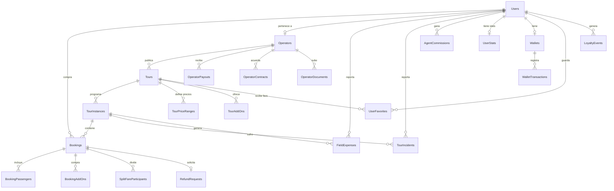

# 🗃️ Modelo de Datos Core — Fuente de Verdad

> Este documento es la **única fuente de verdad** para el esquema de base de datos de BorondoTours.
> Los Specs individuales pueden definir tablas adicionales específicas de su dominio, pero las tablas documentadas aquí son las canónicas.
> Si hay conflicto entre este documento y un Spec, **este documento gana**.

---

## 1. Users (Usuarios — todos los roles)

```
Users
  - id: uuid (PK)
  - email: string (UNIQUE, NOT NULL)
  - password_hash: string | null        ← null si solo usa Google OAuth
  - google_id: string | null            ← Google OAuth sub ID
  - first_name: string
  - last_name: string
  - phone_primary: string | null
  - phone_secondary: string | null
  - date_of_birth: date | null
  - city: string | null
  - country: string (default: 'CO')
  - language: string (default: 'es')
  - avatar_url: string | null
  - document_type: enum (CC, CE, PASSPORT) | null
  - document_number: string | null
  - emergency_contact_name: string | null
  - emergency_contact_phone: string | null
  - medical_conditions: text | null
  - hotel_pickup: string | null
  - role: enum (SUPER_ADMIN, GERENTE, AGENT, COORD, CLIENT,
               OPERATOR_ADMIN, OPERATOR_COORD, OPERATOR_AGENT,
               OPERATOR_GUIDE, OPERATOR_DRIVER)
               ← 10 roles canónicos. Fuente de verdad: Stack-Tecnologico §RBAC
  - custom_role_id: uuid FK | null       ← opcional: refina permisos granulares SOBRE el rol base (ver §23)
  - operator_id: uuid FK | null          ← obligatorio si role = OPERATOR_*
  - is_provider: boolean (default: false)← true si también es proveedor
  - provider_type: enum (EMPRESA, FREELANCER) | null
  - email_verified_at: timestamp | null
  - is_active: boolean (default: true)
  - last_login_at: timestamp | null
  - created_at: timestamp
  - updated_at: timestamp
```

### Users — Índices sugeridos
- `UNIQUE(email)`
- `INDEX(operator_id)` (para aislar datos por operador)
- `INDEX(role)` (para filtros rápidos en el admin)

---

## 2. Operators (Operadores turísticos)

```
Operators
  - id: uuid (PK)
  - legal_name: string                   ← Razón social
  - trade_name: string                   ← Nombre comercial
  - nit: string (UNIQUE)
  - rnt: string | null                   ← Registro Nacional de Turismo
  - logo_url: string | null
  - contact_email: string
  - contact_phone: string
  - address: string | null
  - city: string
  - country: string (default: 'CO')
  - commission_pct: decimal              ← % que retiene BorondoTours
  - operator_class: enum (CORPORATE, LOCAL_MICRO)  ← clasificación operativa/fiscal
  - tax_regime: enum (RESPONSABLE_IVA, NO_RESPONSABLE_IVA)  ← define si emite Factura Electrónica o requiere Documento Soporte
  - is_income_tax_declarant: boolean (default: false)  ← declarante de renta: true→ReteFuente 4%, false→6% (servicios)
  - retefuente_pct: decimal | null       ← override manual; si null, se deriva de is_income_tax_declarant + tipo de servicio
  - reteica_pct: decimal (default: 0)     ← tarifa ICA territorial (por mil), configurable por municipio del servicio (ADR-009)
  - applies_reteica: boolean (default: false)  ← si el municipio del servicio obliga a BorondoTours a retener ICA
  - is_verified: boolean (default: false)
  - verified_at: timestamp | null
  - verified_by: uuid FK | null          ← SUPER_ADMIN que verificó
  - onboarding_status: enum (PENDING_DOCS, PENDING_REVIEW, VERIFIED, SUSPENDED)
  - created_at: timestamp
  - updated_at: timestamp
```

---

## 3. OperatorDocuments (Documentos legales del operador)

```
OperatorDocuments
  - id: uuid (PK)
  - operator_id: uuid FK
  - document_type: enum (RUT, CAMARA_COMERCIO, RNT, CEDULA, TITULO_PROFESIONAL)
  - s3_key: string                       ← clave en S3 privado
  - s3_bucket: string                    ← 'borondo-legal-docs-private'
  - file_name: string                    ← nombre original del archivo
  - file_size_bytes: integer
  - uploaded_by: uuid FK
  - verified_by: uuid FK | null
  - verified_at: timestamp | null
  - lifecycle_status: enum (ACTIVE, GLACIER)
  - glacier_transition_at: timestamp | null  ← cuando se movió a Deep Glacier (15 días post-verificación)
  - created_at: timestamp
```

> **Política S3:** Los documentos se mueven a S3 Deep Glacier **15 días después de la verificación** del operador. Ver [[Politica-Datos-Personales]].

---

## 4. Tours (Catálogo de tours)

```
Tours
  - id: uuid (PK)
  - operator_id: uuid FK
  - title: string
  - slug: string (UNIQUE)               ← para URLs amigables (/tours/:slug)
  - description_md: text                 ← Markdown
  - category: enum (NATURALEZA, AVENTURA, CULTURAL, GASTRONOMICO, URBANO, INTERNACIONAL, CRUCERO)
                                         ← categoría TEMÁTICA del tour
  - product_type: enum (PASADIA, PASANOCHE, EXCURSION, PLAN_PERSONALIZADO, PLAN_AEREO)
                                         ← TIPO de tour a vender (dimensión independiente de category)
  - region_id: uuid FK | null            ← región/ubicación donde se opera el tour (ver §40 Regions)
  - difficulty: enum (FACIL, MODERADO, DIFICIL, EXTREMO)
  - duration_hours: decimal
  - city: string
  - department: string | null
  - country: string (default: 'CO')
  - latitude: decimal
  - longitude: decimal
  - meeting_point: string                ← dirección del punto de encuentro
  - meeting_point_lat: decimal | null
  - meeting_point_lng: decimal | null
  - base_price_cop: decimal
  - pax_rule: enum (BY_AGE, BY_HEIGHT)   ← regla de pasajeros
  - min_pax: integer (default: 1)
  - max_pax: integer
  - reservation_pct: integer (default: 100) ← DEPRECADO: usar deposit_kind + deposit_value
  - deposit_kind: enum (FIXED, PERCENT) | null   ← tipo de abono; se define al APROBAR el tour (BorondoTours), no por operador ni cliente
  - deposit_value: decimal | null        ← monto fijo (COP) si FIXED, o porcentaje si PERCENT
  - full_payment_days_before: integer | null ← días antes del tour para pagar el total (ej. Pasadía 5, Pasanoche 7, Excursión 20, Aéreo 30)
  - is_flexible_payment: boolean (default: false) ← permite acta de compromiso de pago (autoriza BorondoTours, ver Spec-C RF-C14)
  - cancellation_days: integer (default: 5) ← días mínimos para cancelación gratis
  - status: enum (DRAFT, PENDING_REVIEW, PUBLISHED, REJECTED, ARCHIVED)
  - rejection_reason: text | null
  - reviewed_by: uuid FK | null
  - reviewed_at: timestamp | null
  - media_gallery: jsonb                 ← [{url, type, order, alt_text}]
  - video_url: string | null
  - seo_title: string | null
  - seo_description: string | null
  - is_featured: boolean (default: false)
  - search_synced_at: timestamp | null   ← antes meilisearch_synced_at; solo relevante si se activa OpenSearch (F3+). En F1-2 la búsqueda es pg_trgm directo sobre estas columnas
  - created_at: timestamp
  - updated_at: timestamp
```

### Tours — Índices sugeridos
- `UNIQUE(slug)`
- `INDEX(operator_id)`
- `INDEX(status)` (para filtrar publicados)
- `INDEX(category, city)` (para búsqueda por categoría + ciudad)
- `GIN(title gin_trgm_ops)` + `GIN(description_md gin_trgm_ops)` (para búsqueda pg_trgm typo-tolerant — ADR-002/ADR-011)

---

## 5. TourPriceRanges (Precios por categoría de pasajero)

```
TourPriceRanges
  - id: uuid (PK)
  - tour_id: uuid FK
  - label: string                        ← "Adulto", "Niño (5-12)", "Menor 1m"
  - min_value: decimal | null            ← rango según pax_rule (edad o estatura)
  - max_value: decimal | null
  - price_cop: decimal
  - created_at: timestamp
```

---

## 6. TourAddOns (Add-ons opcionales del tour)

```
TourAddOns
  - id: uuid (PK)
  - tour_id: uuid FK
  - name: string                         ← "Almuerzo típico", "Alquiler casco"
  - price_cop: decimal
  - duration_minutes: integer | null      ← tiempo que toma el add-on
  - max_per_booking: integer (default: 10)
  - is_active: boolean (default: true)
  - created_at: timestamp
```

---

## 7. TourInstances (Fechas específicas de operación)

```
TourInstances
  - id: uuid (PK)
  - tour_id: uuid FK
  - instance_date: date
  - start_time: time
  - end_time: time | null
  - available_slots: integer             ← cupos iniciales
  - booked_slots: integer (default: 0)   ← cupos vendidos
  - status: enum (SCHEDULED, FULL, CANCELED, COMPLETED)
  - assigned_guide_id: uuid FK | null    ← OPERATOR_GUIDE asignado
  - assigned_driver_id: uuid FK | null   ← OPERATOR_DRIVER asignado
  - assigned_vehicle_id: uuid FK | null
  - weather_alert: boolean (default: false)
  - coordinator_notes: text | null
  - created_at: timestamp
  - updated_at: timestamp
```

### TourInstances — Índices sugeridos
- `INDEX(tour_id, instance_date)` (para búsqueda por tour + fecha)
- `INDEX(status)` (para filtrar programadas vs canceladas)
- `INDEX(assigned_guide_id)` (para el manifiesto del guía)

---

## 8. Bookings (Reservas)

```
Bookings
  - id: uuid (PK)
  - tour_instance_id: uuid FK
  - user_id: uuid FK                     ← cliente que compra
  - agent_id: uuid FK | null             ← agente que cotizó (si aplica)
  - pax_count: integer
  - subtotal_cop: decimal                ← antes de IVA y Coins
  - iva_cop: decimal                     ← 0 si exento (extranjero con PIP)
  - coins_used: decimal (default: 0)
  - total_cop: decimal                   ← subtotal + iva - coins
  - amount_paid: decimal (default: 0)    ← lo que ha pagado el cliente hasta ahora
  - amount_due: decimal                  ← total_cop - amount_paid (computed o trigger)
  - onepay_reference: string | null
  - status: enum (HOLD, HOLD_GROUP, PARTIAL_PAID, CONFIRMED, SETTLED, CANCELED, COMPLETED, CHARGEBACK, EXPIRED)
  - source: enum (WEB_B2C, AGENT_QUOTE, AGENCY_LINK, QUICK_SALE)
  - passport_s3_key: string | null       ← si extranjero
  - confirmation_number: string (UNIQUE) ← human-readable (ej: BT-2026-00001)
  - canceled_at: timestamp | null
  - canceled_by: uuid FK | null
  - cancellation_reason: text | null
  - cancellation_tier: enum (TIER_1_GTE_10, TIER_2_5_TO_9, TIER_3_LT_5, NO_SHOW) | null
  - penalty_amount: decimal | null       ← monto retenido como penalidad
  - completed_at: timestamp | null
  - created_at: timestamp
  - updated_at: timestamp
```

---

## 9. BookingPassengers (Datos por pasajero)

```
BookingPassengers
  - id: uuid (PK)
  - booking_id: uuid FK
  - user_id: uuid FK | null              ← null si Split Fare sin cuenta
  - full_name: string
  - document_type: enum (CC, CE, PASSPORT)
  - document_number: string
  - phone: string
  - emergency_contact_name: string
  - emergency_contact_phone: string
  - medical_conditions: text | null
  - hotel_pickup: string | null
  - price_category: string               ← "Adulto", "Niño", etc.
  - unit_price_cop: decimal
  - created_at: timestamp
```

---

## 10. BookingAddOns (Add-ons comprados en la reserva)

```
BookingAddOns
  - id: uuid (PK)
  - booking_id: uuid FK
  - addon_id: uuid FK → TourAddOns
  - quantity: integer
  - unit_price_cop: decimal              ← precio al momento de compra (snapshot)
  - total_cop: decimal
  - created_at: timestamp
```

---

## 11. SplitFareParticipants (ver Spec-C §8)

> Definición canónica en [[../01-Specs/Spec-C-Checkout]] §11.

---

## 12. Wallets y WalletTransactions (simplificado — ADR-007)

> **ACTUALIZADO ADR-007:** Se eliminaron los Coins Restringidos. Todos los Coins son libres.
> La tabla `Wallets` solo tiene `balance` (sin `balance_free`/`balance_restricted`).

```
Wallets
  - id: uuid (PK)
  - user_id: uuid FK (UNIQUE)
  - balance: decimal (default: 0)        ← saldo total en Coins (todos libres)
  - created_at: timestamp
  - updated_at: timestamp

WalletTransactions
  - id: uuid (PK)
  - wallet_id: uuid FK
  - booking_id: uuid FK | null
  - type: enum (CREDIT, DEBIT)
  - coins_amount: decimal                ← cantidad de Coins
  - xp_amount: integer | null            ← XP otorgados (si aplica)
  - reason: enum (LOYALTY_PURCHASE, AD_REWARD, REVIEW_REWARD, REFERRAL_REWARD,
                  CANCELLATION_REFUND, FORCE_MAJEURE, COMPENSATION, ONBOARDING,
                  CHECKOUT_USE, VOIDED)
  - ratio_snapshot: jsonb | null         ← {coins: 100, cop: 500} al momento de la transacción
  - note: text | null                    ← obligatorio si reason = COMPENSATION
  - created_by: uuid FK
  - created_at: timestamp
```

---

## 13. UserStats y Loyalty (actualizado Spec-E — modelo multifactorial)

```
UserStats
  - user_id: uuid FK (PK)
  - tours_national: integer (default: 0)
  - tours_international: integer (default: 0)
  - tours_cruise: integer (default: 0)
  - total_spent: decimal (default: 0)
  - xp_total: integer (default: 0)           ← puntos de experiencia acumulados
  - loyalty_level: integer (0-5)             ← nivel actual
  - reviews_written: integer (default: 0)
  - referrals_converted: integer (default: 0)
  - ads_viewed_total: integer (default: 0)   ← acumulado histórico (persistente en Postgres)
  # NOTA (ADR-011): el contador DIARIO ads_viewed_today NO vive aquí. Se lleva en DynamoDB
  # con TTL hasta medianoche Colombia (UpdateItem ADD atómico). Postgres solo guarda el acumulado.
  - level_achieved_at: timestamp | null
  - updated_at: timestamp

LoyaltyConfig (singleton — configuración global)
  - id: integer (PK, siempre = 1)
  - coin_ratio_coins: integer (default: 100)  ← "cada X Coins..."
  - coin_ratio_cop: integer (default: 500)    ← "...equivalen a $Y COP"
  - min_coins_to_use: integer (default: 100)
  - max_referrals_per_user: integer (default: 20)
  - max_ads_per_day: integer (default: 3)
  - updated_by: uuid FK
  - created_at: timestamp
  - updated_at: timestamp

LoyaltyLevels (tabla de configuración — editable desde ERP)
  - id: integer (0-5)
  - name: string
  - xp_threshold: integer                     ← XP necesarios para alcanzar este nivel
  - coins_pct_per_purchase: decimal           ← % de Coins otorgados por compra
  - benefits: jsonb                           ← array de beneficios del nivel
  - badge_icon_url: string | null
  - created_at: timestamp
  - updated_at: timestamp

CoinRewardConfig (recompensas por acción)
  - id: uuid (PK)
  - action: enum (PURCHASE, AD_VIEW, REVIEW_TOUR, REVIEW_GUIDE, REFERRAL, ONBOARDING, CHALLENGE)
  - coins_amount: integer
  - xp_amount: integer
  - max_per_day: integer | null
  - max_per_user: integer | null
  - is_active: boolean (default: true)
  - description_es: string
  - updated_by: uuid FK
  - created_at: timestamp
  - updated_at: timestamp

LoyaltyEvents
  - id: uuid (PK)
  - user_id: uuid FK
  - event_type: enum (LEVEL_UP, COINS_EARNED, COINS_USED, XP_EARNED)
  - old_level: integer | null
  - new_level: integer | null
  - xp_earned: integer | null
  - created_at: timestamp

LoyaltyChallenges (retos temporales — Fase 2)
  - id: uuid (PK)
  - title: string
  - description: text
  - action_required: enum
  - target_count: integer
  - coins_reward: integer
  - xp_reward: integer
  - starts_at: timestamp
  - ends_at: timestamp
  - is_active: boolean
  - created_by: uuid FK
  - created_at: timestamp

UserFavorites (wishlist del viajero)
  - id: uuid (PK)
  - user_id: uuid FK
  - tour_id: uuid FK
  - created_at: timestamp
  - UNIQUE(user_id, tour_id)
```

---

## 14. OperatorPayouts (Liquidaciones al operador)

```
OperatorPayouts
  - id: uuid (PK)
  - operator_id: uuid FK
  - period_start: date
  - period_end: date
  - gross_revenue: decimal               ← suma de bookings CONFIRMED del período
  - commission_amount: decimal           ← gross × commission_pct
  - chargeback_deductions: decimal       ← descuentos por chargebacks
  - retefuente_amount: decimal (default: 0)  ← retención en la fuente sobre el bruto del operador (ADR-009)
  - reteica_amount: decimal (default: 0)     ← retención ICA territorial (según municipio del servicio)
  - reteiva_amount: decimal (default: 0)     ← retención de IVA (15% del IVA; casos específicos)
  - total_withholdings: decimal (default: 0) ← suma de retefuente + reteica + reteiva (pasivo por impuestos ante la DIAN)
  - net_payout: decimal                  ← gross - commission - chargebacks - total_withholdings
  - status: enum (PENDING, IN_REVIEW, PAID, DISPUTED)
  - estimated_payment_date: date | null  ← fecha estimada de pago (fin del ciclo + dias de procesamiento)
  - paid_at: timestamp | null
  - paid_by: uuid FK | null              ← COORD que ejecutó el pago
  - transfer_reference: string | null
  - siigo_document_id: string | null
  - created_at: timestamp
```

---

## 15. OperatorContracts (Historial inmutable de comisiones)

```
OperatorContracts
  - id: uuid (PK)
  - operator_id: uuid FK
  - commission_pct: decimal
  - effective_from: date
  - effective_until: date | null         ← null = vigente actualmente
  - contract_s3_key: string | null
  - approved_by: uuid FK
  - notes: text | null
  - created_at: timestamp
```

---

## 16. AgentCommissions (Comisiones de agentes de ventas)

```
AgentCommissions
  - id: uuid (PK)
  - agent_id: uuid FK → Users (role = AGENT)
  - booking_id: uuid FK
  - commission_pct: decimal
  - commission_amount: decimal
  - period: string                       ← 'YYYY-MM' (período mensual)
  - status: enum (PENDING, APPROVED, PAID)
  - approved_by: uuid FK | null
  - paid_at: timestamp | null
  - created_at: timestamp
```

---

## 17. AgentCommissionHistory (Contratos de comisión de agentes)

```
AgentCommissionHistory
  - id: uuid (PK)
  - agent_id: uuid FK
  - commission_pct: decimal
  - effective_from: date
  - effective_until: date | null
  - set_by: uuid FK                      ← GERENTE o SUPER_ADMIN
  - created_at: timestamp
```

---

## 18. RefundRequests (ver Spec-C §8b)

> Definición canónica en [[../01-Specs/Spec-C-Checkout]] §11.

---

## 19. WebhookEvents (ver Spec-C §9)

> Definición canónica en [[../01-Specs/Spec-C-Checkout]] §11.

---

## 20. TourIncidents (Incidentes operativos)

```
TourIncidents
  - id: uuid (PK)
  - tour_instance_id: uuid FK
  - reported_by: uuid FK                 ← OPERATOR_GUIDE o OPERATOR_COORD
  - severity: enum (LOW, MEDIUM, HIGH, CRITICAL)
  - incident_type: enum (WEATHER, VEHICLE, MEDICAL, SECURITY, DELAY, OTHER)
  - description: text
  - attachments: jsonb | null            ← [{s3_key, type, description}]
  - resolution: text | null
  - resolved_at: timestamp | null
  - resolved_by: uuid FK | null
  - created_at: timestamp
```

---

## 21. FieldExpenses (Gastos de campo del guía)

```
FieldExpenses
  - id: uuid (PK)
  - tour_instance_id: uuid FK
  - reported_by: uuid FK                 ← OPERATOR_GUIDE
  - category: enum (ENTRANCE, FOOD, TRANSPORT, TIPS, SUPPLIES, OTHER)
  - amount_cop: decimal
  - description: string
  - receipt_s3_key: string | null        ← foto del recibo
  - payment_method: enum (CASH, TRANSFER, CARD)
  - status: enum (PENDING_REVIEW, APPROVED, REJECTED)
  - approved_by: uuid FK | null
  - approved_at: timestamp | null
  - synced: boolean (default: true)      ← false si se creó offline
  - sync_id: uuid | null                 ← para deduplicación offline
  - created_at: timestamp
```

---

## 22. Vehicles (Flota de vehículos del operador)

```
Vehicles
  - id: uuid (PK)
  - operator_id: uuid FK
  - plate: string
  - brand: string
  - model: string
  - year: integer
  - capacity: integer                    ← pasajeros máximos
  - soat_expiry: date
  - tecno_expiry: date                   ← tecnomecánica
  - insurance_expiry: date
  - is_active: boolean (default: true)
  - created_at: timestamp
  - updated_at: timestamp
```

---

## 23. CustomRoles (Roles personalizados creados por SUPER_ADMIN)

```
CustomRoles
  - id: uuid (PK)
  - name: string (UNIQUE)
  - display_name: string
  - base_role: enum (mismo enum que Users.role)  ← rol base sobre el que se aplican los overrides
  - permissions: jsonb                   ← esquema definido abajo
  - created_by: uuid FK
  - is_active: boolean (default: true)
  - created_at: timestamp
  - updated_at: timestamp
```

### Esquema de `permissions` (jsonb)

El jsonb es un objeto con claves `allow` y `deny`, cada una un array de strings con formato `recurso:accion`. Los overrides de `CustomRoles` se aplican SOBRE los permisos del `base_role` (allow añade, deny quita). El permiso efectivo = permisos_base ∪ allow − deny.

```jsonc
{
  "allow": ["manifest:read", "manifest:export"],   // permisos añadidos al rol base
  "deny":  ["finance:read", "payout:read"]          // permisos revocados del rol base
}
```

**Convención de permisos (`recurso:accion`):**
- Recursos: `tour`, `instance`, `booking`, `manifest`, `finance`, `payout`, `commission`, `report`, `team`, `vehicle`, `provider`, `region`, `incident`, `ad`, `loyalty`, `operator`, `user`
- Acciones: `read`, `create`, `update`, `delete`, `export`, `approve`, `assign`
- Comodín: `*:read` (todo lectura), `tour:*` (todas las acciones sobre tour)

> **Regla:** Todo usuario tiene SIEMPRE uno de los 10 roles base. `custom_role_id` es opcional y solo refina. Los usuarios de Marketing interno (antes rol `MARKETING`) se modelan como `base_role = GERENTE` con un `CustomRole` que deniega finanzas y permite `ad:*` + `report:read`.

---

## 24. GhostLoginAuditLog (ver Spec-H)

```
GhostLoginAuditLog
  - id: uuid (PK)
  - admin_id: uuid FK                   ← SUPER_ADMIN que hizo el ghost login
  - target_user_id: uuid FK             ← usuario suplantado
  - reason: text (NOT NULL)
  - ip_address: string
  - user_agent: string
  - actions_performed: jsonb             ← log de acciones durante la sesión
  - started_at: timestamp
  - ended_at: timestamp | null
```

---

## 25. Quotations (Cotizaciones — ver Spec-H)

```
Quotations
  - id: uuid (PK)
  - agent_id: uuid FK
  - client_name: string
  - client_email: string
  - client_phone: string
  - tour_instance_id: uuid FK
  - pax_count: integer
  - subtotal_cop: decimal
  - iva_cop: decimal
  - total_cop: decimal
  - addons: jsonb | null
  - onepay_link: string | null
  - status: enum (DRAFT, SENT, OPENED, PAID, EXPIRED, CANCELED)
  - expires_at: timestamp
  - booking_id: uuid FK | null           ← se vincula cuando se paga
  - notes: text | null
  - created_at: timestamp
  - updated_at: timestamp
```

---

## 26. PenaltyIncome (Ingresos por penalidades — ADR-007)

```
PenaltyIncome
  - id: uuid (PK)
  - booking_id: uuid FK
  - amount: decimal                      ← monto de la penalidad retenida
  - percentage: integer                  ← % aplicado (40, 60, 100)
  - tier: enum (TIER_1_GTE_10, TIER_2_5_TO_9, TIER_3_LT_5, NO_SHOW)
  - is_force_majeure: boolean (default: false)
  - operator_claimed: boolean (default: false)  ← true si el operador cobró penalidad
  - operator_penalty_amount: decimal | null      ← lo que el operador cobró a BorondoTours
  - siigo_invoice_id: string | null      ← factura electrónica (Fase 2)
  - created_at: timestamp
```

---

## 27. CancellationPolicies (Override por operador — ADR-007)

```
CancellationPolicies
  - id: uuid (PK)
  - operator_id: uuid FK (UNIQUE)        ← null = política global, pero mejor usar config global aparte
  - tier_1_days: integer (default: 10)
  - tier_1_penalty_pct: integer (default: 40)
  - tier_1_force_majeure_pct: integer (default: 10)
  - tier_2_days: integer (default: 5)
  - tier_2_penalty_pct: integer (default: 60)
  - tier_2_force_majeure_pct: integer (default: 30)
  - tier_3_penalty_pct: integer (default: 100)
  - no_show_penalty_pct: integer (default: 100)
  - allows_reschedule_tier_1: boolean (default: true)
  - created_by: uuid FK
  - created_at: timestamp
  - updated_at: timestamp
```

> **Nota:** La mayoría de operadores NO tendrán un registro en esta tabla. El sistema usa la política global por defecto (definida en configuración). Solo los operadores con acuerdos especiales tienen override aquí.

---

## 28. RefreshTokens (Tokens de refresco — Auth)

```
RefreshTokens
  - id: uuid (PK)
  - user_id: uuid FK
  - token_hash: string                   ← hash del refresh token (nunca el token en claro)
  - expires_at: timestamp
  - revoked_at: timestamp | null         ← revocación en logout o rotación
  - user_agent: string | null
  - ip_address: string | null            ← retención 90 días (política de datos)
  - created_at: timestamp
```

### RefreshTokens — Índices sugeridos
- `INDEX(user_id)`
- `INDEX(token_hash)`

---

## 29. Ads (Anuncios en el flujo B2C)

```
Ads
  - id: uuid (PK)
  - title: string
  - image_url: string                    ← creatividad (S3/CDN)
  - target_url: string
  - position: enum (CHECKOUT_BEFORE_PAY, CONFIRMATION_TOP, CONFIRMATION_BOTTOM, CLIENT_DASHBOARD)
  - advertiser_name: string
  - priority: integer (default: 0)       ← mayor prioridad = más rotación
  - min_loyalty_level_to_hide: integer   ← desde este nivel el usuario NO ve el anuncio (4-5 premium)
  - starts_at: timestamp
  - ends_at: timestamp | null
  - is_active: boolean (default: true)
  - created_by: uuid FK
  - created_at: timestamp
  - updated_at: timestamp
```

---

## 30. AdImpressions (Tracking de impresiones y clics)

```
AdImpressions
  - id: uuid (PK)
  - ad_id: uuid FK
  - user_id: uuid FK | null              ← null si usuario no autenticado
  - booking_id: uuid FK | null           ← contexto de la impresión (checkout/confirmación)
  - event_type: enum (IMPRESSION, CLICK)
  - position: enum (CHECKOUT_BEFORE_PAY, CONFIRMATION_TOP, CONFIRMATION_BOTTOM, CLIENT_DASHBOARD)
  - created_at: timestamp
```

### AdImpressions — Índices sugeridos
- `INDEX(ad_id, event_type)` (para cálculo de CTR)

---

## 31. Reviews (Reseñas de tour y guía)

```
Reviews
  - id: uuid (PK)
  - booking_id: uuid FK                   ← garantiza que solo quien compró puede reseñar
  - tour_id: uuid FK
  - user_id: uuid FK
  - guide_id: uuid FK | null              ← OPERATOR_GUIDE calificado (reseña dual)
  - tour_rating: integer                  ← 1-5
  - guide_rating: integer | null          ← 1-5
  - comment: text | null
  - status: enum (PUBLISHED, REPORTED, HIDDEN)
  - reported_reason: enum (FALSA, OFENSIVA, IRRELEVANTE) | null
  - created_at: timestamp
  - UNIQUE(booking_id)                    ← una reseña por reserva
```

### Reviews — Índices sugeridos
- `INDEX(tour_id, status)` (promedio y listado público)
- `INDEX(guide_id)` (performance del guía)

---

## 32. ManifestCheckins (Check-in de pasajeros en campo)

```
ManifestCheckins
  - id: uuid (PK)
  - tour_instance_id: uuid FK
  - booking_passenger_id: uuid FK
  - checked_in_by: uuid FK                ← OPERATOR_GUIDE que registró
  - status: enum (PENDING, CHECKED_IN, NO_SHOW, LATE)
  - checkin_at: timestamp | null
  - synced: boolean (default: true)       ← false si se creó offline (App 4)
  - sync_id: uuid | null                  ← deduplicación de sync offline
  - created_at: timestamp
```

### ManifestCheckins — Índices sugeridos
- `INDEX(tour_instance_id, status)` (manifiesto en vivo del radar)

---

## 33. QuoteActions (Timeline inmutable de acciones de cotización — propiedad del lead)

```
QuoteActions
  - id: uuid (PK)
  - quotation_id: uuid FK
  - action_type: enum (CREATED, SENT_EMAIL, SENT_WHATSAPP, LINK_OPENED,
                       PRICE_CHANGED, NOTE_ADDED, REASSIGNED)
  - actor_id: uuid FK | null              ← agente (null si acción del cliente, ej. LINK_OPENED)
  - note: text | null
  - created_at: timestamp                 ← cada acción renueva el contador de 90 días de propiedad
```

### QuoteActions — Índices sugeridos
- `INDEX(quotation_id, created_at)` (timeline ordenado)

---

## 34. OperatorChargebacks (Contracargos descontados al operador)

```
OperatorChargebacks
  - id: uuid (PK)
  - operator_id: uuid FK
  - booking_id: uuid FK
  - amount: decimal
  - reason: text
  - status: enum (PENDING, DEDUCTED, DISPUTED)
  - deducted_from_payout_id: uuid FK | null  ← payout del que se descontó
  - created_at: timestamp
```

---

## 35. UserPushTokens (Tokens de notificación push — Mobile)

```
UserPushTokens
  - id: uuid (PK)
  - user_id: uuid FK
  - expo_push_token: string
  - device_type: enum (IOS, ANDROID)
  - is_active: boolean (default: true)
  - last_used_at: timestamp | null
  - created_at: timestamp
  - UNIQUE(expo_push_token)
```

---

## 36. SplitFareParticipants (Participantes de pago dividido)

```
SplitFareParticipants
  - id: uuid (PK)
  - booking_id: uuid FK
  - participant_index: integer
  - amount_reservation: decimal          ← % inicial que paga cada participante
  - amount_balance: decimal              ← saldo restante individual
  - onepay_link_reservation: string      ← link OnePay.la del abono
  - onepay_link_balance: string | null   ← link OnePay.la del saldo (segundo cobro)
  - reservation_paid: boolean (default: false)
  - reservation_paid_at: timestamp | null
  - balance_paid: boolean (default: false)
  - balance_paid_at: timestamp | null
  - expires_at: timestamp                 ← vencimiento del link de abono
  - created_at: timestamp
```

> Fuente de comportamiento: Spec-C RF-C06 / RF-C06b. Definición canónica: este documento.

---

## 37. RefundRequests (Solicitudes de reembolso bancario)

```
RefundRequests
  - id: uuid (PK)
  - booking_id: uuid FK
  - requested_by: uuid FK                 ← usuario que solicita
  - reason: enum (RIGHT_OF_WITHDRAWAL, OPERATOR_CANCEL, JUDICIAL_ORDER, FORCE_MAJEURE)
  - amount: decimal
  - status: enum (PENDING_REVIEW, APPROVED, REJECTED, COMPLETED, MANUAL_TRANSFER)
  - approved_by: uuid FK | null           ← COORD o SUPER_ADMIN
  - rejection_reason: text | null
  - onepay_refund_id: string | null       ← si se ejecutó vía API OnePay.la
  - transfer_reference: string | null     ← si fue transferencia manual
  - siigo_credit_note_id: string | null   ← Nota Crédito (Fase 2)
  - completed_at: timestamp | null
  - created_at: timestamp
```

> Fuente de comportamiento: Spec-C RF-C09 (Ley 1480 — derecho de retracto). Definición canónica: este documento.

---

## 38. WebhookEvents (Idempotencia de webhooks externos)

```
WebhookEvents
  - id: uuid (PK)
  - provider: enum (ONEPAY, SIIGO)
  - external_event_id: string (UNIQUE)    ← previene procesar el mismo evento dos veces
  - event_type: string
  - payload: jsonb
  - processed_at: timestamp | null
  - created_at: timestamp
```

> Fuente de comportamiento: Spec-C RF-C07/RF-C10. Definición canónica: este documento.

---

> **Cobertura del MER:** con las tablas 28–38 (RefreshTokens, Ads, AdImpressions, Reviews,
> ManifestCheckins, QuoteActions, OperatorChargebacks, UserPushTokens, SplitFareParticipants,
> RefundRequests, WebhookEvents), el Modelo-Datos-Core cubre las **41 tablas** del MER
> de Arquitectura-Sistema §5. Las tablas del `operational-planning-module` (Spec-K) se
> agregarán como sección aparte una vez confirmado su modelo de datos.
>
> **Gobernanza:** para `Ads`, `AdImpressions`, `OperatorChargebacks`, `SplitFareParticipants`,
> `RefundRequests` y `WebhookEvents`, este documento es la definición canónica. Spec-C §11
> las referencia pero no las redefine.

---

## 39. PlanComponents (Componentes de planes compuestos — personalizado / aéreo)

> Para `product_type` PLAN_PERSONALIZADO y PLAN_AEREO el precio se desglosa en componentes con
> regla de abono propia. Ej. personalizado: tiquete 100% + tarifa admin (Aeronáutica Civil) 100% + hotel 20%.

```
PlanComponents
  - id: uuid (PK)
  - booking_id: uuid FK | null           ← reserva a la que pertenece (o null si aún es cotización)
  - quotation_id: uuid FK | null         ← cotización de origen (planes de agencia)
  - component_type: enum (TIQUETE, HOTEL, ADMIN_FEE, OTHER)
  - label: string                        ← descripción del componente
  - gross_amount_cop: decimal            ← valor total del componente
  - deposit_pct: integer                 ← % del componente exigido como abono (tiquete=100, hotel=20, admin=100)
  - deposit_amount_cop: decimal          ← gross × deposit_pct (calculado)
  - source: enum (MANUAL, AERONAUTICA_CIVIL)  ← ADMIN_FEE proviene de tarifa oficial Aeronáutica Civil
  - created_at: timestamp
```

> El abono total del plan = Σ deposit_amount_cop de sus componentes. El saldo se paga hasta 1 día
> antes si hay cupo (planes aéreos no tienen fecha de bloqueo propia — ver Spec-C RF-C13).

---

## 40. Regions (Regiones — taxonomía global + operación del tour)

```
Regions
  - id: uuid (PK)
  - name: string
  - department: string | null            ← departamento de Colombia
  - description: text | null
  - parent_region_id: uuid FK | null     ← taxonomía global jerárquica gestionada por SUPER_ADMIN
  - geo_polygon: jsonb | null            ← coordenadas de polígono (visualización en mapa)
  - is_global: boolean (default: false)  ← true = región de la taxonomía unificada (SUPER_ADMIN)
  - created_by: uuid FK
  - created_at: timestamp
```

---

## 41. OperatorRegions (Regiones donde opera cada operador — M2M)

```
OperatorRegions
  - id: uuid (PK)
  - operator_id: uuid FK
  - region_id: uuid FK
  - created_at: timestamp
  - UNIQUE(operator_id, region_id)
```

---

## 42. Providers (Proveedores — COMPARTIDOS entre operadores)

> Un proveedor (restaurante, hospedaje, transporte, guía freelance) puede prestar servicio a varios
> operadores. Por eso NO es propiedad de un operador; el vínculo comercial se define en ProviderAgreements.

```
Providers
  - id: uuid (PK)
  - trade_name: string
  - contact_name: string | null
  - phone: string
  - email: string | null
  - address: string | null
  - category: enum (RESTAURANTE, HOSPEDAJE, TRANSPORTE, ACTIVIDAD, GUIA, OTRO)
  - capacity: integer | null
  - created_at: timestamp
  - updated_at: timestamp
```

---

## 43. ProviderRegions (Regiones que cubre un proveedor — M2M)

```
ProviderRegions
  - id: uuid (PK)
  - provider_id: uuid FK
  - region_id: uuid FK
  - UNIQUE(provider_id, region_id)
```

---

## 44. ProviderAgreements (Acuerdo proveedor ↔ operador)

```
ProviderAgreements
  - id: uuid (PK)
  - provider_id: uuid FK
  - operator_id: uuid FK                 ← cada operador tiene su propio acuerdo con el proveedor compartido
  - pricing_kind: enum (PER_PERSON, GROUP, PACKAGE)
  - price_cop: decimal
  - capacity_max: integer | null
  - payment_terms: enum (PREPAGADO, POST_TOUR, LIQUIDACION_MENSUAL)
  - special_instructions: text | null
  - effective_from: date
  - effective_until: date | null
  - status: enum (ACTIVE, EXPIRED)
  - created_at: timestamp
```

### ProviderAgreements — Índices sugeridos
- `INDEX(operator_id, status)` · `INDEX(provider_id)`

---

## 45. ResourceUnavailability (Días no disponibles de guías y conductores)

> Solo aplica a recursos humanos (Users con rol OPERATOR_GUIDE / OPERATOR_DRIVER).
> La disponibilidad de vehículos se deriva del conductor o de la empresa proveedora de transporte.

```
ResourceUnavailability
  - id: uuid (PK)
  - user_id: uuid FK                     ← guía o conductor
  - start_date: date
  - end_date: date                       ← igual a start_date si es un solo día
  - reason: enum (VACACIONES, INCAPACIDAD, PERSONAL, CAPACITACION)
  - note: text | null
  - created_by: uuid FK
  - created_at: timestamp
```

### ResourceUnavailability — Índices sugeridos
- `INDEX(user_id, start_date, end_date)`

---

## 46. ReadinessChecklistItems (Ítems de alistamiento por instancia)

```
ReadinessChecklistItems
  - id: uuid (PK)
  - tour_instance_id: uuid FK
  - item_key: string                     ← ej: GUIDE_ASSIGNED, DRIVER_ASSIGNED, VEHICLE_SOAT_VALID, MANIFEST_HAS_PAX
  - label: string
  - is_mandatory: boolean                ← obligatorios = fijos del sistema; opcionales = configurables por operador
  - is_system: boolean                   ← true = ítem base del sistema; false = agregado por el operador
  - is_complete: boolean (default: false)
  - completed_at: timestamp | null
  - created_at: timestamp
```

> El Estado_Alistamiento_Tour (NO_LISTO / PARCIALMENTE_LISTO / LISTO) se calcula solo con los
> ítems `is_mandatory = true`. Los opcionales registran cumplimiento sin bloquear (Spec-K RF-K09).

---

## 47. OperationalClosure (Cierre operativo post-tour)

```
OperationalClosure
  - id: uuid (PK)
  - tour_instance_id: uuid FK (UNIQUE)
  - real_pax: integer                    ← check-ins reales del manifiesto
  - no_shows: integer
  - field_expenses_total: decimal
  - incidents_count: integer
  - time_deviation_minutes: integer | null  ← planeado vs real
  - expected_revenue: decimal            ← reservas confirmadas × precio
  - real_revenue: decimal                ← pax con check-in × precio
  - no_show_penalties: decimal
  - net_operating_result: decimal
  - cash_discrepancy_flag: boolean (default: false)  ← efectivo sobrante del anticipo
  - expense_overrun_flag: boolean (default: false)   ← gastos > anticipo en más del 20%
  - closure_note: text | null
  - status: enum (OPEN, CLOSED)
  - closed_by: uuid FK | null
  - closed_at: timestamp | null
  - created_at: timestamp
```

---

## 48. TourInstanceNotes (Notas operativas por instancia)

```
TourInstanceNotes
  - id: uuid (PK)
  - tour_instance_id: uuid FK
  - author_id: uuid FK
  - category: enum (CAMBIO_RECOGIDA, NECESIDADES_ESPECIALES, AVISO_CLIMA, CLIENTE_VIP, INSTRUCCIONES_PROVEEDOR, GENERAL)
  - body: text
  - created_at: timestamp
```

> Las notas se incluyen en el briefing pre-tour del guía y se sincronizan offline (Spec-K RF-K13).

---

## 49. Taxes (Catálogo maestro de impuestos — orquestación Siigo, ADR-010)

> Patrón adoptado de un sistema contable de referencia (ver `Referencia-Sistema-Impuestos-EVA.md`):
> BorondoTours decide **QUÉ** impuestos aplican; Siigo calcula **CUÁNTO**. Este catálogo guarda las
> tarifas y el código Siigo. Centraliza tarifas antes dispersas (reemplaza el `TaxRateConfig` propuesto).

```
Taxes
  - id: uuid (PK)
  - country: string (default: 'CO')
  - kind: enum (IVA, RETEFUENTE, RETEICA, RETEIVA, IMPOCONSUMO)
  - unit: enum (PERCENT, PER_MIL, FIXED)  ← porcentaje, por mil (ICA) o valor fijo
  - value: decimal(6,4)                   ← ej: 0.1900 (IVA), 0.0350 (ReteFuente), 0.00966 (ICA 9.66‰)
  - name: string                          ← "IVA 19%", "Retefuente 3.5%"
  - siigo_code: string                    ← código del impuesto en Siigo (ej: 2026, 2043)
  - description: string
  - is_active: boolean (default: true)
  - created_at: timestamp
  - updated_at: timestamp
  - deleted_at: timestamp | null
  - UNIQUE(country, name)
```

---

## 50. ServiceTaxes (Mapeo servicio facturable → impuestos aplicables — N:M)

> Los impuestos se asignan al **tipo de servicio facturable**, no al cliente. Un tour de cloud... (N/A);
> aquí: una venta de tour aplica IVA; una liquidación a operador aplica retenciones; una penalidad aplica IVA.

```
ServiceTaxes
  - id: uuid (PK)
  - service_kind: enum (TOUR_SALE, ADDON, PENALTY, COMMISSION, OPERATOR_PAYOUT, AD_REVENUE)
  - product_type: enum (PASADIA, PASANOCHE, EXCURSION, PLAN_PERSONALIZADO, PLAN_AEREO) | null
                                          ← opcional: diferencia impuestos por tipo de tour si aplica
  - tax_id: uuid FK → Taxes
  - created_at: timestamp
  - deleted_at: timestamp | null
```

> Ejemplo: `TOUR_SALE` → [IVA 19%] (0% si extranjero con pasaporte, RF-C04); `OPERATOR_PAYOUT` →
> [ReteFuente, ReteICA, ReteIVA] según configuración del operador (ADR-009). El **ReteICA no se calcula
> en BorondoTours**: se controla con un flag en el tipo de documento de Siigo (ADR-010).

---

## 51. Invoices (Documentos electrónicos — Siigo)

> BorondoTours no tenía tabla canónica de facturas. Se agrega para trazabilidad de todos los documentos
> electrónicos (facturas de venta, notas crédito, documentos soporte, notas de liquidación).

```
Invoices
  - id: uuid (PK)
  - booking_id: uuid FK | null            ← factura de venta al cliente
  - operator_payout_id: uuid FK | null    ← nota de liquidación / documento soporte al operador
  - refund_request_id: uuid FK | null     ← nota crédito por reembolso
  - document_kind: enum (FACTURA_VENTA, NOTA_CREDITO, DOCUMENTO_SOPORTE, NOTA_LIQUIDACION)
  - siigo_document_id: string | null      ← id del documento en Siigo
  - siigo_number: string | null           ← consecutivo (ej: IE-1434)
  - subtotal_value: decimal(14,4)         ← suma de precios sin impuesto
  - tax_value: decimal(14,4)              ← total de impuestos calculados por Siigo
  - total_value: decimal(14,4)            ← neto final devuelto por Siigo
  - balance_value: decimal(14,4)          ← saldo pendiente
  - currency: string (default: 'COP')
  - idempotency_key: string (UNIQUE)      ← evita documentos duplicados en reintentos
  - observations: text | null             ← exclusiones legales (ej: art. 476 ET) documentadas aquí
  - status: enum (PENDING, ISSUED, FAILED, CANCELED)
  - issued_at: timestamp | null
  - created_at: timestamp
  - updated_at: timestamp
```

> `OperatorPayouts.siigo_document_id` y `RefundRequests.siigo_credit_note_id` referencian a `Invoices`.

---

> **Tablas de Spec-K, planes de pago e impuestos (39–51):** extienden el Core con planificación operativa,
> proveedores compartidos, tipos de producto, planes compuestos y orquestación fiscal con Siigo.
> Total de tablas canónicas: **54** (41 del MER original + 13 nuevas). Actualizar el conteo del MER
> en Arquitectura-Sistema §5.

---

## Diagrama de relaciones (Mermaid)



---

## Convenciones de diseño

1. **UUIDs:** Todas las PKs son `uuid v4` generados por la aplicación (no auto-increment)
2. **Timestamps:** Todos en UTC. El frontend convierte a zona horaria local (America/Bogota)
3. **Soft Delete:** No se usa soft delete. Los registros se archivan con `status = ARCHIVED` cuando aplique
4. **Auditoría:** Campos `created_at` y `updated_at` en todas las tablas. Para tablas sensibles, `created_by` adicional
5. **Enums:** Se implementan como PostgreSQL `ENUM` types (no strings arbitrarios)
6. **JSONB:** Se usa para datos semi-estructurados que no requieren JOINs frecuentes (gallery, permissions, addons snapshot)
7. **Naming:** snake_case para tablas y columnas. PascalCase solo en la documentación

---

## Links relacionados
- [[../01-Specs/Spec-C-Checkout]]
- [[../01-Specs/Spec-D-Client-Portal]]
- [[../01-Specs/Spec-E-Loyalty]]
- [[../01-Specs/Spec-F-Auth]]
- [[../01-Specs/Spec-G-ERP-Operativo]]
- [[../01-Specs/Spec-H-ERP-Agencia]]
- [[../01-Specs/Spec-I-B2B-Portal-Operadores]]
- [[Politica-Datos-Personales]]
