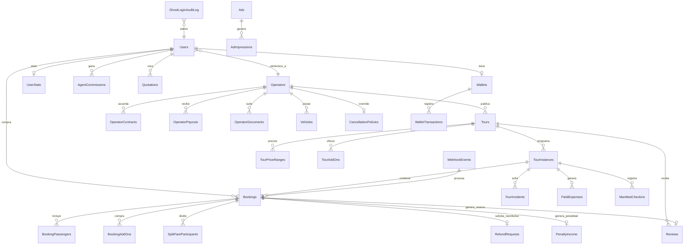

# Arquitectura del Sistema — BorondoTours

> Documento técnico de arquitectura que complementa los Specs funcionales.
> Define: requerimientos no funcionales, infraestructura AWS, patrones de diseño,
> modelo entidad-relación completo, y análisis de completitud por rol.

---

## 1. Requerimientos No Funcionales

### 1.1 Performance

| Métrica | Fase 1 (Demo) | Fase 2 (Operativo) | Fase 3 (Escala) | Método de medición |
|---------|--------------|-------------------|----------------|-------------------|
| API Response Time (p95) | < 300ms | < 200ms | < 150ms | NestJS Interceptor + logs |
| API Response Time (p99) | < 1s | < 700ms | < 500ms | APM (AWS X-Ray Fase 3) |
| LCP (Largest Contentful Paint) | < 2.5s | < 2.0s | < 1.8s | Lighthouse CI |
| FID (First Input Delay) | < 100ms | < 75ms | < 50ms | Web Vitals |
| Time to Interactive | < 3.5s | < 3.0s | < 2.5s | Lighthouse |
| DB Query Time (p95) | < 100ms | < 75ms | < 50ms | Drizzle query logger |
| Webhook processing | < 2s | < 1s | < 500ms | SQS + Lambda metrics (CloudWatch) |
| Concurrent users | 100 | 1.000 | 5.000 | Load testing (k6) |

### 1.2 Disponibilidad y Resiliencia

| Aspecto | Fase 1 (MVP/Demo) | Fase 2 (Operativo) | Fase 3 (Escala) |
|---------|-------------------|-------------------|-----------------|
| Uptime SLA | 99% (7.3h downtime/mes) | 99.5% | 99.9% (43min/mes) |
| Estrategia DR | Backup & Restore (single-región) | Pilot Light (2ª región apagada) | Aurora Global DB (+ activo-activo opcional) |
| RTO | 1-4 horas | 30-60 minutos | < 1-2 minutos |
| RPO | ≤24 horas (RDS PITR) | minutos | ~1 segundo (Aurora Global) |
| Failover | Manual (sam deploy + RDS restore) | Semi-automatico (promover replica) | Automatico (Route 53 + Aurora Global) |
| Backups BD | RDS PITR (7 dias) + snapshots | RDS + read replica cross-región | Aurora continuous + cross-region |
| Multi-región | ❌ No (asumido) | Replica cross-región (Pilot Light) | ✅ Aurora Global + DynamoDB Global Tables |

> **Nota DR (ADR-011 Parte D):** El estado transaccional vive en RDS/Aurora, que es el cuello de botella del RTO cross-región. Un RTO < 1-2 min solo es alcanzable con **Aurora Global Database** (Fase 3, cuando el volumen de facturación lo justifique). Las capas stateless (Lambda, API Gateway, S3/CloudFront) son fáciles de multi-región. La supervivencia a caída de región **no** es un objetivo de Fase 1.

### 1.3 Escalabilidad

| Componente | Fase 1 — serverless cost-efficient | Fase 2 — operativo | Fase 3 — escala |
|------------|----------------------------|----------------------|---------------------|
| Backend API | AWS Lambda (Lambda-lith) + API Gateway HTTP | igual (más memoria/concurrencia) | + Provisioned Concurrency donde aplique |
| Base de datos | RDS PostgreSQL t4g.micro (Single-AZ) + RDS Proxy | RDS t4g.small (Multi-AZ) | Aurora PostgreSQL Serverless v2 (read replicas + Global DB) |
| Contadores/idempotencia | DynamoDB con TTL | igual | igual |
| Frontend | S3 + CloudFront (desde Fase 1) | S3 + CloudFront | S3 + CloudFront + WAF |
| Jobs | EventBridge + SQS + Step Functions | igual | igual + más flujos |
| WebSockets | API Gateway WebSocket API + Lambda | igual | + radar en vivo |

> **Principio de escalabilidad serverless:** Lambda y DynamoDB escalan automáticamente por demanda.
> El único componente con "tier" a subir es RDS (t4g.micro → t4g.small → Aurora Serverless v2).
> Escalar no implica re-arquitectura ni migración de plataforma.

### 1.4 Seguridad

| Capa | Implementacion |
|------|---------------|
| Transporte | TLS 1.3 obligatorio via ACM + CloudFront + API Gateway (HSTS preload) |
| Autenticacion | JWT RS256 (access) + opaque token HttpOnly (refresh) |
| Autorizacion | RBAC 10 roles + tenant isolation por operator_id + **Lambda Authorizer** en API Gateway |
| Datos en reposo | AES-256 (KMS) para PII (document_number, phone, medical) |
| Almacenamiento S3 | SSE-KMS (pasaportes, docs legales en bucket privado) |
| Inputs | class-validator (backend) + Zod (frontend) + contratos Zod compartidos |
| XSS | DOMPurify via SafeHtml (frontend) + sanitize en backend |
| SQL Injection | Drizzle ORM (queries parametrizadas) |
| Rate Limiting | **API Gateway throttling** (usage plans por ruta y API key) |
| CORS | Whitelist explicita de origenes |
| Secretos | AWS Secrets Manager (todas las fases, desde Fase 1) |
| Headers | Helmet.js (CSP, X-Frame-Options, HSTS, etc.) |
| Network | VPC (Lambdas en subnet privada + VPC Endpoints) desde Fase 1 |
| WAF | **Diferido a Fase 3** por costo (riesgo aceptado en F1) — ver ADR-011 |

### 1.5 Observabilidad

| Aspecto | Fase 1 | Fase 2 | Fase 3 |
|---------|--------|--------|--------|
| Logging | Structured JSON hacia CloudWatch Logs | CloudWatch Logs + Log Insights | CloudWatch + Structured queries + alarmas |
| Metricas | CloudWatch Metrics (Lambda invocations/errors/duration, RDS, DynamoDB) | + custom metrics | CloudWatch Metrics + Custom dashboards |
| Tracing | Request ID en headers + CloudWatch | Request ID + CloudWatch | AWS X-Ray distributed tracing (Fase 3) |
| Alertas | CloudWatch Alarms → SNS → Email + AWS Budgets | + SQS DLQ alerts | CloudWatch Alarms + PagerDuty |
| APM | No aplica | No aplica | AWS X-Ray o DataDog |
| Error tracking | CloudWatch Logs | Sentry (frontend + backend) | Sentry + CloudWatch |

---

## 2. Infraestructura — Diagrama de Servicios

> **Principio rector:** Todo AWS **serverless-first** desde el dia 1. Las fases solo varian el tier/tamano
> de cada servicio, nunca la plataforma. Migrar de proveedor es deuda tecnica evitable.
>
> **⚠️ FUENTE DE VERDAD:** La arquitectura vigente es **serverless-first sobre AWS Lambda**, definida en [[../02-ADRs/ADR-011-Arquitectura-Consolidada]] (supera a ADR-005 y ADR-008). Los diagramas ECS Fargate que aparecían en versiones anteriores de este documento fueron reemplazados por la topología Lambda descrita abajo.

### 2.0 Decisiones de Infraestructura (AWS serverless-first — ADR-011)

| Decision | Servicio elegido | Alternativa descartada | Razon |
|----------|-----------------|----------------------|-------|
| Compute backend | **AWS Lambda "Lambda-lith"** (NestJS completo) + API Gateway HTTP API | ECS Fargate, EC2 | Pago-por-uso, escala a casi-cero en inactividad. Se acepta cold start en F1 |
| Tiempo real / Chat | **API Gateway WebSocket API** + Lambda + DynamoDB `Connections` | Socket.io (no corre en Lambda) | Serverless, sin servidor de conexiones persistente |
| Jobs / Asíncrono | **EventBridge Scheduler + SQS + Step Functions** | BullMQ + Redis | Sin worker encendido 24/7; DLQ nativo |
| Base de datos | **RDS PostgreSQL t4g.micro** + RDS Proxy → Aurora Serverless v2 (F3) | Aurora desde F1, Neon | t4g.micro es lo más barato para tráfico bajo constante. RDS Proxy resuelve el connection pooling de Lambda |
| Cache + contadores | **API Gateway throttling + DynamoDB TTL** | ElastiCache Redis | Sin BullMQ, Redis ya no se necesita en F1 |
| Búsqueda | **PostgreSQL `pg_trgm`** (F1-2) → OpenSearch Serverless (F3+) | Meilisearch | Typo-tolerance gratis en Postgres |
| Frontend hosting | S3 privado + CloudFront + OAC | Vercel | Sin vendor lock-in, misma CDN en todas las fases |
| Auth | JWT propio (Passport) + Lambda Authorizer | Cognito | Costo marginal ~$0/usuario a escala nacional |
| Secretos | AWS Secrets Manager | .env | Rotacion automatica, IAM nativo, auditoria |
| DNS + TLS | Route 53 + ACM | Externo | Integracion nativa con CloudFront/API Gateway |
| Email | AWS SES | SendGrid | Ya en AWS, costo inferior a escala |
| IaC | AWS SAM + CloudFormation | Terraform | YAML declarativo, sin transpile, deploy directo |

> **NO en Fase 1 (por costo, riesgo aceptado):** AWS WAF, AWS X-Ray, ElastiCache Redis, ECS Fargate.

### 2.1 Fase 1: MVP — AWS Serverless Minimo Viable (~$45–60/mes)

```
                              INTERNET
                                 |
                      +----------v----------+
                      |    AWS CloudFront   |
                      |  (CDN + HTTPS/TLS)  |
                      +----+-----------+----+
                           |           |
               +-----------v--+   +----v-------------------+
               |  S3 Bucket   |   |  API Gateway            |
               |  (frontend   |   |  - HTTP API  (REST)     |
               |   SPA, OAC)  |   |  - WebSocket API (chat) |
               +--------------+   +----+---------------+----+
                                       |                |
                              +--------v--------+   +----v-----------+
                              |  Lambda-lith    |   |  Lambdas WS    |
                              |  (NestJS,       |   |  $connect /    |
                              |   Node 22)      |   |  sendMessage   |
                              +---+--------+----+   +----+-----------+
                                  |        |             |
                       +----------+        |             |
                       |                   |             |
              +--------v-------+   +--------v-----+  +----v----------+
              |  RDS Proxy     |   |  Secrets Mgr |  |  DynamoDB     |
              |     |          |   +--------------+  |  Chat + Conns |
              +-----v----------+                     |  + contadores |
              |  RDS PostgreSQL|                      |  (TTL)        |
              |  t4g.micro     |                      +---------------+
              |  Single-AZ     |
              |  (PostGIS)     |          Jobs asíncronos:
              +----------------+   +---------------------------------+
                       |           | EventBridge Scheduler (cron)    |
              +--------v----+      | SQS (colas + DLQ)               |
              |  S3 Priv    |      | Step Functions (Split Fare, etc)|
              |  (media,    |      | -> Lambdas worker               |
              |  docs) +SES |      +---------------------------------+
              +-------------+

VPC (us-east-1):
  - Lambdas en subnet privada (acceso a RDS vía RDS Proxy)
  - VPC Endpoints para S3, DynamoDB, Secrets Manager, SQS (evita NAT Gateway)
  - Sin ALB, sin NAT Gateway, sin ECS, sin ElastiCache

Costo estimado Fase 1:
  - Lambda + API Gateway (HTTP + WS): ~$0-10/mes (pago por uso)
  - RDS t4g.micro Single-AZ: ~$12/mes
  - RDS Proxy: ~$15/mes
  - DynamoDB (chat + conexiones + contadores): ~$1-5/mes
  - SQS + EventBridge + Step Functions: ~$0-3/mes
  - CloudFront + S3: ~$5/mes
  - Secrets Manager + VPC Endpoints: ~$8/mes
  Total: ~$45-60/mes

Servicios externos (no AWS):
  - Onepayla API (pagos Colombia)
  - Google OAuth2 (autenticacion social)
  - Mapbox GL JS (mapas, token en frontend)
```

> **Nota cold start:** el Lambda-lith en VPC arranca en ~2-4s tras inactividad. Se acepta en Fase 1
> (sin Provisioned Concurrency) — el demo se hace con la Lambda ya "caliente". Ver ADR-011.
>
> **NO en Fase 1 (riesgo aceptado):** AWS WAF (API pública sin protección L7 gestionada; mitigación:
> API Gateway throttling + Lambda Authorizer) y AWS X-Ray (tracing diferido a Fase 3).

### 2.2 Fase 2: Plataforma Operativa — Serverless multi-servicio (~$150–250/mes)

```
                              INTERNET
                                 |
                    +------------v-----------+
                    |      AWS CloudFront     |
                    +-----+-------------+-----+
                          |             |
              +-----------v--+   +------v----------------+
              |  S3 (frontend)|   |  API Gateway          |
              +---------------+   |  HTTP + WebSocket      |
                                  +------+-----------+-----+
                                         |           |
                                 +-------v-----+ +---v-----------+
                                 | Lambda-lith | | Lambdas WS    |
                                 +------+------+ +---------------+
                                        |
              +-------------------------+--------------------+
              |            |            |                    |
  +-----------v----+  +----v-------+  +-v----------+  +-------v------+
  |  RDS PostgreSQL|  | RDS Proxy  |  | DynamoDB   |  | EventBridge  |
  |  t4g.small     |  +------------+  | chat+conns |  | + SQS + Step |
  |  Multi-AZ      |                  | +contadores|  | Functions    |
  +----------------+                  +------------+  +--------------+
              |
  +-----------+--------+
  |           |        |
  +--------+  +-----+  +-----------+
  |S3 Priv |  |SES  |  |Secrets Mgr|
  +--------+  +-----+  +-----------+
Nuevos en Fase 2:
  - RDS Multi-AZ (alta disponibilidad real)
  - Más funciones/flujos (Step Functions para Split Fare, comisiones)
  - CloudWatch Alarms + SNS (alertas automaticas)
  - (Búsqueda sigue en pg_trgm; OpenSearch solo si el volumen lo exige)
```

### 2.3 Fase 3: Escala — Serverless Production-Grade (~$800–1500/mes segun trafico)

```
                              INTERNET
                                 |
                    +------------v-----------+
                    |      AWS CloudFront     |
                    |  (CDN + WAF + Shield)   |
                    +-----+-------------+-----+
                          |             |
              +-----------v--+   +------v----------------+
              |  S3 (frontend)|   |  API Gateway          |
              +---------------+   |  HTTP + WebSocket      |
                                  +------+-----------+-----+
                                         |           |
                                 +-------v-----+ +---v-----------+
                                 | Lambda-lith | | Lambdas WS    |
                                 | (+Provision.| +---------------+
                                 | Concurrency)|
                                 +------+------+
                                        |
        +-------------------+-----------+-----------+------------------+
        |                   |           |           |                  |
  +-----v---------+  +------v-----+  +--v-------+  +v-------------+  +--v--------+
  | Aurora Server-|  | RDS Proxy  |  | DynamoDB |  | EventBridge  |  | OpenSearch|
  | less v2       |  +------------+  | Global   |  | +SQS +Step   |  | Serverless|
  | (+Global DB   |                  | Tables   |  | Functions    |  | (opcional)|
  |  para DR)     |                  +----------+  +--------------+  +-----------+
  +---------------+
        |
  +-----+----+  +-----+  +----------------+  +-----------------+
  |S3 Priv   |  |SES  |  | Secrets Manager|  | X-Ray + CW      |
  |+ Glacier |  +-----+  +----------------+  | Dashboards      |
  +----------+                               +-----------------+

Adicionales Fase 3:
  - Aurora Serverless v2 + Aurora Global Database (DR multi-región, RTO <1-2min)
  - AWS WAF + Shield + X-Ray (reintroducidos tras diferirse en F1)
  - DynamoDB Global Tables (chat/contadores multi-región)
  - S3 Glacier Deep Archive (docs fiscales 5 anos)
  - AWS Backup (centralizado RDS + DynamoDB)
  - SNS + SQS dead-letter queues
  - GitHub Actions + ECR (CI/CD pipeline)
  - Route 53 Health Checks (failover automatico)
  - AWS WAF avanzado (OWASP reglas gestionadas)
```

### 2.4 Mapa de Equivalencias (servicios eliminados vs AWS)

| Eliminado | Reemplazado por | Disponible desde |
|-----------|----------------|-----------------|
| Vercel | S3 + CloudFront | Fase 1 |
| Railway/Render (backend) | **AWS Lambda + API Gateway** | Fase 1 |
| ECS Fargate (ADR-005/008) | **AWS Lambda "Lambda-lith"** | Fase 1 |
| Neon PostgreSQL | RDS PostgreSQL **t4g.micro** + RDS Proxy | Fase 1 |
| ElastiCache Redis / BullMQ | **EventBridge + SQS + Step Functions** (jobs) + DynamoDB TTL (contadores) | Fase 1 |
| Socket.io | **API Gateway WebSocket API** | Fase 1 |
| Meilisearch Cloud | **PostgreSQL pg_trgm** (F1-2) → OpenSearch Serverless (F3+) | Fase 1 |
| .env / Railway secrets | AWS Secrets Manager | Fase 1 |
| Docker Hub / ECR | (no aplica — Lambda empaqueta el código, sin imágenes de servidor) | Fase 1 |

---

## 3. Patrones de Diseño — Backend (NestJS)

### 3.1 Arquitectura por capas (Vertical Slice)

```
Request -> Controller -> Service -> Repository -> Database
                          |
                     Guards (RBAC)
                     Interceptors (Response transform)
                     Pipes (Validation)
                     Filters (Exception handling)
```

### 3.2 Patrones implementados

| Patron | Uso en BorondoTours | Ejemplo |
|--------|---------------------|---------|
| Repository Pattern | Abstrae Drizzle ORM. Cada entidad tiene su repository | BookingRepository.findByUser(userId) |
| Service Layer | Logica de negocio aislada del framework | BookingService.cancel(bookingId, userId) |
| Guard Pattern | RBAC en decorators | @Roles('AGENT', 'GERENTE') en controllers |
| Interceptor Pattern | Transformacion de responses, logging | ResponseInterceptor wraps en {data, error, meta} |
| Strategy Pattern | Calculo de penalidades por franja | CancellationStrategy.calculate(booking, tier) |
| Observer/Event | Webhooks disparan multiples acciones | PaymentConfirmedEvent — Coins + Payout + Email + Kanban |
| Queue Pattern | Jobs asincronos con **SQS + Lambda** (antes BullMQ) | SplitFareBalanceJob, ReconcilePaymentsJob |
| Saga / Orquestación | Flujos multi-paso con **Step Functions** | Split Fare (reserva→saldo→settle), conciliación |
| Singleton | Configuracion global | LoyaltyConfig (id=1) |
| Factory Pattern | Creacion de links Onepayla segun tipo | PaymentLinkFactory.create(type, amount) |
| Decorator Pattern | NestJS custom decorators | @CurrentUser(), @Roles(), @TenantIsolated() |

### 3.3 Event-Driven Architecture (Webhooks + SQS/EventBridge)

```
OnePay webhook -> API Gateway -> Lambda WebhookHandler (valida HMAC, idempotencia en DynamoDB/RDS)
  -> encola evento en SQS (procesamiento desacoplado + DLQ)
    -> Lambda PaymentEventProcessor
      |-- BookingService.confirm()               (transaccional en RDS)
      |-- WalletService.accrueCoins()            (transaccional)
      |-- PayoutService.createPending()          (transaccional)
      |-- CommissionService.calculate()          (transaccional)
      |-- NotificationService.sendConfirmation() (SES / Expo Push)
      +-- Kanban update -> push por API Gateway WebSocket

Flujos multi-paso (Split Fare, conciliación) -> AWS Step Functions.
Cron (conciliación 2AM, recordatorios, SOAT, activación de chat) -> EventBridge Scheduler -> Lambda.
```

> Las acciones **críticas** post-pago (booking, payout, commission) se ejecutan en la misma transacción de RDS. Las **no-críticas** (email, push, kanban) van por el evento SQS. El job de conciliación diaria es la red de seguridad si el webhook nunca llega.

### 3.4 Tenant Isolation Pattern

Decorator personalizado que inyecta operator_id del JWT.
Se usa en TODOS los endpoints de operador.
Internamente agrega WHERE operator_id = jwt.operator_id a todas las queries.

### 3.5 CQRS Ligero (Separacion lectura/escritura)

No es CQRS completo (no hay event sourcing), pero se separa:
- Commands (escriben): CreateBookingCommand, CancelBookingCommand
- Queries (leen): GetTourCatalogQuery, GetWalletBalanceQuery

Beneficio: las queries pueden usar read-replicas en Fase 3 sin cambiar codigo.

---

## 4. Patrones de Diseño — Frontend

| Patron | Implementacion | Ubicacion |
|--------|---------------|-----------|
| Container/Presenter | Containers manejan datos (hooks), Presenters solo UI | TourDetailContainer hacia TourDetailView |
| Store Pattern | Zustand slices por dominio | auth.store, cart.store, coins.store |
| Query Invalidation | TanStack Query invalida cache tras mutaciones | onSuccess: invalidateQueries(['bookings']) |
| Route-based Code Splitting | TanStack Router lazy() por ruta | Cada app (B2C/ERP/B2B) es un chunk separado |
| Compound Components | Componentes complejos con sub-componentes | Checkout.Step, Kanban.Column |
| Render Props / Hooks | Logica reutilizable sin HOCs | useAvailability(tourId), useSocket(room) |
| Optimistic Updates | Actualizar UI antes de la respuesta del server | Kanban drag: mueve la tarjeta, revierte si falla |
| Error Boundary | Aislamiento de errores por seccion | Mapa, Chat, Checkout tienen boundaries independientes |

---

## 5. Modelo Entidad-Relacion (MER) Completo



### Tablas del sistema: 41

| # | Tabla | Dominio |
|---|-------|---------|
| 1 | Users | Auth |
| 2 | RefreshTokens | Auth |
| 3 | CustomRoles | Auth |
| 4 | Operators | Tenants |
| 5 | OperatorDocuments | Tenants |
| 6 | OperatorContracts | Finanzas |
| 7 | OperatorPayouts | Finanzas |
| 8 | Tours | Catalogo |
| 9 | TourPriceRanges | Catalogo |
| 10 | TourAddOns | Catalogo |
| 11 | TourInstances | Operaciones |
| 12 | Bookings | Core |
| 13 | BookingPassengers | Core |
| 14 | BookingAddOns | Core |
| 15 | SplitFareParticipants | Pagos |
| 16 | Wallets | Loyalty |
| 17 | WalletTransactions | Loyalty |
| 18 | UserStats | Loyalty |
| 19 | LoyaltyConfig | Loyalty |
| 20 | LoyaltyLevels | Loyalty |
| 21 | CoinRewardConfig | Loyalty |
| 22 | LoyaltyChallenges | Loyalty |
| 23 | LoyaltyEvents | Loyalty |
| 24 | Ads | Publicidad |
| 25 | AdImpressions | Publicidad |
| 26 | Reviews | Social |
| 27 | TourIncidents | Operaciones |
| 28 | FieldExpenses | Operaciones |
| 29 | ManifestCheckins | Operaciones |
| 30 | Vehicles | Operaciones |
| 31 | Quotations | CRM |
| 32 | QuoteActions | CRM |
| 33 | AgentCommissions | Finanzas |
| 34 | AgentCommissionHistory | Finanzas |
| 35 | RefundRequests | Pagos |
| 36 | WebhookEvents | Infra |
| 37 | OperatorChargebacks | Finanzas |
| 38 | PenaltyIncome | Finanzas |
| 39 | CancellationPolicies | Config |
| 40 | GhostLoginAuditLog | Audit |
| 41 | UserPushTokens | Mobile |

Tabla DynamoDB adicional: ChatMessages (PK: chat_type#entity_id, SK: timestamp#msg_id, TTL)

> **Actualización (2026-07-05):** El conteo real es ahora **54 tablas**. Las tablas ManifestCheckins,
> QuoteActions, Reviews, RefreshTokens, UserPushTokens y las 3 diferidas de Spec-C ya se consolidaron
> en Modelo-Datos-Core §28–38. Se añadieron 13 tablas nuevas (§39–51): PlanComponents, Regions,
> OperatorRegions, Providers, ProviderRegions, ProviderAgreements, ResourceUnavailability,
> ReadinessChecklistItems, OperationalClosure, TourInstanceNotes, y las fiscales Taxes, ServiceTaxes,
> Invoices (orquestación Siigo — ADR-010). Ver Modelo-Datos-Core (fuente de verdad).

---

## 6. Estructura de Modulos NestJS (Backend)

```
/backend/src
  /modules
    /auth             <- Login, registro, JWT, OAuth, OTP, Guards
    /users            <- CRUD usuarios, perfil, onboarding
    /tours            <- CRUD tours, instancias, disponibilidad, busqueda
    /bookings         <- Checkout, cancelacion, voucher PDF
    /payments         <- Webhook Onepayla, conciliacion, Split Fare
    /wallet           <- Borondo Coins, XP, niveles, transacciones
    /loyalty          <- Configuracion niveles, rewards, challenges
    /operators        <- CRUD operadores, contratos, onboarding B2B
    /payouts          <- Liquidaciones operador, chargebacks
    /commissions      <- Comisiones agentes, liquidacion periodos
    /crm              <- Quotations, Kanban pipeline, leads
    /manifest         <- Manifiesto, check-in, agency links
    /ads              <- Banners, rewarded ads, impresiones, metricas
    /reviews          <- Resenas tour + guia, trigger automatico
    /incidents        <- Log de incidentes, alertas urgencia
    /vehicles         <- Flota, SOAT, asignaciones
    /notifications    <- Email (SES), Push (Expo), SMS (Fase 2)
    /chat             <- API Gateway WebSocket handlers + DynamoDB (Connections + Messages)
    /reports          <- Dashboards, KPIs, exportar PDF/CSV
    /admin            <- Ghost login, config global, audit log
  /shared
    /guards           <- RolesGuard, TenantGuard, ThrottleGuard
    /interceptors     <- ResponseInterceptor, LoggingInterceptor
    /decorators       <- @Roles(), @CurrentUser(), @TenantIsolated()
    /filters          <- HttpExceptionFilter, ValidationFilter
    /pipes            <- ValidationPipe config global
    /interfaces       <- Tipos compartidos
    /utils            <- Helpers: slug, currency, date
  /config             <- Configuracion por entorno (.env -> ConfigService)
  /database
    /schema           <- Drizzle schema definitions (todas las tablas)
    /migrations       <- Migraciones versionadas
    /seeds            <- Datos iniciales (LoyaltyLevels, CoinRewardConfig)
  main.ts
  app.module.ts
```

---

## 7. Analisis de Completitud por Rol

> Este análisis cubre los tres roles principales de consumo de la plataforma (CLIENT, AGENTE, OPERATOR_ADMIN). Los roles internos operativos (GERENTE, COORD, OPERATOR_GUIDE, OPERATOR_DRIVER) se cubren en los Specs correspondientes (Spec-G, Spec-J).

### 7.1 VIAJERO (CLIENT)

| Necesidad | Funcionalidad | Estado |
|-----------|--------------|--------|
| Descubrir tours | Catalogo + filtros + mapa | Spec-A |
| Ver disponibilidad | Calendario semaforo | Spec-B |
| Reservar y pagar | Checkout + Onepayla | Spec-C |
| Ver sus reservas | Portal cliente | Spec-D |
| Cancelar autonomamente | Cancelacion escalonada | Spec-C RF-C11 |
| Reprogramar | Reprogramar reserva | Spec-D RF-D08b |
| Descargar voucher | PDF con QR | Spec-D RF-D06 |
| Chatear pre-tour | Chat con guia + agente | Spec-D RF-D08 |
| Ganar recompensas | Coins multifactorial | Spec-E |
| Ver progreso de nivel | XP + barra progreso | Spec-E RF-E03 |
| Usar descuentos | Coins en checkout | Spec-C RF-C05 |
| Calificar experiencia | Resenas dual | Spec-D RF-D09 |
| Referir amigos | Codigo de referido | Spec-E RF-E10 |
| Recibir recordatorios | Push + email 24h antes | Spec-D RF-D10 |
| Solicitar reembolso | PQRS | Spec-C RF-C09 |
| Push notifications | Promos, confirmaciones | Spec-J RF-J11 |
| Mapa de conquistas | Gamificacion Colombia | Spec-E RF-E09 (Fase 2) |

**GAP detectado:** Tabla UserFavorites + API para wishlist (RF-B01 lo menciona pero no hay modelo). Agregar en Fase 1.

### 7.2 AGENTE (AGENTE)

| Necesidad | Funcionalidad | Estado |
|-----------|--------------|--------|
| Pipeline de ventas | Kanban 6 columnas | Spec-H RF-H02 |
| Crear cotizaciones | Formulario + preview | Spec-H RF-H06 |
| Enviar links de pago | Link Magico Onepayla | Spec-H RF-H07 |
| Enviar por WhatsApp | wa.me pre-llenado | Spec-H RF-H08 |
| Ver comisiones | Panel personal | Spec-H RF-H11 |
| Venta rapida (efectivo) | Fast sale | Spec-H RF-H24 |
| Propiedad del lead | 90 dias + alertas | Spec-H RF-H04 |
| Celebrar ventas | Ka-ching sonoro | Spec-H RF-H12 |
| Competir con equipo | Leaderboard | Spec-H RF-H13 |
| Meta mensual | Barra de progreso | Spec-H RF-H14 |

**GAP detectado:** Agenda/calendario personal del agente (ver tours de sus clientes esta semana). Nice-to-have Fase 2.

### 7.3 OPERADOR (OPERATOR_ADMIN)

| Necesidad | Funcionalidad | Estado |
|-----------|--------------|--------|
| Dashboard financiero | KPIs + ocupacion + proyeccion | Spec-I RF-I02/03 |
| Crear tours | Wizard 4 pasos + revision | Spec-I RF-I04 |
| Gestionar fechas/cupos | Calendario + bulk create | Spec-I RF-I06 |
| Ver manifiesto consolidado | Auto-fill multicanal | Spec-I RF-I08 |
| Links para agencias externas | URL publica sin login | Spec-I RF-I10/11 |
| Radar de operaciones | Grid + semaforo + GPS | Spec-I RF-I13-16 |
| Asignar equipo | Guia + conductor + vehiculo | Spec-I RF-I19b |
| Ver liquidaciones | Historial + PDF desglose | Spec-I RF-I22 |
| Cancelar por fuerza mayor | Flujo documentado | Spec-I RF-I17 |
| Gestionar equipo | CRUD miembros | Spec-I RF-I18 |
| Ver resenas | Solo lectura + reportar | Spec-I RF-I24b |
| Revenue por canal | Dona + tabla | Spec-I RF-I23 |

**GAP detectado:** Canal de soporte bidireccional con BorondoTours (actualmente solo notificaciones). Fase 2.

### 7.4 Resumen de Gaps

| # | Gap | Rol | Prioridad | Fase |
|---|-----|-----|-----------|------|
| 1 | Tabla UserFavorites + API wishlist | CLIENT | Media | Fase 1 |
| 2 | Agenda/calendario personal | AGENT | Baja | Fase 2 |
| 3 | Templates WhatsApp seguimiento | AGENT | Baja | Fase 2 |
| 4 | Canal soporte bidireccional operador | OPERATOR | Media | Fase 2 |
| 5 | Fecha estimada de pago en liquidaciones | OPERATOR | Baja | Fase 1 |

---

## 8. Estrategia de Testing

| Nivel | Herramienta | Cobertura minima | Que se prueba |
|-------|-------------|-----------------|---------------|
| Unit (backend) | Vitest | 80% servicios | Logica financiera, RBAC, penalidades, Coins, XP |
| Unit (frontend) | Vitest + Testing Library | 80% stores/hooks | Stores Zustand, hooks compartidos, guards rutas |
| Integration | Supertest + TestContainers | Flujos criticos | Checkout E2E, webhook handler, cancelacion |
| E2E | Playwright | Flujos de negocio | Discovery-Checkout-Confirmacion, Login por rol |
| Load | k6 | SLAs de seccion 1.1 | API /tours, /checkout, /webhooks bajo carga |
| Security | OWASP ZAP (CI) | Top 10 | Inyeccion, XSS, auth bypass |

**Tests OBLIGATORIOS (no se mergea sin ellos):**
- Calculo de IVA (19% / 0% exento)
- Calculo de penalidades por franja (40% / 60% / 100%)
- Acreditacion de Coins + XP por compra (con multiplicador nacionalidad)
- Calculo de comision del agente
- Calculo de payout del operador
- Guards RBAC (acceso y denegacion por cada rol)
- Tenant isolation (operador A no ve datos de operador B)
- Idempotencia de webhooks (mismo event_id no se procesa 2 veces)
- Ratio de Coins (conversion correcta a COP)

---

## 9. Convenciones de API

### Métodos HTTP (RFC 10008 adoptado)

| Método | Uso | Body | Seguro | Idempotente | Cacheable |
|---|---|---|---|---|---|
| **GET** | Lecturas simples (detalle, listados cortos, perfil) | ❌ | ✅ | ✅ | ✅ CDN + TanStack |
| **QUERY** | Búsquedas complejas con filtros (RFC 10008) | ✅ JSON | ✅ | ✅ | ✅ TanStack (CDN pendiente soporte) |
| **POST** | Escrituras (crear recurso, acciones con side-effects) | ✅ JSON | ❌ | ❌ | ❌ |
| **PATCH** | Actualizaciones parciales | ✅ JSON | ❌ | ✅ | ❌ |
| **DELETE** | Eliminaciones | ❌ | ❌ | ✅ | ❌ |

**Convención de uso:**
- `GET` para lecturas donde los parámetros caben en la URL (≤10 query params): `/tours/:slug`, `/bookings/me`, `/wallet/balance`
- `QUERY` para búsquedas con body JSON (filtros complejos, múltiples categorías, anidados, geo-polígono): `QUERY /tours/search`
- `POST` exclusivamente para operaciones que modifican estado: `/bookings/checkout`, `/bookings/:id/cancel`, `/webhooks/onepay`

**¿Por qué QUERY y no POST /search?** RFC 10008 (junio 2026) define QUERY como un método seguro e idempotente con body — semántica correcta para búsquedas. POST /search "miente" sobre la intención (el servidor no crea nada), no es cacheable por intermediarios, y no se puede reintentar automáticamente. QUERY sí. Es el estándar correcto.

**Implementación en NestJS (Lambda-lith):**
```typescript
// Decorador custom — NestJS no tiene @Query() nativo como method decorator
// src/shared/decorators/http-query.decorator.ts
export const HttpQuery = (path: string) =>
  RequestMapping({ path, method: RequestMethod.ALL }); // + guard que rechaza si method !== 'QUERY'
```

**Implementación en frontend (Axios + TanStack Query):**
```typescript
// El método QUERY se usa con body, TanStack cachea con queryKey
const { data } = useQuery({
  queryKey: ['tours', 'search', filters],
  queryFn: () => axios({ method: 'QUERY', url: '/api/v1/tours/search', data: filters }),
  staleTime: 5 * 60 * 1000,
});
```

**Ejemplo de endpoint de búsqueda:**
```
QUERY /api/v1/tours/search
Content-Type: application/json

{
  "q": "cafetero",
  "filters": {
    "categories": ["NATURALEZA", "AVENTURA"],
    "difficulties": ["FACIL", "MODERADO"],
    "regions": ["eje-cafetero", "antioquia"],
    "priceRange": { "min": 50000, "max": 300000 },
    "durationRange": { "min": 4, "max": 12 },
    "productTypes": ["PASADIA", "EXCURSION"],
    "dateRange": { "from": "2026-08-01", "to": "2026-09-30" },
    "paxMin": 2,
    "ivaExemptAvailable": true,
    "geo": {
      "type": "radius",
      "center": { "lat": 4.71, "lng": -74.07 },
      "radiusKm": 50
    }
  },
  "sort": { "field": "popular", "order": "desc" },
  "cursor": "eyJ..."
}

Response:
{
  "data": [...tours],
  "error": null,
  "meta": { "cursor": "eyJ...", "hasMore": true, "total": 47 }
}
```

**Nota AWS:** API Gateway HTTP API con ruta `ANY /{proxy+}` pasa el método QUERY al Lambda-lith sin problemas. CloudFront aún no cachea QUERY a nivel CDN (julio 2026), pero el caché real de búsquedas dinámicas vive en TanStack Query (frontend), no en CDN.

---

### Response format (todas las respuestas)

```json
{
  "data": {},
  "error": null,
  "meta": { "cursor": "eyJ...", "hasMore": true }
}
```

### Error format

```json
{
  "data": null,
  "error": {
    "code": "BOOKING_ALREADY_CANCELED",
    "message": "Esta reserva ya fue cancelada",
    "details": {}
  },
  "meta": null
}
```

### Paginacion: cursor-based

```
QUERY /api/v1/tours/search  → cursor en el body del request
GET /api/v1/bookings/me?cursor=eyJ...&limit=12  → cursor en query param (listados simples)
Response meta: { cursor: "eyJ...", hasMore: true }
```

### Versionado
- Todas las rutas bajo /api/v1/
- Cambios breaking: /api/v2/ (post-inversion)

---

## 10. Jobs y Cron (EventBridge Scheduler + SQS + Step Functions)

> Los jobs `Cron` se disparan con **EventBridge Scheduler** → Lambda. Los jobs `Event` se disparan por
> mensajes en **SQS** (con DLQ) o eventos de dominio. Los flujos multi-paso (split-fare) usan **Step Functions**.
> Reemplaza el BullMQ + Redis de la arquitectura anterior (ver ADR-011).

| Job | Trigger | Frecuencia | Accion |
|-----|---------|-----------|--------|
| reconcile-onepay | EventBridge cron | Diario 2:00 AM | Conciliar pagos ultimas 48h |
| split-fare-balance | Cron | Diario 8:00 AM | Enviar links de saldo 5 dias antes |
| lead-expiry-check | Cron | Diario 6:00 AM | Alertar leads que expiran en 7 dias |
| soat-expiry-alert | Cron | Diario 7:00 AM | Alertar vehiculos con SOAT por vencer |
| premium-cupo-release | Cron | Diario 9:00 AM | Liberar cupos premium no usados (3 dias antes) |
| tour-reminder | Cron | Diario 8:00 AM | Push + email 24h antes del tour |
| review-request | Event | Post-COMPLETED | Enviar solicitud de resena 24h post-tour |
| refund-expiry | Cron | Diario 10:00 AM | Cerrar RefundRequests sin respuesta mas de 30 dias |
| ads-daily-reset | Cron | Diario 00:00 COT | Resetear contador de ads vistos por usuario |
| xp-monthly-ads | Cron | Mensual dia 1 | Otorgar 25 XP a usuarios con 20+ ads vistas |
| operator-docs-cleanup | Cron | Semanal | Eliminar docs de operadores rechazados mas de 7 dias |
| glacier-transition | Cron | Diario | Mover docs verificados mas de 15 dias a Deep Glacier |

---

## Links relacionados

- [[Frontend-Architecture]] — Diseno frontend detallado
- [[../01-Specs/Spec-F-Auth]] — Seguridad, RBAC
- [[../02-ADRs/ADR-011-Arquitectura-Consolidada]] — **fuente de verdad de infraestructura (serverless-first)**
- [[../02-ADRs/ADR-005-Infra-MVP]] — Decisiones de infraestructura (superado)
- [[../02-ADRs/ADR-007-Politica-Cancelacion-Escalonada]] — Modelo de penalidades
- [[../00-Inicio/Inventario-Funcionalidades-MVP]] — Roadmap
- [[../03-Knowledge/Modelo-Datos-Core]] — Schema BD fuente de verdad
