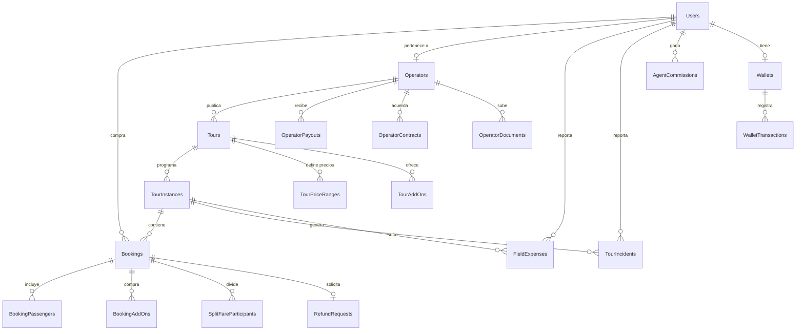

# 🗃️ Modelo de Datos Core — Fuente de Verdad

> Este documento es la **única fuente de verdad** para el esquema de base de datos de BorondoTours.
> Los Specs individuales pueden definir tablas adicionales específicas de su dominio, pero las tablas documentadas aquí son las canónicas.
> Si hay conflicto entre este documento y un Spec, **este documento gana**.

---

## 1. Users (Usuarios — todos los roles)

```
Users
  - id: uuid (PK)
  - email: string (UNIQUE, NOT NULL)
  - password_hash: string | null        ← null si solo usa Google OAuth
  - google_id: string | null            ← Google OAuth sub ID
  - first_name: string
  - last_name: string
  - phone_primary: string | null
  - phone_secondary: string | null
  - date_of_birth: date | null
  - city: string | null
  - country: string (default: 'CO')
  - language: string (default: 'es')
  - avatar_url: string | null
  - document_type: enum (CC, CE, PASSPORT) | null
  - document_number: string | null
  - emergency_contact_name: string | null
  - emergency_contact_phone: string | null
  - medical_conditions: text | null
  - hotel_pickup: string | null
  - role: enum (SUPER_ADMIN, GERENTE, COORD, AGENTE, MARKETING,
               OPERATOR_ADMIN, OPERATOR_COORD, OPERATOR_AGENT,
               OPERATOR_GUIDE, OPERATOR_DRIVER,
               VIAJERO, CUSTOM)
  - custom_role_id: uuid FK | null       ← si role = CUSTOM, referencia a CustomRoles
  - operator_id: uuid FK | null          ← obligatorio si role = OPERATOR_*
  - is_provider: boolean (default: false)← true si también es proveedor
  - provider_type: enum (EMPRESA, FREELANCER) | null
  - email_verified_at: timestamp | null
  - is_active: boolean (default: true)
  - last_login_at: timestamp | null
  - created_at: timestamp
  - updated_at: timestamp
```

### Users — Índices sugeridos
- `UNIQUE(email)`
- `INDEX(operator_id)` (para aislar datos por operador)
- `INDEX(role)` (para filtros rápidos en el admin)

---

## 2. Operators (Operadores turísticos)

```
Operators
  - id: uuid (PK)
  - legal_name: string                   ← Razón social
  - trade_name: string                   ← Nombre comercial
  - nit: string (UNIQUE)
  - rnt: string | null                   ← Registro Nacional de Turismo
  - logo_url: string | null
  - contact_email: string
  - contact_phone: string
  - address: string | null
  - city: string
  - country: string (default: 'CO')
  - commission_pct: decimal              ← % que retiene BorondoTours
  - is_verified: boolean (default: false)
  - verified_at: timestamp | null
  - verified_by: uuid FK | null          ← SUPER_ADMIN que verificó
  - onboarding_status: enum (PENDING_DOCS, PENDING_REVIEW, VERIFIED, SUSPENDED)
  - created_at: timestamp
  - updated_at: timestamp
```

---

## 3. OperatorDocuments (Documentos legales del operador)

```
OperatorDocuments
  - id: uuid (PK)
  - operator_id: uuid FK
  - document_type: enum (RUT, CAMARA_COMERCIO, RNT, CEDULA, TITULO_PROFESIONAL)
  - s3_key: string                       ← clave en S3 privado
  - s3_bucket: string                    ← 'borondo-legal-docs-private'
  - file_name: string                    ← nombre original del archivo
  - file_size_bytes: integer
  - uploaded_by: uuid FK
  - verified_by: uuid FK | null
  - verified_at: timestamp | null
  - lifecycle_status: enum (ACTIVE, GLACIER)
  - glacier_transition_at: timestamp | null  ← cuando se movió a Deep Glacier (15 días post-verificación)
  - created_at: timestamp
```

> **Política S3:** Los documentos se mueven a S3 Deep Glacier **15 días después de la verificación** del operador. Ver [[Politica-Datos-Personales]].

---

## 4. Tours (Catálogo de tours)

```
Tours
  - id: uuid (PK)
  - operator_id: uuid FK
  - title: string
  - slug: string (UNIQUE)               ← para URLs amigables (/tours/:slug)
  - description_md: text                 ← Markdown
  - category: enum (NATURALEZA, AVENTURA, CULTURAL, GASTRONOMICO, URBANO, INTERNACIONAL, CRUCERO)
  - difficulty: enum (FACIL, MODERADO, DIFICIL, EXTREMO)
  - duration_hours: decimal
  - city: string
  - department: string | null
  - country: string (default: 'CO')
  - latitude: decimal
  - longitude: decimal
  - meeting_point: string                ← dirección del punto de encuentro
  - meeting_point_lat: decimal | null
  - meeting_point_lng: decimal | null
  - base_price_cop: decimal
  - pax_rule: enum (BY_AGE, BY_HEIGHT)   ← regla de pasajeros
  - min_pax: integer (default: 1)
  - max_pax: integer
  - reservation_pct: integer (default: 100) ← % que se cobra como reserva (Split Fare)
  - cancellation_days: integer (default: 5) ← días mínimos para cancelación gratis
  - status: enum (DRAFT, PENDING_REVIEW, PUBLISHED, REJECTED, ARCHIVED)
  - rejection_reason: text | null
  - reviewed_by: uuid FK | null
  - reviewed_at: timestamp | null
  - media_gallery: jsonb                 ← [{url, type, order, alt_text}]
  - video_url: string | null
  - seo_title: string | null
  - seo_description: string | null
  - is_featured: boolean (default: false)
  - meilisearch_synced_at: timestamp | null
  - created_at: timestamp
  - updated_at: timestamp
```

### Tours — Índices sugeridos
- `UNIQUE(slug)`
- `INDEX(operator_id)`
- `INDEX(status)` (para filtrar publicados)
- `INDEX(category, city)` (para búsqueda por categoría + ciudad)

---

## 5. TourPriceRanges (Precios por categoría de pasajero)

```
TourPriceRanges
  - id: uuid (PK)
  - tour_id: uuid FK
  - label: string                        ← "Adulto", "Niño (5-12)", "Menor 1m"
  - min_value: decimal | null            ← rango según pax_rule (edad o estatura)
  - max_value: decimal | null
  - price_cop: decimal
  - created_at: timestamp
```

---

## 6. TourAddOns (Add-ons opcionales del tour)

```
TourAddOns
  - id: uuid (PK)
  - tour_id: uuid FK
  - name: string                         ← "Almuerzo típico", "Alquiler casco"
  - price_cop: decimal
  - duration_minutes: integer | null      ← tiempo que toma el add-on
  - max_per_booking: integer (default: 10)
  - is_active: boolean (default: true)
  - created_at: timestamp
```

---

## 7. TourInstances (Fechas específicas de operación)

```
TourInstances
  - id: uuid (PK)
  - tour_id: uuid FK
  - instance_date: date
  - start_time: time
  - end_time: time | null
  - available_slots: integer             ← cupos iniciales
  - booked_slots: integer (default: 0)   ← cupos vendidos
  - status: enum (SCHEDULED, FULL, CANCELED, COMPLETED)
  - assigned_guide_id: uuid FK | null    ← OPERATOR_GUIDE asignado
  - assigned_driver_id: uuid FK | null   ← OPERATOR_DRIVER asignado
  - assigned_vehicle_id: uuid FK | null
  - weather_alert: boolean (default: false)
  - coordinator_notes: text | null
  - created_at: timestamp
  - updated_at: timestamp
```

### TourInstances — Índices sugeridos
- `INDEX(tour_id, instance_date)` (para búsqueda por tour + fecha)
- `INDEX(status)` (para filtrar programadas vs canceladas)
- `INDEX(assigned_guide_id)` (para el manifiesto del guía)

---

## 8. Bookings (Reservas)

```
Bookings
  - id: uuid (PK)
  - tour_instance_id: uuid FK
  - user_id: uuid FK                     ← cliente que compra
  - agent_id: uuid FK | null             ← agente que cotizó (si aplica)
  - pax_count: integer
  - subtotal_cop: decimal                ← antes de IVA y Coins
  - iva_cop: decimal                     ← 0 si exento (extranjero con PIP)
  - coins_used: decimal (default: 0)
  - total_cop: decimal                   ← subtotal + iva - coins
  - onepay_reference: string | null
  - status: enum (HOLD, HOLD_GROUP, PARTIAL_PAID, CONFIRMED, SETTLED, CANCELED, COMPLETED, CHARGEBACK, EXPIRED)
  - source: enum (WEB_B2C, AGENT_QUOTE, AGENCY_LINK, QUICK_SALE)
  - passport_s3_key: string | null       ← si extranjero
  - confirmation_number: string (UNIQUE) ← human-readable (ej: BT-2026-00001)
  - canceled_at: timestamp | null
  - canceled_by: uuid FK | null
  - cancellation_reason: text | null
  - completed_at: timestamp | null
  - created_at: timestamp
  - updated_at: timestamp
```

---

## 9. BookingPassengers (Datos por pasajero)

```
BookingPassengers
  - id: uuid (PK)
  - booking_id: uuid FK
  - user_id: uuid FK | null              ← null si Split Fare sin cuenta
  - full_name: string
  - document_type: enum (CC, CE, PASSPORT)
  - document_number: string
  - phone: string
  - emergency_contact_name: string
  - emergency_contact_phone: string
  - medical_conditions: text | null
  - hotel_pickup: string | null
  - price_category: string               ← "Adulto", "Niño", etc.
  - unit_price_cop: decimal
  - created_at: timestamp
```

---

## 10. BookingAddOns (Add-ons comprados en la reserva)

```
BookingAddOns
  - id: uuid (PK)
  - booking_id: uuid FK
  - addon_id: uuid FK → TourAddOns
  - quantity: integer
  - unit_price_cop: decimal              ← precio al momento de compra (snapshot)
  - total_cop: decimal
  - created_at: timestamp
```

---

## 11. SplitFareParticipants (ver Spec-C §8)

> Definición canónica en [[../01-Specs/Spec-C-Checkout]] §11.

---

## 12. Wallets y WalletTransactions (ver Spec-D §9)

> Definición canónica en [[../01-Specs/Spec-D-Client-Portal]] §9.
> Tabla `WalletTransactions` con type `CREDIT/DEBIT` y reason enum.

---

## 13. UserStats / Loyalty (ver Spec-D §9 + Spec-E §9)

> `UserStats` es la tabla canónica para estadísticas del usuario, incluyendo `loyalty_level`.
> Definición en [[../01-Specs/Spec-D-Client-Portal]] §9.

---

## 14. OperatorPayouts (Liquidaciones al operador)

```
OperatorPayouts
  - id: uuid (PK)
  - operator_id: uuid FK
  - period_start: date
  - period_end: date
  - gross_revenue: decimal               ← suma de bookings CONFIRMED del período
  - commission_amount: decimal           ← gross × commission_pct
  - chargeback_deductions: decimal       ← descuentos por chargebacks
  - net_payout: decimal                  ← gross - commission - chargebacks
  - status: enum (PENDING, IN_REVIEW, PAID, DISPUTED)
  - paid_at: timestamp | null
  - paid_by: uuid FK | null              ← COORD que ejecutó el pago
  - transfer_reference: string | null
  - siigo_document_id: string | null
  - created_at: timestamp
```

---

## 15. OperatorContracts (Historial inmutable de comisiones)

```
OperatorContracts
  - id: uuid (PK)
  - operator_id: uuid FK
  - commission_pct: decimal
  - effective_from: date
  - effective_until: date | null         ← null = vigente actualmente
  - contract_s3_key: string | null
  - approved_by: uuid FK
  - notes: text | null
  - created_at: timestamp
```

---

## 16. AgentCommissions (Comisiones de agentes de ventas)

```
AgentCommissions
  - id: uuid (PK)
  - agent_id: uuid FK → Users (AGENTE)
  - booking_id: uuid FK
  - commission_pct: decimal
  - commission_amount: decimal
  - period: string                       ← 'YYYY-MM' (período mensual)
  - status: enum (PENDING, APPROVED, PAID)
  - approved_by: uuid FK | null
  - paid_at: timestamp | null
  - created_at: timestamp
```

---

## 17. AgentCommissionHistory (Contratos de comisión de agentes)

```
AgentCommissionHistory
  - id: uuid (PK)
  - agent_id: uuid FK
  - commission_pct: decimal
  - effective_from: date
  - effective_until: date | null
  - set_by: uuid FK                      ← GERENTE o SUPER_ADMIN
  - created_at: timestamp
```

---

## 18. RefundRequests (ver Spec-C §8b)

> Definición canónica en [[../01-Specs/Spec-C-Checkout]] §11.

---

## 19. WebhookEvents (ver Spec-C §9)

> Definición canónica en [[../01-Specs/Spec-C-Checkout]] §11.

---

## 20. TourIncidents (Incidentes operativos)

```
TourIncidents
  - id: uuid (PK)
  - tour_instance_id: uuid FK
  - reported_by: uuid FK                 ← OPERATOR_GUIDE o OPERATOR_COORD
  - severity: enum (LOW, MEDIUM, HIGH, CRITICAL)
  - incident_type: enum (WEATHER, VEHICLE, MEDICAL, SECURITY, DELAY, OTHER)
  - description: text
  - attachments: jsonb | null            ← [{s3_key, type, description}]
  - resolution: text | null
  - resolved_at: timestamp | null
  - resolved_by: uuid FK | null
  - created_at: timestamp
```

---

## 21. FieldExpenses (Gastos de campo del guía)

```
FieldExpenses
  - id: uuid (PK)
  - tour_instance_id: uuid FK
  - reported_by: uuid FK                 ← OPERATOR_GUIDE
  - category: enum (ENTRANCE, FOOD, TRANSPORT, TIPS, SUPPLIES, OTHER)
  - amount_cop: decimal
  - description: string
  - receipt_s3_key: string | null        ← foto del recibo
  - payment_method: enum (CASH, TRANSFER, CARD)
  - status: enum (PENDING_REVIEW, APPROVED, REJECTED)
  - approved_by: uuid FK | null
  - approved_at: timestamp | null
  - synced: boolean (default: true)      ← false si se creó offline
  - sync_id: uuid | null                 ← para deduplicación offline
  - created_at: timestamp
```

---

## 22. Vehicles (Flota de vehículos del operador)

```
Vehicles
  - id: uuid (PK)
  - operator_id: uuid FK
  - plate: string
  - brand: string
  - model: string
  - year: integer
  - capacity: integer                    ← pasajeros máximos
  - soat_expiry: date
  - tecno_expiry: date                   ← tecnomecánica
  - insurance_expiry: date
  - is_active: boolean (default: true)
  - created_at: timestamp
  - updated_at: timestamp
```

---

## 23. CustomRoles (Roles personalizados creados por SUPER_ADMIN)

```
CustomRoles
  - id: uuid (PK)
  - name: string (UNIQUE)
  - display_name: string
  - permissions: jsonb                   ← lista de permisos granulares
  - created_by: uuid FK
  - is_active: boolean (default: true)
  - created_at: timestamp
  - updated_at: timestamp
```

---

## 24. GhostLoginAuditLog (ver Spec-H)

```
GhostLoginAuditLog
  - id: uuid (PK)
  - admin_id: uuid FK                   ← SUPER_ADMIN que hizo el ghost login
  - target_user_id: uuid FK             ← usuario suplantado
  - reason: text (NOT NULL)
  - ip_address: string
  - user_agent: string
  - actions_performed: jsonb             ← log de acciones durante la sesión
  - started_at: timestamp
  - ended_at: timestamp | null
```

---

## 25. Quotations (Cotizaciones — ver Spec-H)

```
Quotations
  - id: uuid (PK)
  - agent_id: uuid FK
  - client_name: string
  - client_email: string
  - client_phone: string
  - tour_instance_id: uuid FK
  - pax_count: integer
  - subtotal_cop: decimal
  - iva_cop: decimal
  - total_cop: decimal
  - addons: jsonb | null
  - onepay_link: string | null
  - status: enum (DRAFT, SENT, OPENED, PAID, EXPIRED, CANCELED)
  - expires_at: timestamp
  - booking_id: uuid FK | null           ← se vincula cuando se paga
  - notes: text | null
  - created_at: timestamp
  - updated_at: timestamp
```

---

## Diagrama de relaciones (Mermaid)



---

## Convenciones de diseño

1. **UUIDs:** Todas las PKs son `uuid v4` generados por la aplicación (no auto-increment)
2. **Timestamps:** Todos en UTC. El frontend convierte a zona horaria local (America/Bogota)
3. **Soft Delete:** No se usa soft delete. Los registros se archivan con `status = ARCHIVED` cuando aplique
4. **Auditoría:** Campos `created_at` y `updated_at` en todas las tablas. Para tablas sensibles, `created_by` adicional
5. **Enums:** Se implementan como PostgreSQL `ENUM` types (no strings arbitrarios)
6. **JSONB:** Se usa para datos semi-estructurados que no requieren JOINs frecuentes (gallery, permissions, addons snapshot)
7. **Naming:** snake_case para tablas y columnas. PascalCase solo en la documentación

---

## Links relacionados
- [[../01-Specs/Spec-C-Checkout]]
- [[../01-Specs/Spec-D-Client-Portal]]
- [[../01-Specs/Spec-E-Loyalty]]
- [[../01-Specs/Spec-F-Auth]]
- [[../01-Specs/Spec-G-ERP-Operativo]]
- [[../01-Specs/Spec-H-ERP-Agencia]]
- [[../01-Specs/Spec-I-B2B-Portal-Operadores]]
- [[Politica-Datos-Personales]]
